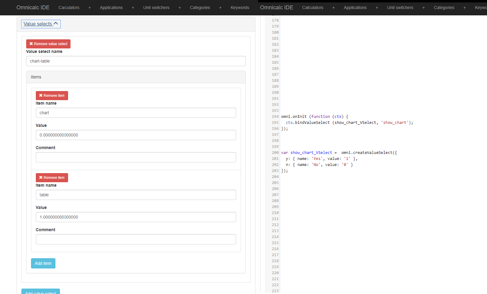

Click versus Code
=================

When you createa calculator there are two main ways to add functionality: clicking and filing in text boxes, and writing the code that create such functionality. Most of the times the choice is made for you and you can only do what you can do. However, there are a couple of occasions that you might be wondering what path to take; let's talk about those!

When there is an option...
--------------------------

There are two very clear examples of functionality that is duplicated and can be done either *click-based* or using customJS: **default values** and **value selects**. 

For most people the click-based solution is the simplest and fastest route, but customJS concentrates all the important stuff in one single place, making it easier to understand at a glance. We must find a balance.

First of all, if you are strongly partial to either method, by all means use it! However, if you are simply most comfortable using one or the other, here is what we can consider 'best practice'.

If your calculator has little or no customJS, then use the click-based solution, since it probably be faster and you don't gain anything from writing customJS. However, if your calculator **relies heavily** on the usage of customJS, then try your best to set default values and create value selects as parts of the code.

.. _clickVsCode:                  

    Comparison between click-based and code-based versions of creating a value select

Placing as much of the configuration of the calculator inside customJS keeps everything more organised, easier to tweak and change, and will be greatly appreciated by anyone that looks at your calculator after the fact (that includes future, you as well).

This is still a very subjective rule in the sense that you will have to decide what constitutes a "*customJS-loaded*" calculator. As a reference point I think we can agree that if all you are doing in customJS is hiding variables, you can consider the calculator to NOT be customJS-heavy.

On the other extreme, if you are showing charts, simulating things or you are doing a marketing calculator, you can be certain you're dealing with a calculator that relies heavily on customJS.

The difficult bit is the gray area. For example, if you are only using magic rows, or if you only have ``omni.define`` functions in your customJS. In those cases... you're on your own, make your choice.

When there is no option
-----------------------

Most of the functionality offered in customJS does not appear in the click-base interface, and it is pretty obvious that the decision has been made for you. However, there is one function that might seem to be duplicated but, in fact, it isn't. That is the error message.

We have the ``ctx.addUnmetCondition`` available in customJS and it resembles very much that of the *Conditions* tab. Nevertheless, there is a key difference between them that makes them non-equivalent. Your conditions on the click-based interface stop the calculator from computing any values, therefore avoiding bad behaviours in the calculator. The customJS version is limited to just showing the user an error message, but it does not stop any calculations from happening.

Knowing this, you should use the customJS version for **warning** the user about strange results, unreasonable input or innacurate values. The click-based version should be used for preventing the user from doing stupid things and breaking the calculator.

.. tip:: 
  There is a way to create fancy customJS-based conditions. It requires to use both the click-based interface and the customJS editor. You can learn more about it in :ref:`Add custom conditions (Error Message)<addumet>`.
