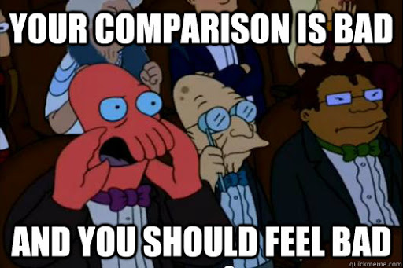

.. _comparisons:
Comparisons, staying sane a little longer
=========================================

Some say that "comparisons are odious", but we calculatorians know they are just unnavoidable. Thus, we must master the art of comparing not only apples to apples, but apples to oranges and even apples to fear.

In this piece we will explore the way we can compare values of any kind. So let's dive in and see how we should compare variables, how we can (but don't really enjoy) and `how we shouldn't <https://charlieharvey.org.uk/page/javascript_the_weird_parts>`__. 

.. warning::
  We will encounter weird things that can blow you mind. Do not try to `understand them too hard <https://github.com/denysdovhan/wtfjs>`__ , simply accept that javascript is weird and, like a Spaniard speaking English, it really doesn't make much sense.

The basics, when a plan comes together
--------------------------------------

Let's start with the most basic comparisons we can make in javascrit: apples to apples. That is, when we compare numbers to numbers, text to text, etc.

.. _plansComeTogether:                  
.. figure:: imgs/planComesTogether.jpg
    :scale: 50%
    :alt: plan comes together
    :align: center

Comparisons in javascript are typically done by using the comparison operator ``==`` or ``===`` which act exactly in the same way as long as the variables compared are of the same type. A second feature of comparisons is that they return a boolen stating whether the comparison is ``true`` or ``false``.

Let's take a look at a few examples using text:

.. code-block:: javascript
  
  var myName = 'Alvaro';
  var otherName = 'not Alvaro';
  var comparison = (myName === otherName); // comparison is false
  otherName = 'Alvaro';
  comparison = (myName === otherName); // comparison is now true

Simple enough, right? For comparing numbers we have other operators available like the **greater than**: ``>``, **less than**: ``<``, **greater than or equal to**: ``>=`` and **less than or equal to**: ``<=``. This can be seen in the following examples:

.. code-block:: javascript
  
  var myNumber = 8;
  var otherNumber = 11;
  var comparison = (myNumber === otherNumber); // comparison is false
  comparison = (myNumber >= otherNumber); // comparison is false
  comparison = (myNumber <= otherNumber); // comparison is true
  otherNumber = 8;
  comparison = (myNumber > otherNumber); // comparison is false
  comparison = (myNumber >= otherNumber); // comparison is true

Up to here everything is well and good, but things get complicated quickly. Arrays (and objects in general) don't work well with ``==`` and ``===`` so even if they are the same type of variable with the same content you might find they are not *'equal'*. Moreover, what if I compare to other types like an Array, or ``undefined`` or ``NaN`` [#f1]_ ... The answer is *havoc*, unless you are prepared in advanced.

Truthy, flasy and why 0 and '0' are kinda the same but not really
-----------------------------------------------------------------

It is now the time to compare apples to oranges. Obviously this is not striaght foward and the way javascript deals with it makes it even more complicated at times. First, let's mix variable types.

When comparing text and number, for example, javascript trying to convert (coerce) one type into another before comparing. When we don't want to do this, we can simply use ``===`` which tells javascript *"I know they might be different, but make sure the are absolutely the same thing, or give me false"*.

If, instead, we use ``==`` javascript would try to convert the values into the same type. This means that ``4 === '4' -> false`` but ``4 == '4' -> true`` which is very convenient at times. 
  
Things get even more bizarre when we mix in weird types like ``NaN``, ``undefinded``, ``Infinity``... Here we have again the option to allow conversion (via ``==``) or force strict comparison (using ``===``). The notion of `Falsy <https://developer.mozilla.org/en-US/docs/Glossary/Falsy>`__ and `Truthy <https://developer.mozilla.org/en-US/docs/Glossary/Truthy>`__ values becomes important and explains why ``0 == ''``, ``null == undefined`` or ``[] == 0`` are all true but they become false if we use the strict comparison ``===``.

.. seealso::
  We talked about "truthy" and "falsy" values when exploring condition so we recomend going back and reading that article again. Find it as :ref:`Better Conditions<betterConditions>` in the documentation.

When 'equals' are not enough, why ``NaN`` is not the same as ``NaN``
--------------------------------------------------------------------

When comparing special types using the ``==`` and ``===`` things can quickly break down. A clear example of this is the fact that ``[1,2] === [1,2] -> false`` and the most extreme version can be found with ``NaN === NaN -> false``. 

.. _comparisonBad:                  

So what do we do? - you might be asking in panic as you proceed to tear off your hair and quit all things javascript-. Fear not, for in such cases there is always a built in solution (or easy workaround). In the case of ``NaN`` values, it takes the form of a special function called ``isNaN`` (not to be confused with ``Number.isNaN``).

.. note:: 
  There are similar functions to compare against Inifinity values (``isFinite``), check if the variable is an array (``isArray``), etc.

Let's see how these two act in the "real world":

.. code-block:: javascript

  var anotherNotNumber = 8 * 'joe'; // returns NaN
  anotherNotNumber === NaN; // false
  isNaN(anotherNotNumber); // true
  Number.isNaN(anotherNotNumber); // true

  // Compare undefined variable with NaN (works with 'null' values too)
  newVariableNotSet === anotherNotNumber; // false
  isNaN(newVariableNotSet); // true
  Number.isNaN(newVariableNotSet); // false

As you can see the behaviour of ``isNaN`` and ``Number.isNaN`` is slightly different with the 'Number' version of the funciton being more strict. 

.. seealso::

  You can check the outcome of the most common comparison in javascript by playing with the `[docs] Stranger comparisons <https://bb.omnicalculator.com/#/calculators/2043>`__ on BB.

There are even more weird things going on with javascript (also ouside of pure comparisons), but that's a topic for another day. For now, as a prize for making it this far without your head exploding, one last meme: 

.. _JSMakesNoSense:                  
.. figure:: imgs/4skcofasa1p01.png
    :scale: 25%
    :alt: noSenseJs
    :align: center

  
.. rubric:: tl;dr

Comparisons in javascript are only easy if you compare variables of the same type or if the conversion is straight forward, so always try to do that. Outside of that, learn about truthy and falsy values for the best compromise between confusing and useful. 

Comparing weird types of variables (``null``, ``NaN``, ...) requires the use of special functions. If in doubt, check `the calculator we made <https://bb.omnicalculator.com/#/calculators/2043>`__ to understand what you can expect from each comparison.

Just remember that javascript, just like flat earthers, doesn't make sense.

.. rubric:: Footnotes

.. [#f1] ``NaN`` stands for "Not a Number" and it's generally the result of an illegal mathematical operation like ``8 * 'joe'``;

