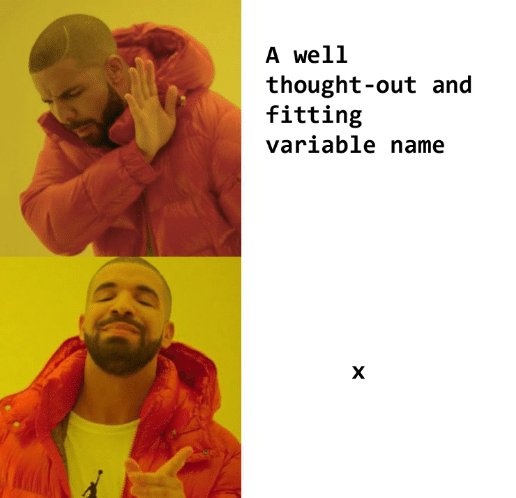
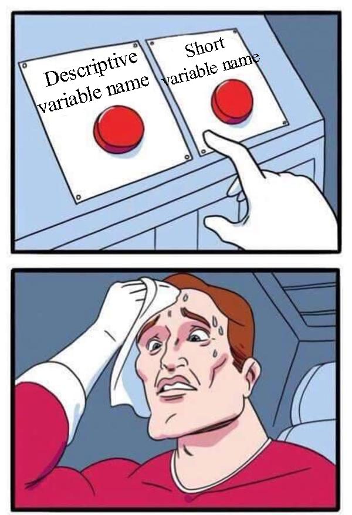

Naming Variables: a proposal for a common standard
==================================================

Naming variables is crucial to have a clean and understandable code. When chosing a name for your variable you are technically free to use any characters you want, but a well chosen name will save you time and headaches. 

.. _varNameDrake:                  

    Please don't follow Drake's advice

In this section we will take a look at the principles of naming variables as well as a proposal for standarising the way we do so at Omni. As much as this is a guide, this is also a conversation starter to arrive at a commonly agreed naming scheme for all of our calculators. In an ideal world we will all follow the final version of these guidelines.[#f2]_

General rules for names in any program
--------------------------------------

Before we start with the specifics of our customJS code, it is important to remember what we should strive for. A variable name should fulfil a series of requirements. Those requirements are almost self-evident after you've seen enough code written by someone else. 

.. _varNameDecision:                  

For those who are wondering or want a reminder, here is a short list:

#. **Start with a lower case letter**: The convention for almost all programming languages, avoids code errors and helps with readability.
#. **Unique names**: Each variable needs a unique name. It's a "limitation" of all programming languages.
#. **Names should be standard**: Don't reinvent the wheel, if there's a common name for that quantity, use it.
#. **Be descriptive**: Don't be afraid to use self-descriptive names such as ``car_mass``, ``interest_rate`` or ``chartData``.
#. **Stay away from shortcuts**: Unless universally accepted, don't use acronyms. Things like ``roi`` (Return On Investment - Finance ) or ``t`` (Time - Physics) are acceptable. Others like ``ppm`` (for reading speed, Pages Per Minute) or ``e_in_obrt`` (Electrons in Orbital - Chemistry) are not acceptable as they make it harder to understand the code.
#. **Keep it Short**: The KISS simple applies here. Be concise, without sacrificing understandability. 

Now that we know what are the guidelines for naming variables, let's take a look at how to apply them to our calculators.

Calculator Variables
--------------------

The way our Beloved Belligerent (BB) converts variable names to labels in the calculator make it very convenient to use the underscore ``_`` notation for separating different words in one variable name. So we will write ``price_of_gas`` as opposed to the camelCasing alternative ``priceOfGas``. 

If we do so, then the label for that variable will automatically be set to *Price of gas* reducing the editing needed for each variable.[#f1]_

.. note:: 
  For calculator variables use only lowercase letters and separate each word with an underscore ``_``.

Since labels should also follow most (if not all) of the principles we have explained for naming variables, we can use this convention to ensure good naming variables and labels at the same time.  

Variables in customJS
---------------------

When in customJS we will find the need to create javascript variables. Some of them will represent the calculator variables mentioned before while others will be exclusively present in our customJS code. We can make it easier for the read to know which variable is which by following two simple rules.

We should name those variables related to the calculator variables the same as the ones in the calculator. It will be immediately obvious what variable in the calculator corresponds to which in the code making it easier for anyone to quickly understand and debug someone else's code when needed.

The second rule is to use cameCasing for javascript-only variables. camelCasing is a way of writing that gets rid of spaces in a sentence or collection of words by capitalising every letter that comes after a space. By using such visually different convention, one can tell at a glance if a variable might have a calculator counterpart or not.

For example, a calculator variable could be named ``price_of_gas`` but a similar variable that is only used inside customJS would be named ``priceOfGas``. 

.. note::
  In customJS, name variables exactly the same as you did in the calculator. If you create extra variables in your code, use camelCasing for better distinction at a glance.

It might sound very odd for many (specially the most experienced ones) to mix different writing conventions but since we have two very distinct types of variables (a situation almost never happening in real programming) it makes sense to get some clear visual distinction between them.

Value Setters/Selects and other data
------------------------------------

Sometimes you need to create a variable in customJS to hold some data that will be later be linked to a calculator variable. This is the case when you use a value setter or a value select. 

In such cases we should chose a name for the data variable that clearly states which variable it is related to. The best way to do so is by using the name of the variable and appending extra information to it. The convention we are proposing here is to add ``_`` and a descriptor of the type of variable at the end.

For example, if we have a value select to be associated to the variable ``price_of_gas_`` we would name the value setter variable ``price_of_gas_VSelect``. As we read the name of said variable it becomes obvious to which calculator variable it is related, what it contains, and in what format the information is stored. 

.. note::
  When you create variable for the sole purpose of storing data that will be related to a calculator variable, name the data variable exactly like the variable in the calculator and append ``_`` and the type of variable. Use ``_VSetter`` for both value setters and ``_VSelect`` for value selects.

There will be situations in which the same value setter/select will be assigned to more than one variable, or maybe one variable can have more than one value setter associated depending on user input. In those cases, exercise your right to freedom and do what you think is best in that situation.

A word on authoritarianism
--------------------------

At Omni we have never supported any kind of authoritarian regime, and naming conventions are no exception. As much as some would like to have strict rules with punishments for those not complying, we prefer to fight on the side of freedom. 

.. _varNameMeaningful:                  
.. figure:: varNameMeaningful.jpg
    :scale: 70%
    :alt: Choosing meaningful name meme
    :align: center

So, even if the rules above seems like a very strict system, you should feel free to do differently if you so wish. Treat each point as a strong suggestion rather. If you ever feel like you have a better system, go use it! We beg you to, at least, stay consistent with your own rules within the same calculator and we are very grateful that you kept the names of variables simple, yet descriptive so that we don't need to spend 30min deciphering each of your *"clever"* acronyms and abbreviations.

.. rubric:: tl;dr
In short: know the rules, do what you want, but please, please, try to be mindful of others. We all thank you for that.

.. rubric:: Footnote
.. [#f2] Then again, in an ideal world we would all communicate telepathically and I wouldn't have to write this. ¯\_(ツ)_/¯
.. [#f1] #marginalGains
