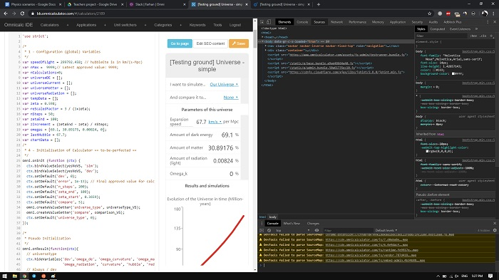
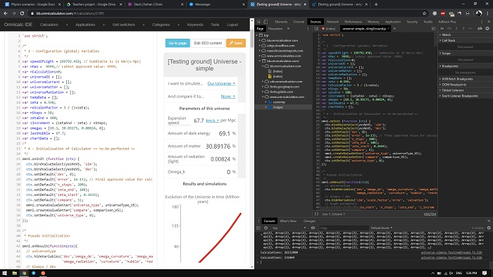

How to save a changes after a calculator crash
==============================================

Whenever you take on a big calculator project, something like a marketing calculator, you're bound to make mistakes in your code. Those mistakes have the annoying ability to break everything at the worst of times. 

Probably the most common example is when you are editing an existing ``for`` loop and suddenly the page freezes, becomes irresponsive and then crashes leaving you no hope to recover all the changes you've made in the previous hour and forgot to save. 

.. note::
  This trick works even when the whole webpage has crashed due to malfunctioning code.

Obviously prevention is your best friend, you should save after every major change to your code. However, we ain't perfect and we *sometimes* forget to save. So I'm here to tell you that if this happens to you ever again: *Don't Panic!*

We are going to see a way to recover all your changes after that fatal page crash in 3 simple steps.

.. rubric:: Enter the developer Console

.. _devConsole:

Bring up you browser's developer tools. Generally you can do that by pressing **F12** on your keyboard. You will see something like what we show in the picture above.

This is a powerful tool that helps real developers test, debug and improve their web code. We will simply ignore most of its features for now and focus on getting back our code.

.. rubric:: Navigate throught the folders

.. _devConsole:

We need to find the file that stores the last version of the code that was ran by the browser the one that includes all of our changes, including the mistake.

Navigate to the tab called **"Sources"** you will see a folder structure on the left of the developer tools. Look for a group named *"www.omnicalculator.com"*. Double clicking it should show the subfolders, find the one named *"customjs"* and double click on it. Now you should see a file name exactly like the ``slug`` of your calculator, double click again to open it.

The customJS code that you wrote before the calculator crashed should appear inside the developer tools. You might think you're done but there's a very crucial step you still need to take.

.. rubric:: Fix your mistake before pasting it back

Remember that the calculator crashed because there was some mistake in the code it was executing? That mistake is still there in the file you are seeing right now. So before you copy it and paste it again in your calculator, you need to fix it. 

You can edit the code directly on the developer tools, or you can copy it all onto a text editor, fix your mistake and the paste it back on the calculator. However you do it don't reload until you are certain you got the code you needed somewhere safe. 

After making sure you're safe, you can reload the webpage, paste your code and **Immediately** safe the calculator so that you don't lose those changes again. 

.. tip::
  You can do the same thing from the calculator webpage, not only from BB.
