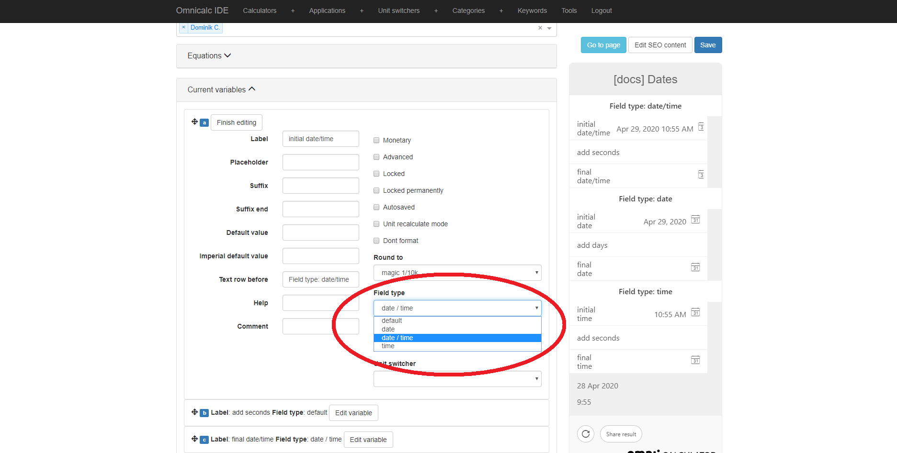

.. _dating:

Dating by yourself (or how to play with time in customJS)
=========================================================

Just like in love life, in a programmer's life dates are never easy to manage. When it comes our human ways to measure time, they are all very unscientific and convoluted. Not only do we have different time zones (which are a problem in and of itself) but we also have strange conversions between units of time that unintuitive at best.

To deal with all of these computers keep track of time using the SI system (that is, in seconds) and using the 1st January 1970 as the reference point from which we start counting our dates. The idea is that after we have a standardised number, we can build our functions and conversions so that we can format this time according to our needs. This way of measuring time is called UNIX time or Epoch time. You can learn more about it `here <https://www.omnicalculator.com/conversion/unix-time>`__ . [#f1]_

Luckily for us, we don't need to create from scratch the aforementioned functions and conversions. We can make use of what others created, and that's what we're gonna talk about.

Dates in javascript (``Date`` class)
------------------------------------

Javascript has its on class to manage time and dates called ``Date``. By using objects of this class we can simplify the way we manage date formats and not need to worry about how many seconds have passed since a weird date in the 70s.

.. note::
  Check out all the available options for the class ``Date`` by in `Mozilla's documentation <https://developer.mozilla.org/en-US/docs/Web/JavaScript/Reference/Global_Objects/Date>`__

The class date requires an input parameter being the Unix time corresponding to the date of interest **in miliseconds**. There are many ways to create and initialise and object of the class ``Date``, by far the most commonly used is: ``var date = new Date()`` where we set the time of the variable ``date`` to **now**, meaning the time at which the code was ran.

Once we have an object like that we can obtain the corresponding month, year, day... in human readable format by using the built in *get* methods such as ``getMonth()``, ``getYeat()``... as well as methods for performing mathematical operations on dates.

Dates in Omni Calculators
-------------------------

Dates in our beloved customJS and Omni Calculators are treated very similarly as it is in any other computer-based technology. However, given that we have 3 different options for the user to input time dates into the calculator, we need to be mindful of their differences. 

.. _fieldType:                  

You can select the type of date variable in the calculator under the option **Field type**. Each of them have a similar behaviour but use different base units.

* ``date`` - It presents the user with a selectable calendar date without specifying the time in the day. The **base unit is days**.
* ``date/time`` - It presents the user with a selectable calendar date with the ability to specify the time in the day. The **base unit is seconds**.
* ``time`` - Allows the user to select a time in the day, but not a day in the calendar. The **base unit is seconds**.

The implications of having one base unit or another are just to do with the value you will get when using ``ctx.getNumberValue`` and the conversions you might need to do when operating with them mathematically (adding, subtracting, multiplying...)

.. tip::
  If this all sounds slightly confusing, Dominik has created a calculator to showcase the usage of dates in Omni Calculators. Check it out as `[docs] Dates <https://www.omnicalculator.com/adminbb/calculators/2066>`__ on BB.

Useful tricks to format time
----------------------------

Global variables
~~~~~~~~~~~~~~~~

When you are dealing with dates and times it is often needed to perform standard conversions constantly. We recommend creating a global variable with the conversion values. Your code will be more readable, your conversions easier to make and you will avoid numerical mistakes.

We recomend using clear names that explain the conversion factor, here are some examples: ``secInDay``, ``dayInYear``, ``hoursInMonth``,...

Reusing someone else's work
~~~~~~~~~~~~~~~~~~~~~~~~~~~

Dealing with time variables and date conversions is one of the most common problem in the coding world. If you search online you will surely find someone else's code that does exactly what you need to do. You can simply copy and past it in your calculator [#f2]_ . 

The :ref:`Omni-Repository<repo>` is also a great place to search for such functions. If you can't find any, build your own and submit it!

tl;dr
-----

* Computers store dates as time elaps since a fixed date.
* You can use javascript's build in ``Date`` objects to painless manipulate time and dates
* Omni Calculators will do most of the work with date, just make sure you choose the appropriate type.
* Copy, reuse, and create your own functions and global variables to simplify your work when you need to manage date in customJS.
* For practical information check out the calculator on BB.

.. rubric:: Footnotes

.. [#f1] Shameless plug, I know ;)
.. [#f2] It is generally a good idea to give credit to the original creator by mentioning him/her in the comments of your code
