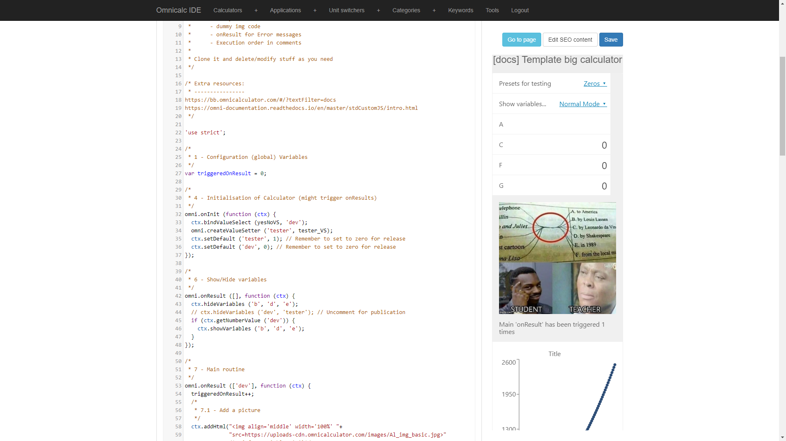

The template: a starting point for your cJS adventure
=====================================================

Writing your own customJS can seem daunting, specially at the beginning. Where do I start? How do a create a chart? ... These are questions we ask all the time and to answer them we have to search BB trying to remember which calculator had a chart, or an image on it so that we can copy the code and modify it for our needs. 

To avoid all that hassle, we have created the **Template Calculator**, a calculator that contains all the commonly used features and some extras to make your life easier.

Let's see what this template contains and how to use it efficiently, so that we can work less while doing more.

.. note::
  You can find the template calculator on BB as the `[docs] Template big calculator <https://www.omnicalculator.com/adminbb/calculators/2050>`__ Clone it and start using it!

What is in the template
-----------------------

The template is a working calculator that has no real function. It includes most the regularly used features and omni-functions and severs as a great starting point for when you are creating a cJS-heavy calculator.

The first thing you will find is a block of comments at the top indicating the preferred style of commenting as well as containing a description of the calculator and useful links (namely to all the sample calculators and the documentation).

.. _templateImg:

After that, the calculator starts with the optional ``'use strict';`` statement. Then we can see a common structure in which a block of comment describes what is (or should) appear right below it. Each block comment has a number assigned to it. 

The number might seem random, but for those experienced in the ways of cJS, they will know is the :ref:`Order of Execution<orderOfExecution>`. It indicates in which order that code is executed. So 3 will be executed before 4 and 7 will come after 6... I think you get it.

The calculator has 7 distinct parts that we will explain briefly here.

Parts of the calculator
~~~~~~~~~~~~~~~~~~~~~~~

According to the order of execution, these are the sections of the Template calculator.

.. rubric:: 1 - Global variables

This is where you place any *configurarion* variables that should be visible for any other function and must not disappear or be reset. We explained how this works in :ref:`The life and death of a variable<scope>`.

.. rubric::  4 - omni.onInit

The code placed here will be run once. Here is where you initialise your calculator with things like ``bindValueSelect``, ``setDefault`` and perform any operations necessary before the user can interact with the calculator.

.. rubric:: 6 - omni.onResult  *[Show/Hide]*

If you have a lot of variables to hide/show during the interaction with the calculator it is worth placing them in their own ``omni.onResult`` context. Almost always you will want this context to be triggered by any result so use ``[]`` as the triggering condition. Keep this function to **only show/hide variables**.

.. rubric:: 7 - omni.onResult *[Main]*

The meat and potatoes [#f1]_ of the calculator. For big calculators everything meaningful will happen here. For smaller calculator *EVERYTHING* can be included into this single ``onResult`` context.

In the calculator we have included a picture and a line chart. The line chart makes use of an external function (see point 2) to compute the values we want to be shown. Using extra functions to perform computations outside of the main loop helps with readability in complex mathematical expressions.

.. rubric:: 8 - omni.onResult *[Error messages]*

Just like we did with the show/hide ``onResult``, it is often convenient to separate *Error messages* from the main execution of the calculator. It helps your code be more clear and readable.

.. rubric:: 5 - omni.define

Any custom functions that we need will go here, between ``omni.onResult`` and javascript functions due to their importance. Once again, good naming practices guarantee that we don't need to read the code inside of them to know what they do.

.. rubric:: 2 - Extra functions

Any pure javascript function that you need to create for your calculator is placed here. It will be created at the beginning so that it is always available to be used by the calculator. Following a strong naming scheme allows for these functions to be written near the bottom of the code so that they don't clutter the main actions.

.. rubric:: 3 - Data variables

All the static data you need for your calculator comes here. If you use good :ref:`variable names`<naming_variables>` their content and role should be obvious to any reader and therefore we can get away with placing it at the very bottom of the calculator code.

.. rubric:: Extras available for development

The calculator also includes a simple value select and a simple value setter. Their main purpose is to be used as templates to copy and modify to your needs.

They also serve an additional role for complex calculator. The value select can temporarily cancel the show/hide behaviour in ``onResult``, which can be very helpful when trying to debug computational problems.

The values setter has some preset options for the variables, so that with a simple click you can simulate and test different inputs, mimicking a potential user's behaviour. 

Feel free to tune them to your needs or ignore them if they don't seem convenient to you.

How to use the template
-----------------------

.. _cloneImg:

To use the template is very simple. The first thing you need to do is to **CLONE THE CALCULATOR**. Never work on the original version as you could create inconveniences for the next calculatorian that wants to use it.

Once you have clones it, you can work on it as you like, it is yours. Modify, change, delete, add functions and code as you need or want. All the features, orders, naming schemes and behaviours are proposed ones, you don't need to use them if you don't want them. 

tl;dr
~~~~~

When you want to create a new calcualtor with a lot of cJS, the Template Calculator is a good starting point. It contains a suggested organization and several examples of the most common functions. **Clone it first** and modify it to your heart's desire afterwards. 

.. rubric:: Footnote
.. _[#f1] For vegetarians it would be the... "tofu and potatoes", I gues
