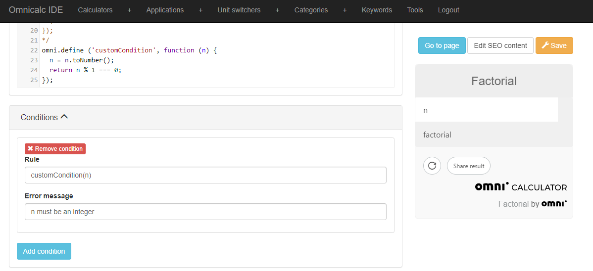

.. _addumet:

Add custom conditions (Error Message)
-------------------------------------

The function displays a custom error message under the field in focus (the field you are entering data in). The error message is always displayed in red.

This function provides some of the functionality that can be found on the `Conditions` tab on BB. It allows you to set a error message from inside customJS. It does not, however, stop the calculator from functioning like it would without the error message. Any behaviour you need to complement the error message needs to be manually coded.

We tend to favour customJS version of bb functionality for flexibility, but in this case the behaviour is different enough that you should just chose whatever suits your needs best.

Syntax:
~~~~~~~

Since the function only shows an error message the syntax is very simple. If you plan on implementing this function remember to set up proper conditions. Using statements like ``if``, ``else``, ``switch``... You can learn more about them in the section about :ref:`javascript statements<execOrder>`.

.. code-block:: javascript

    var text = "Error message";
    ctx.addUnmetCondition(text);

.. warning::

    This function only works inside a ``onResult`` context.

Arguments
~~~~~~~~~

Text
''''

A string containing the error message you want the user to see. Since the position of the message will depend on which field the user has set focus on, make the message as complete and understandable as possible.
    
+------+--------+----------+---------------+
| Name | Type   | Required | Description   |
+======+========+==========+===============+
| text | string | Yes      | Error message |
+------+--------+----------+---------------+

.. note::

    If you are planning to use this function make sure to set the conditions
    you want correctly and manage the error in a way that the user is not
    confused by it. A typical way to handle and error is to hidden the variable
    that will have a strange value such as ``NaN`` or ``Infinity``.

    .. _customCondition:

Adding custom conditions that stop the calculator
-------------------------------------------------

The ``ctx.addUnmetCondition`` shows an error message in the calculator but does not stop the calculator from computing anything. They are useful for warning users about unexpected behvaiour or strange results. If you want to prevent the user from calculating things with certain outputs you need to use the built in the **Conditions** tab in the calculator creation page. You can set your conditions directly there, or you can create your custom conditions using customJS.

To create a personalised condition in customJS you need to create an omni-function using ``omni.define``. This function must return a boolean variable (numbers work with ``0`` meaning ``false`` and all other numbers meaning ``true``). This function must have at least one input parameter.

Once create you simply call that function from the **Rule** field of your new condition. Remember to specify the variable(s) you need for the valuation to run.

.. code-block:: javascript
  
  omni.define('customCondition', function (n) {
    n = n.toNumber();
    return n % 1 === 0;
  });

.. _customConditionImg:

    Example of using a function to create custom conditions.

When the value returned by your custom function is ``true`` the calculator will execute normally. If the return value of your function is ``false`` then the calcualtor will stop the calculations and show the error message you defined in the **Conditions** tab. In the picture above you can see an example where our custom conditions are handled by a function named ``customCondition``.
