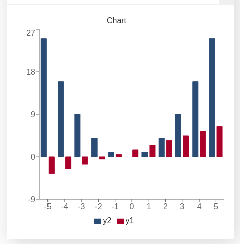

.. _barChart:

How to create a bar chart
=========================

We are now going to take a look at how to create a ``bar`` chart, but this time we will not use statically created values like in the section :ref:`addChart<addChart>`.

When making a calculator the data normally has to be... calculated (surprising, right?) based on the input given by the user. Behind this calculation there is always a **function that depends on some parameters**, normally it's either *x* or *time*, but could be anything.

To create the data we will use a ``for`` loop and we will use the method ``push`` which **adds a new entry at the end of an array**. Our '*entry*' represents a point and is an array with the values we want to display.

Practical example
-----------------

We first define the example function: ``f(x) = xⁿ + offset``. We will display the data from ``x = a`` to ``x = b``. The user will input two different values for ``n`` and ``offset`` giving us the chance to show several datasets in one graph.

Our goal here is to create a bar chart that will show two different functions together. The user will define ``n`` and ``offset`` for each of our functions. 

.. _barChartIMG:

   Example of a bar chart with two user defined functions

We have chosen the following colours for this chart: **red2** (for ``n1`` and ``offset1``) and **blue** (for ``n2`` and ``offset2``) which corresponds to positions **11** and **1** in the array of data [#f1]_ as shown in the :ref:`color coding in charts <colorChart>` picture we showed in a previous section.

.. warning::
    The position of the labels need to match the position of the data in the array, otherwise the data will not be shown.

.. seealso::
    We have created a calculator using this code so that you can see the results for yourself. Check it out at `Charts (bar) <https://www.omnicalculator.com/adminbb/calculators/1993>`__ on BB.

Code and comments
-----------------

Let's look that the example code now:

.. code-block:: javascript
    :linenos:
    :emphasize-lines: 12-17

    'use strict';

    omni.onResult(['a','b','offset1','n1','n2','offset2'], function(ctx){

        var chartData = [],
            n1 = ctx.getNumberValue('n1'),
            n2 = ctx.getNumberValue('n2'),
            offset1 = ctx.getNumberValue('offset1'),
            offset2 = ctx.getNumberValue('offset2'),
            a = ctx.getNumberValue('a'),
            b = ctx.getNumberValue('b');

        for (var i = a; i <= b; i++){
            chartData.push([mathjs.format(i, 2), // x-value
                            mathjs.pow(i, n2) + offset2, // blue y-value
                            ,,,,,,,,,      // black data to match color
                            mathjs.pow(i, n1) + offset1 // red2 y-value
                           ]);
        }
        ctx.addChart({type: 'bar',
                      labels: ['x', 'y2',,,,,,,,,, 'y1'],
                      data: chartData,
                      title: "Chart",
                      afterVariable: "",
                      alwaysShown: false
                    });
    });

As you can see, there is little to no difference between making a basic ``bar`` chart and making a ``line`` or ``area`` chart. We have purposely not activated the option to *stack* the data as this option is very prone to errors.

.. warning::
    **WARNING**: *Stacking* option only works in very specific and simple scenarios. Before you use it we recommend you check the section :ref:`Stacking a.k.a. playing Jenga<brokenStacking>`.

The ``bar`` chart is ideal for situations in which data is presented in chunks (a.k.a. discrete data). Financial calculators make the most use out of it to show monthly payments/earnings or any other kind of data where we are interested in the total value over a period of time rather than instantaneous values.

.. tip::
    For cleaner code that is easy to understand consider using functions when performing complex operations inside the *for* loop. You might also want to look up the `map method <https://www.w3schools.com/jsref/jsref_map.asp>`__.

    ..
        You might also want to look up the :ref:`Advanced uses of arrays<advArray>` section or the `map method <https://www.w3schools.com/jsref/jsref_map.asp>`__.

.. rubric:: Footnotes

.. [#f1] The first position in an array is the position "**0**" (zero) and corresponds to the x-value.
