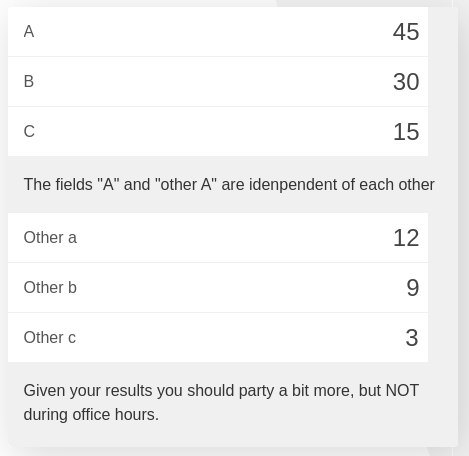

.. _custommsg:
Custom Message in Calculator
=============================

In this example we will show a custom text message in the calculator. The
result will look something like this:

The messages can be static (always the same) or dynamic (reacting to user input), and they can be located anywhere in the calculator.

For our **first example** we will look at the simplest version: the static message that is always shown.

.. seealso::
    We have created a calculator using this code so that you can see the results for yourself. Check it out at `Custom Message <https://www.omnicalculator.com/adminbb/calculators/1940>`__ on BB

Static messages
---------------

In this example we will make a custom message for our calculator. It will appear after the variable named ``c``. The message will always been shown no matter what happens with the variable ``c``.

.. code-block:: javascript
    :linenos:

    'use strict';
    omni.onResult(function(ctx){
    ctx.addTextInfo('The fields "A" and "other A" are independent of each other', 
                    {afterVariable: 'c'}
                   );
    });

.. note::
	For the message to be shown at all times we need to trigger ``onResult`` from the beginning. We can do that by setting default values on our variables.

This kind of message is typically used as a second title for the calculator, mostly when the variable above switches between different behaviours in the calculator. It can also be used as an alternative to **Text row before** to separate variables in a calculator without creating different blocks of calculator.

It could also be a way to convey and **describe better the results** in terms that would be understandable by everyone. For those kinds of situation we typically use dynamic messages like the ones below.

Dynamic messages
----------------

Dynamic messages are **messages that change**, they react to the behaviour and results of the calculator. We will see here the most typical example, which is a message explaining the meaning of the numerical result. 

Any result that requires some kind of knowledge to be understood should include a short message with the **interpreted results**. A good example of this are medical calculator in which the results of a test are expressed as number and need to be interpreted by a professional in order to asses the effect on the patient's health.

.. code-block:: javascript
    :linenos:

    'use strict';
    omni.onResult(['a', 'other_a'], function(ctx, _a, _other_a){
        var sumA = _a.toNumber() + _other_a.toNumber();
        var commonTxt = "Given your results you should";

        if (sumA > 0) {
            ctx.addTextInfo(commonTxt + " party a bit more, but NOT during office hours.");
        } else {
            ctx.addTextInfo(commonTxt + " go see a REAL doctor. No, youtube doesn't count.");
        }
    });

As you can see here the text displayed changes depending on conditions set on the values calculated. It also exemplifies the usefulness of **concatenating strings** so that you don't have to re-write text that is the same in all cases. Just another example of :ref:`Striving to be lazy as a programmer <lazy>`.
