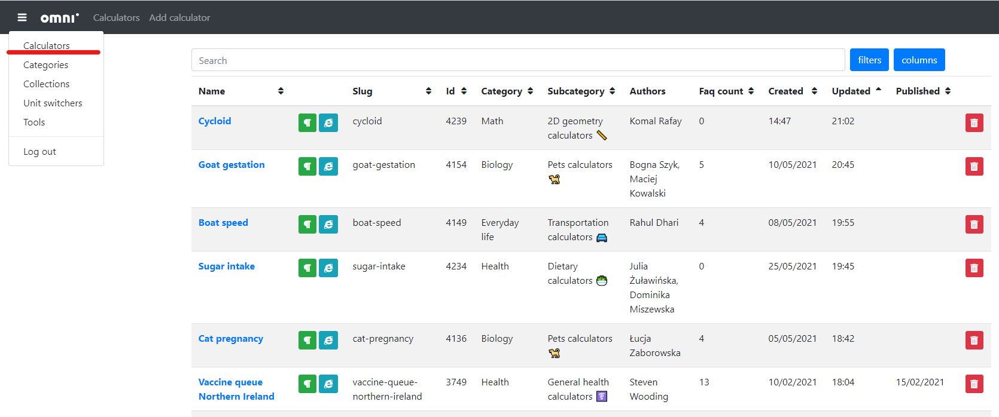
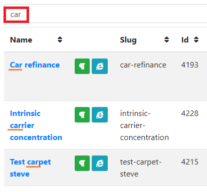
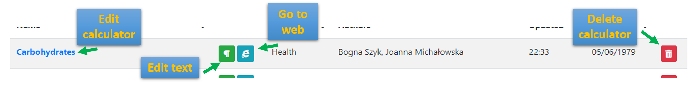

.. _calculators:

Calculators
=====================

The calculators tab is the **default one** when logging into `adminBB
<https://www.omnicalculator.com/adminbb>`__. You can create a new calculator or find any existing one by its name or ID, go to its edit page, or check some of its basic information.

.. _calculatorsIntro:

    The start page of adminBB

The upper panel of the edit calculator page contains the following items, from left to right:

* **Three-bar hamburger menu** — Access other parts of adminBB.
* **Omni logo** and **Calculators** — The link to the current page, you can use it as a refresh button 🔄.
* **Add calculator** — Creates a new calculator and takes you there.

Search panel
------------

You can search a calculator by its **name** or **ID**:

* Typing a **string** returns all the calculators with this phrase in their names (it can also be a part of the word, not necessarily an exact match).
* Typing a **number** returns only the calculator with that ID (if it exists).

.. _calculatorsSearchExample:

    The example of using the search panel. See that names with words containing the phrase **car**, e.g. **carrier**, show up as well.

Filters
-------

By defining some of these filters you can limit the search results depending on your needs:

* **Is published** — *Yes* shows published calculators, *No* shows unpublished ones.
* **Purpose** — You can choose between *production*, *non production*, *temporary*, or *unassigned*. You can check these descriptions :ref:`here <detailsPurpose>`.  
* **Categories** — Shows calculators within a chosen category.
* **Author** — Shows calculators by the selected author. 
* **Redundant** — *Yes* shows :ref:`redundant  <detailsParentRedundantCalc>` calculators, *No* shows all the others.
* **Faq count** — Shows calculators with FAQs within given range.
* **Updated at** — Shows calculators which were updated between the given dates.
* **Published at** — Shows calculators published between the given dates.

Selecting multiple options for one field shows every calculator that matches **at least one of them**. For instance, if you choose two authors, you'll see **all** of their calculators - they don't have to be co-authors of any 😉.

Columns
-------

Here you can decide which calculators' attributes you want to see. **Name** is always visible and you can choose which of the remaining ones are important for you. These are:

* Slug;
* ID;
* Category;
* Subcategory;
* Authors;
* Faq count;
* Created;
* Updated; and
* Published.

.. note::
  You can always come back to *default* settings by pressing **Reset** button.

Editing and deleting calculator 
-------------------------------

.. _calculatorsLinks:

    The calculator's clickable attributes on adminBB

There are a few clickable elements that let you interact with a calculator:

* **Calculator's name** — A link to the :ref:`calculator's edit page <editCalculator>`.
* **Paragraph symbol** — A link to the :ref:`calculator's text edit page <editCalculatorText>`.
* **Internet Explorer symbol** — A link to the :ref:`calculator's web page <calculatorPage>`.
* **Trash bin icon** 🗑️ — Lets you **remove the calculator**. To do so, you need to confirm the action by entering the calculator's slug.

.. warning::
  **DO NOT delete published calculators!** You may want to remove one of those you've started but you're no longer working on. However, it's usually safer to simply change its purpose to **temporary** as these will disappear sometime in the future.
