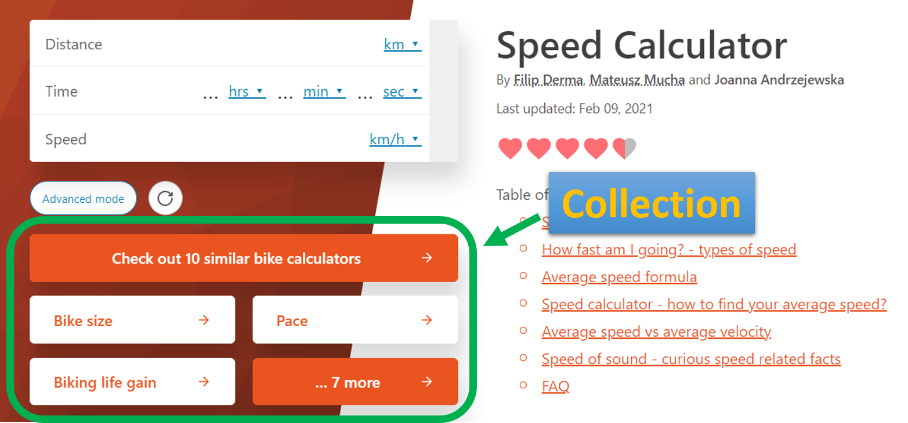

.. _collections:
Collections
=====================

Collections help us **group calculators** that are closely **related thematically**. They don't need to be of the same category. We usually create collections for marketing purposes. 

A few of **other calculators from the same collection display below the calculator**. If the calculator doesn't belong to any collection, you can see a set of calculators from the same (sub)category by default.

.. _collectionsExample:

    The calculators from "Bike calculators" collection show up below speed calculator. See that speed belongs to "Everyday life" category, while bike size is the one of "Sports"

.. note::
  A calculator can belong to **more than one collection**.
