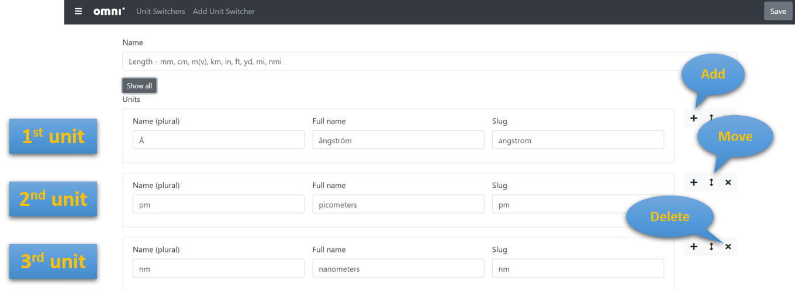
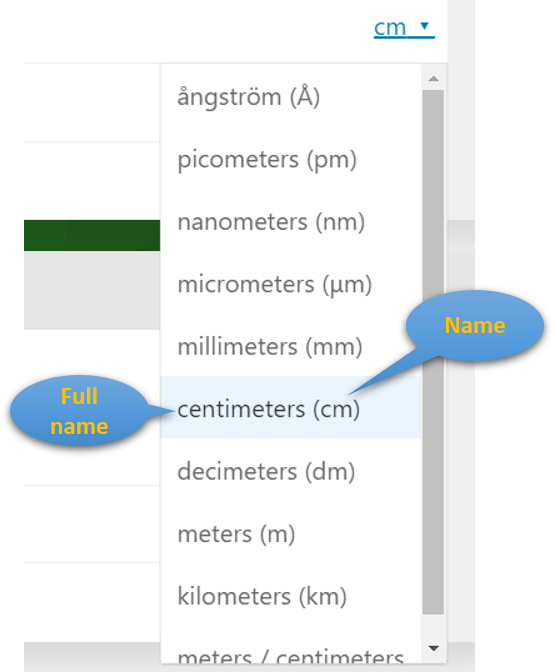

.. _unitSwitchers:
Unit switchers
=====================

Unit switchers make our life easier as they provide us the **list of units we can switch between without worrying about proper conversion rates**.

In this unit switchers menu, you can check all of the existing unit switchers or create new ones.

By clicking a unit switcher's name, you enter the unit switcher tab:

.. _calculatorsLinks:

    The unit switcher's edit page
    
There are the following fields:

* **Name** — it should be as descriptive as possible. It's a good practice to mark which unit is the base one by adding *(v)* next to it. 
* **Show all/Collapse all** — shows or hides some of the units' fields. More on this at the end of the next section.
* **Units list** — each item has identical structure and attributes.
* **Add, Move, Delete buttons** — let you reorganize the number and order of units.

.. warning::
  If you decide to **remove a unit** from an existing unit switcher, make sure **it isn't used in any of the calculators**.

Units' attributes
----

Here is the list of units' fields you can edit:

.. _calculatorsLinks:

    Units' attributes visible on a calculator page

* **Name (plural)** — it's usually the short version of a unit, e.g. *cm*. You can see it next to the long name in the bracket.
* **Full name** — expansion of the abbreviation/acronym.
* **Slug** — a unique attribute that helps distinguish between units and prevents duplicates.
* **Vaule** — a conversion rate between units. The default unit has value ``v``. For instance, if the default unit is ``meter (m)``, then the value for ``centimeter (cm)`` is ``100*v``. 
* **Reversed name (singular)** — usually the same as **Name** unless there is a difference between singular and plural. It's used when the box `Works in reverse <https://omnigeneraltips.readthedocs.io/en/latest/generalTips/calculatorStructure/groupsAndVariables.html#works-in-reverse-checkbox>`__ is checked.
* **Reversed full name** — the analogous relationship as between **Full name** and **Name**.
* **Comment** — use it, e.g., to explain a specific application of the unit.
* **Available by default** — check the box for commonly used variables or leave it empty for less popular ones.

.. note::
  **Name**, **slug**, and **value** are **obligatory** fields for every unit. The remaining attributes are optional.

When you choose **Collapse all** only the name, full name, and slug will be visible. To see all of the others, you need to select **Show all** option.

Add Unit Switcher
----

To make a new unit switcher, go to *Add Unit Switcher* on the top panel. You need to **input the obligatory fields for at least one unit**. Click the *Save* button and a brand new unit switcher comes to live!

.. note::
  If you want to create a new unit switcher, make sure **there isn't any similar, already existing one**. Sometimes you may only need to add one or more units to one of the current unit switchers.
  
  
Unit Switchers naming convension
----

Ideally, the unit switcher's name should be self-explanatory and easy to find. A good name may also involve:

* Most common units;
* Default unit.

Sometimes, we add a prefix *zzz*, *xxx*, or others, to the unit swhitcher's name. It indicates that this unit switcher is **designed for a specific calculator** and it's **pretty unlikely it'll be used more often in the future**.
