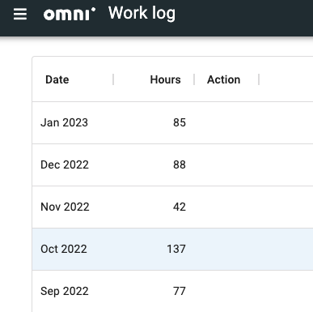

Work log
========

This page is where you will **submit the number of hours you have worked** for each calendar month. You will get reminded to do this in Slack.

    Example of the Work log page on adminBB.

To enter a **new entry** for the number of hours for the last month:

#. Click in the empty box and type in the number of hours you've worked.
#. Click somewhere else on the page.
#. Press the "Done" button.
#. You should get a confirmation message that your hours have been submitted.

If you make a **mistake**, please contact Magda on Slack to resolve the issue.
