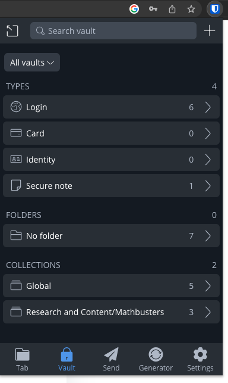
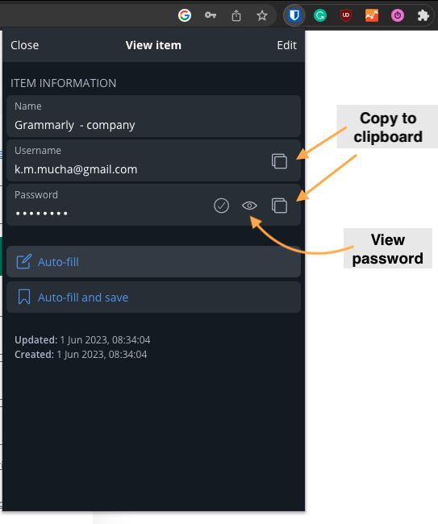
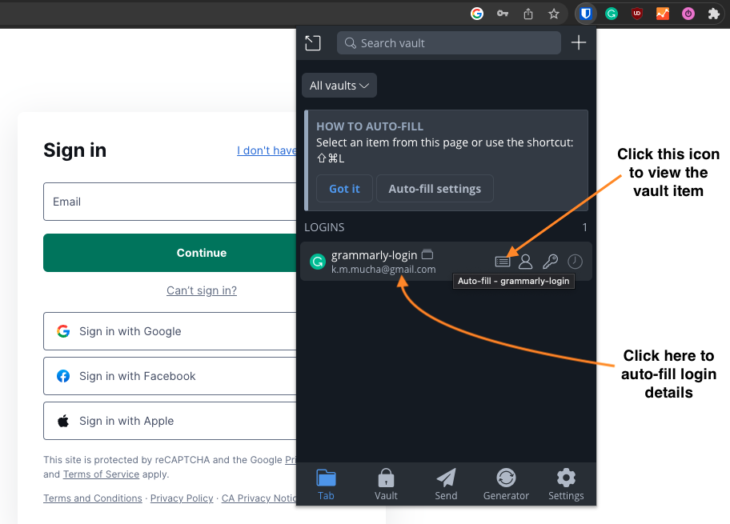
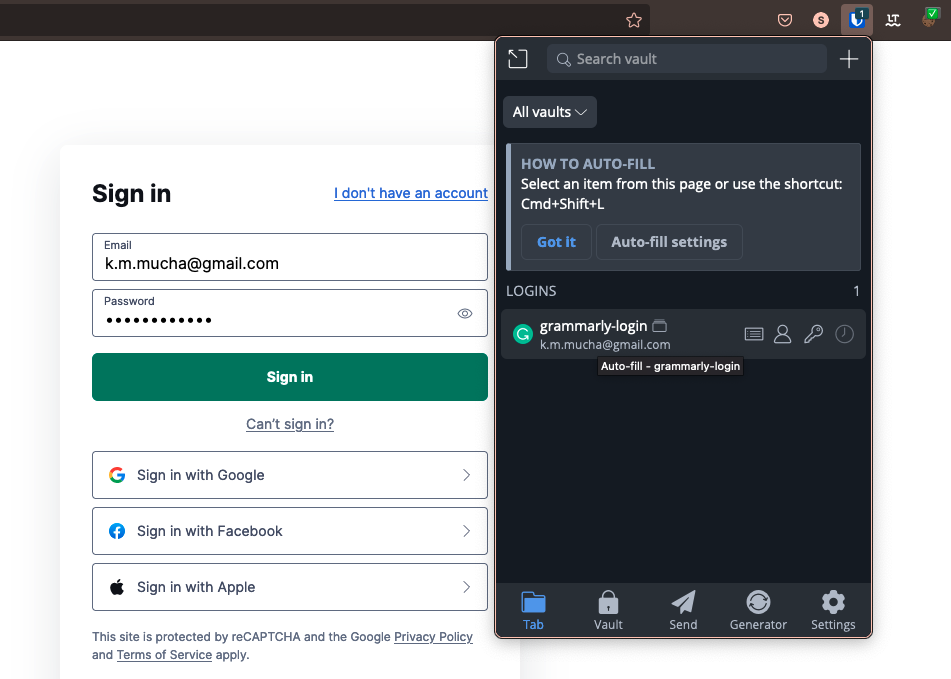

.. _Bitwarden:

Guide to Bitwarden
==================

What is Bitwarden?
------------------

Bitwarden is an open-source password management service that stores passwords and secrets in encrypted vaults. It is accessible on various platforms, such as Windows, MacOS, iOS, and Android. It also has Google Chrome and Mozilla Firefox browser extensions. At Omni, we will be using it to store and access passwords to common-use accounts.

Downloading Bitwarden
---------------------

You can download Bitwarden as:

* Android app from `Play Store <https://play.google.com/store/apps/details?id=com.x8bit.bitwarden>`_;
* Browser Extensions for `Firefox <https://addons.mozilla.org/en-US/firefox/addon/bitwarden-password-manager/>`_ and `Chrome <https://chrome.google.com/webstore/detail/bitwarden-free-password-m/nngceckbapebfimnlniiiahkandclblb>`_; and
* iOS app from `App Store <https://apps.apple.com/us/app/bitwarden-password-manager/id1137397744>`_.

How to use Bitwarden?
---------------------

You'll receive an email invite to join the organization and your team. Click on the invite link to:

* Create an account; and 
* Set a master password (make it long and not a password you use somewhere else). 

Once you log in and are in the vault, you'll have access to the passwords to the common accounts used by your teams. 

You can download the **browser extension to autofill** the passwords for the common accounts. If the password is reset, your team leader will update it in the vault, saving you the hassle of chasing down the new password.

You can find more information on how to autofill passwords for browsers on this `webpage <https://bitwarden.com/help/auto-fill-browser/>`_.

Password Vault
^^^^^^^^^^^^^^

Let's have a quick tour of the Omni Bitwarden Vault.

The main Vault view shows you all of logins and other item types that Bitwarden supports.

    Vault view of Bitwarden.

At the top, you can **search** for items and click on the plus icon to **add items** (these will be personal to you).

Next, you can view **all the vaults** (both personal and Omni) or just one of these vaults.

Then items are organized by **type**, **folders** (we only have one folder) and **collections** (we have items that are company-wide and items that are for each Calculatorian team).

Here is an example of an login item in the Omni Bitwarden Vault:

    Grammarly login item in the Omni Bitwarden Vault.

From this view, you can **copy** and the **username** and **password** to the **clipboard**, for later **pasting** into a website or app.

Auto-filling passwords
^^^^^^^^^^^^^^^^^^^^^^

The easiest way to use Bitwarden to login to a site is to let it auto-fill the username and password for you. Here is how it works, step-by-step.

1. Go to the **login page** of Grammarly, SemRush, etc. We'll use Grammarly in this example.
2. Click on the **Bitwarden extension icon** in your browser application and you will see that the Grammarly vault item is ready to auto-fill the login details.

  When on the Grammarly website, the Grammarly vault item appears in the Tab section of Bitwarden.

3. Next, **click on the vault item**. You can click anywhere, except on the icons, which will do other things. Bitwarden will auto-fill the login details.
4. Continue with the Grammarly login process and you'll see the password has already been entered for you.

  Both the username and password gets auto-filled by Bitwarden.

.. tip::
  If auto-fill does not work for some reason, you can always click the **person icon** to copy the username and the **key icon** to copy the password to the clipboard.

Multiple Bitwarden accounts
---------------------------

If you are **already a Bitwarden user** and have an account, it might still prompt you to create a new account. In that case, you can log in to multiple accounts and `switch between them <https://bitwarden.com/help/account-switching/>`_.

Note that you **can't switch between accounts on the browser extension**. The best solution is to download the `desktop version <https://bitwarden.com/download/>`_ of Bitwarden and copy Omni login details from there.