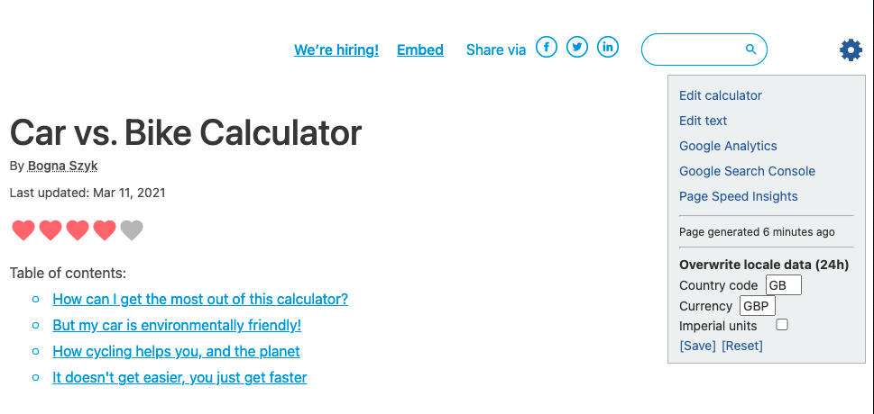

.. _buttons:

Quick links, page age, locale and revisions
===========================================

Quick links
-----------

.. _buttonsExample:

There are several handy links available to you once you click the **gear cog icon** in the top-right hand corner of the calculator page.

* :ref:`Edit calculator <editCalculator>` — Opens the edit calculator page.
* :ref:`Edit text <writingTexts>` — Opens the edit text page.
* :ref:`Google Analytics <googleAnalytics>` — Opens the Google Analytics page for this calculator — shows traffic this calculator is getting.
* :ref:`Google Search Console <searchConsole>` — Opens the Google Search Console for this calculator — show which keywords people used to find the calculator.
* `Page Speed Insights <https://developers.google.com/speed/docs/insights/v5/about>`_ — Analyses the speed of the page *(mainly for develops)*.

For detailed documentation on each of these pages, click on the links in the list above.

.. tip::
  Clicking on these links will replace the calculator page. If you want to open them in a new tab instead, you can right-click on the link and choose **Open link in new tab** (or similar).

Page age
--------

After the list of links, information about **when the page was generated** is shown. This is so you know whether you are looking at a version of the calculator that includes the changes you just made, or an old version. Try **reloading the page** to get the latest version (this can take ~10 minutes).

.. _buttonsOverwrite:

Overwrite locale data
---------------------

To help test your calculator as if you were a user in another country, you can change the locale data.

There are three settings to play with:

* **Country code** — Allows you to change the country you report to the calculator. Use the standard `two-letter country codes <https://www.iban.com/country-codes>`_.
* **Currency** — Allows you to change the currency you report to the calculator. Use the standard `three-letter currency codes <https://www.iban.com/currency-codes>`_.
* **Imperial units** — Checking this box will make any variables that have a default imperial unit provided display that unit.

To make a change:

1. Make the changes you want.
2. Click the **[Save]** button.
3. Click the **Reset defaults** button (located below the calculator), in order to see the imperial units update.

Changes will remain in effect for **24 hours**.

To **reset back to your regular settings**, press the **[Reset]** button.

.. warning::
  Changed local settings apply **site-wide, to all calculators** and will remain for 24 hours or until reset.

Revisions
---------

Here you can specify the revision number of the calculator to display. Enter a number in the **Calculator serial** box and click on the **Set** link. The page will reload with that revision of the calculator.

The revisions section of the menu will be **shaded mustard** to indicate you are on a numbered revision and not the default live revision.

.. note::
  If you enter a number of a revision that **doesn't exist**, you will get a 404 error page. Just hit the back button to get back to the calculator. You can see which revisions are available on the :ref:`edit calculator page <calcRevisions>`.

Press the **Reset** link to go back to the default live revision.

Learn more about the revisions here: :ref:`calcRevisions`.