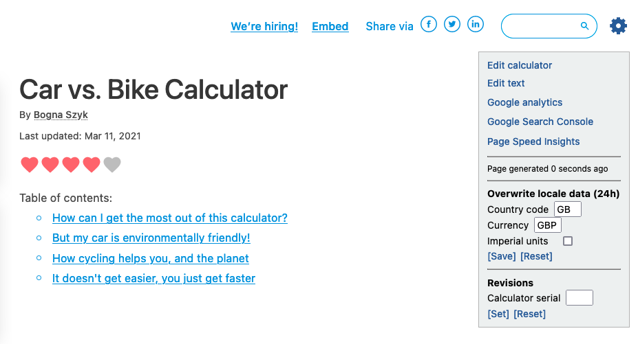

.. _buttons:

Quick links, page age and locale
================================

Quick links
-----------

.. _buttonsExample:

There are several handy links available to you once you click on the **gear cog icon** in the top-right hand corner of the calculator page.

* :ref:`Edit calculator <editCalculator>` — opens the edit calculator page;
* :ref:`Edit text <writingTexts>` — opens the edit text page;
* :ref:`Google Analytics <googleAnalytics>` — opens the Google Analytics page for this calculator — shows traffic this calculator is getting;
* :ref:`Google Search Console <searchConsole>` — opens the Google Search Console for this calculator — show which keywords people used to find the calculator; and
* `Page Speed Insights <https://developers.google.com/speed/docs/insights/v5/about>`_ — *(mainly for develops)* analyses the speed of the page.

For detailed documentation on each of these pages, click on the links in the list above.

.. tip::
  Clicking on these links will replace the calculator page. If you want to open them in a new tab instead, you can right-click on the link and choose **Open link in new tab** (or similar).

Page age
--------

After the list of links, information about **when the page was generated** is shown. This is so you know whether you are looking at a version of the calculator that includes the changes you just made, or an old version. Try **reloading the page** to get the latest version.

Overwrite locale data
---------------------

To help test your calculator as viewer as if you were in another country, you can change the locale data.

There are three settings to play with:

* **Country code** — allows you to change the country you report to the calculator. Use the standard `two-letter country codes <https://www.iban.com/country-codes>`_.
* **Currency** — allows you to change the currency you report to the calculator. Use the standard `three-letter currency codes <https://www.iban.com/currency-codes>`_.
* **Imperial units** — checking this box will make any variables that have a default imperial unit set display that unit.

To make a change:

1. Make the changes you want.
2. Click the **[Save]** button.
3. Click the **Reset defaults** button, in order to see the imperial units update.

To **reset back to your regular settings**, press the **[Reset]** button.

.. warning::
  Changed local settings apply **site-wide, to all calculators** and will remain until changed or reset.
