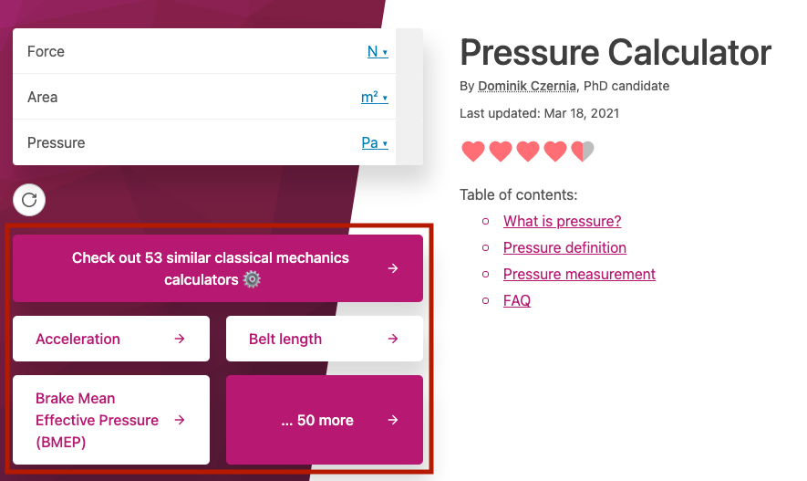

.. _checkSimilar:

Check out similar calculators
=============================

.. _checkSimilarExample:

  Below the calculator, there are links to the subcategory and similar calculators

To help the user discover more useful, related calculators, links are displayed underneath the calculator.

The first one is a link to the **same subcategory** that the current calculator belongs to. If the calculator doesn't belong to a subcategory, then this is a link to its **category**.

If the calculator belongs to a **special collection** of calculators, the link will be to this collection.

There are then links to the first **three** calculators in the subcategory / category / collection.

The **final link** is again to the subcategory / category / collection, but with an indication of how many more there are to explore.

.. note::
  The names of the calculators in these links come from the **Name** of the calculator. The convention is to **only capitalize the first letter of the first word**. That's why you should make sure your calculator's name is formatted correctly. For example, **Belt length** rather than **Belt Length**.
