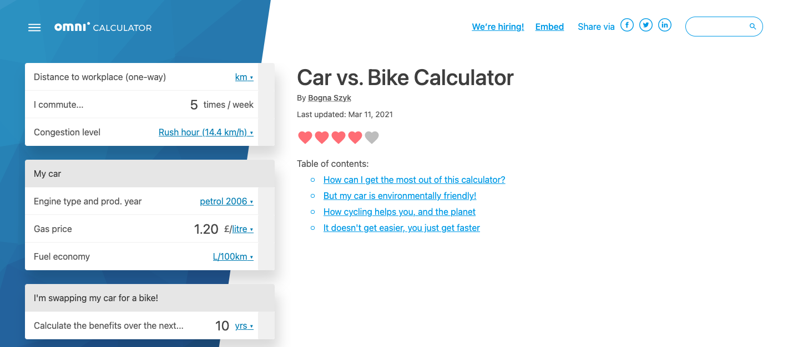

.. _calculatorPage:

Calculator page
=================================================

.. _calculatorPageExample:

The calculator page shows the finished result of your calculator and text. It is the **final version** and you should always double check how your calculator looks and performs here **before sending it for review**.

Read on to learn about some special tools available to you on the calculator page, and how the search bar can help you find internal links for your texts.

.. toctree::
  :maxdepth: 3

  buttons
  tableOfContents
  searchBar
  checkSimilar
