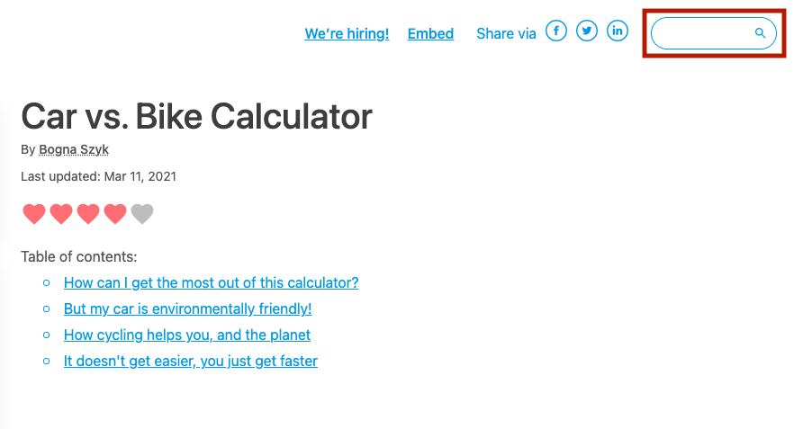
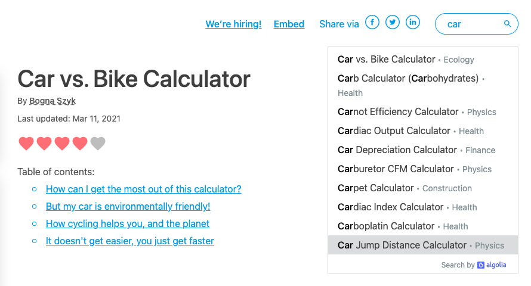

.. _searchBar:

Search bar
=====================

.. _searchBarLocation:

  You can find the search bar in the top-right corner of the calculator page (highlighted in red).

To find and discover other calculators that might help you or you want to link to, the best way is to use the **search bar** at the top-right of the calculator page.

Start typing in a keyword and the search results will appear underneath. The 10 best calculators are shown.

.. tip::
  To find more internal links for your calculator text, enter words from your text into the search bar to see if we have a calculator based on that word. Below is an example when entering the word "car".

  .. _searchBarExample:

If you are looking for a particular calculator and you can't seem to find it, you might have more luck using the search box at the top of the :ref:`calculator index page <calculators>`.