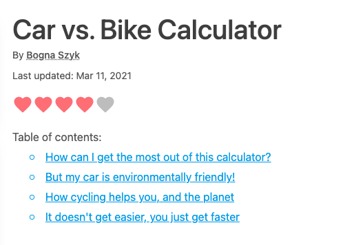

.. _tableOfContents:

Table of contents
=====================

.. _tableOfContentsExample:

Each calculator has a table of contents section at the top. This is created from the level 2 (``##``) heading names.

Clicking on one of these links allows the user to quickly get to that part of the text that interests them.

It is also useful for you when you want to link from one section of your text to another. You can do this by following these steps:

#. **Right-click** on the section heading you would like to link to and choose **Copy link**.
#. **Paste** the link into the text editor and remove everything before the ``#`` character.
#. Use Markdown to **create a link** in the form ``[link text](#heading-name)``.

For example, to link to the first heading in the Car vs. Bike Calculator (see image at top of page), you would do something like ``[see first section](#how-can-i-get-the-most-out-of-this-calculator)``.
