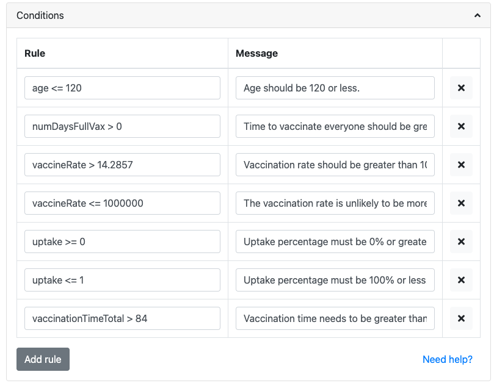

.. _conditions:

Conditions
=====================

We can enforce conditions on what the user can input for certain variables. We might want to do this for a variety of reasons:

* Avoid division by zero (an output of ``Infinity`` otherwise appears);
* Avoid NaN (not a number) results (e.g., certain trigonometry functions and values);
* Commonsense variable ranges (e.g., a person's age is probably not going to be much than 120 years); and
* Math definitions (e.g., percentages run from 0 to 100% – normally, anyway).

How to define a condition
-------------------------

.. _conditionsExample:

    Example of the conditions section of the edit calculator page. 

Type a rule you **don't** want users to break and a message they'll see if they do.
For example: rule ``a < 5`` enforces ``a`` to be smaller than 5. This means user will see warning (message) when they input ``a`` greater than or equal to 5.

In more detail, here are step-by-step instructions:

#. Open the **Conditions** tab and press the **Add rule** button.
#. Use the variable's name and inequality sign and a number to define the condition. For example, ``age <= 120`` says that the variable ``age`` needs to be less than or equal to 120 years.
#. Provide a **helpful message** to the user about why their input was rejected and what they can do to correct it. For this age condition, the message is "Age should be 120 or less."
#. To apply a new or changed condition, you **need to save** the calculator before it is reflected in the calculator preview.

Condition inequality operators
------------------------------

You can use the following inequality operators in your conditions:

* ``<`` – less than;
* ``>`` – greater than;
* ``<=`` – less than or equal to; and
* ``>=`` – greater than or equal to.

Specifying multiple conditions
------------------------------

To save writing serval rules, all with the same message, you can combine them into on rule by specifying more than one inequality in the **Rule** input field.

You do this by using a **comma** to separate each rule. For example, ``a > 3, a < 5`` means than ``a`` should be greater than 3, but less than 5.

Using math.js functions as condition tests
------------------------------------------

You can use math.js functions in your condition rules. Two of the most useful are:

* ``isInteger(a)`` – the value ``a`` must be an integer; and
* ``isPrime(a)`` – the value ``a`` must be a prime number.

Using Omni.define functions as condition tests
----------------------------------------------

If the simple inequality operators are not enough for a very complex condition, you can use Omni.define functions, as long as they return ``true`` or ``false``.

Detailed information on how to do that is covered in the CustomJS documentation section :ref:`customCondition`.

