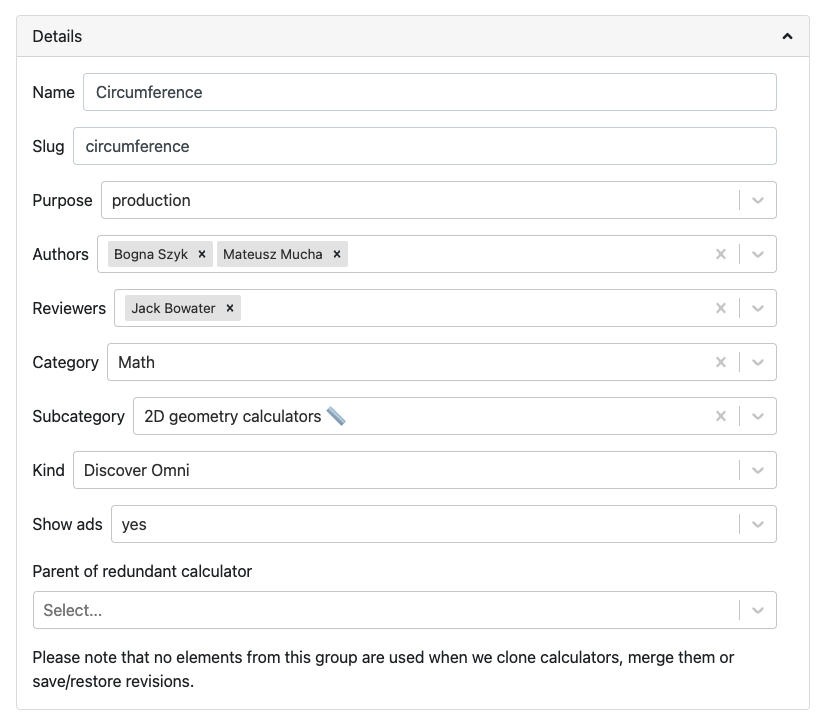

.. _details:

Details
=======

The **Details** section of calculator edit contains all of its main properties, such as name, author, category, etc. Let's go through each field and describe each one in detail.

.. _detailsExample:

  Example of the details section from the circumference calculator.

.. _detailsSlug:

Slug
----

The slug is the **last part of the URL** of your calculator's page on the website. It's usually the same as the name of the calculator, but with all lower case letters and hyphens replacing spaces.

Slugs are **unique site-wide**, even if the calculators are in different categories. You will get an error message on saving if the slug is unavailable.

.. tip::
  When creating a new calculator, just type in the **name** of the calculator and a slug will be automatically generated based on it. Pretty clever, right?

.. warning::
  **DON'T change the slug of a published calculator!** Doing so will negatively affect it's ranking on search engines, break any links that have been sent out to journalists or people's bookmarks.

Slug rules
^^^^^^^^^^

Here are the rules to help you create a great slug:

* DO use only **lowercase** letters;
* DO use **hyphens** between words;
* DON'T use underscore or spaces between words;
* DON'T use the word "calculator"; and
* DO try to keep the slug as **short** as possible.

*Examples of good slugs*: ``sphere``, ``roi``, ``sodium-correction``

*Examples of bad slugs*: ``spherevolumecalculator``, ``Return_on_Equity``, ``sodium-correction-for-hyper-and-hyponatremia``

.. _detailsName:

Name
----

This is the name of your calculator. It is used on the index of calculators and in links on the website to other related calculators. See below for the rules you should follow when naming your calculator.

Name rules
^^^^^^^^^^

* **DON'T** use the word "calculator" (if it's a converter, use the word "converter", though);
* **DO** capitalize the first word; and
* **DON'T** capitalize other words (unless they're "naturally" capitalized).

*Examples of good names:* BMI, Length converter, Acceleration, Ideal transformer.

*Examples of bad names:* bmi calculator, Ideal Transformer Calculator.

.. _detailsPurpose:

Purpose
-------

The purpose attribute of a calculator helps us organize them in terms of why they were created. The purpose attribute has the following options:

* ``production`` – This is the option to use for regular calculators that are to be published on the site.
* ``non production`` – Calculators used for testing, documentation, etc. Non-production are not destined to be published on the site.
* ``temporary`` – The calculator is not meant to be around for very long. This is the **default** purpose when you **clone** a calculator. Bear in mind that your old temporary calculators may be deleted in the future. This label will also help you clear up old temporary calculators that you no longer need.

Authors
-------

When you create a calculator, this field will be filled in with your name. If you write a calculator with the help of a fellow calculatorian, you can add them by clicking on this field and selecting them from the dropdown menu.

If you need to delete an author from a calculator, click the cross at the end of their name. Clicking the large cross at the end of the field will delete all the authors.

Category and subcategory
------------------------

Select the main category that your calculator falls into best. If you are not sure, ask on Slack. If that doesn't help, there is always the "**Other**" category for subjects that are hard to categorize.

Once you select a category, the field "**Subcategory**" will appear and you go through the same process again. Note, that you don't have to set a subcategory if your calculator doesn't fit any of them.

Kind
----

This setting is used to include a calculator in a special collection of calculators (e.g. the `Discover Omni <https://www.omnicalculator.com/discover>`_ collection). You should  probably leave this setting to the default, unless you are told otherwise.

Show ads
--------

This setting controls whether adverts are displayed on the calculator page. You should generally only change this setting if you are told to do so. This setting has the following three options:

* ``default`` — The calculator will use the current site-wide setting of whether ads are shown.
* ``yes`` — Forces adverts to be shown.
* ``no`` — Force adverts not to be shown.

.. note::
  Marketing calculators usually start off with not showing ads while pitches are being sent to journalists. Once the traffic picks up, adverts will usually be turned on.

.. _detailsParentRedundantCalc:

Parent of redundant calculator
------------------------------

For search engine optimization reasons, we might want to have sub-calculators that just do one thing that a larger, more complex calculator does. For example, the `area calculator <https://www.omnicalculator.com/math/area>`_ can calculate the areas of many shapes. A calculator that only calculators the area of a rectangle might be considered a redundant calculator.

This setting is used to organize a redundant calculator so we know which main calculator it belongs to. Specifying a parent will **make the current calculator redundant** and hide it from its category index page. You should only set a parent if you have been told to do so.

You can search for the parent calculator either by starting to **type its name**, or by entering its **ID number**.
