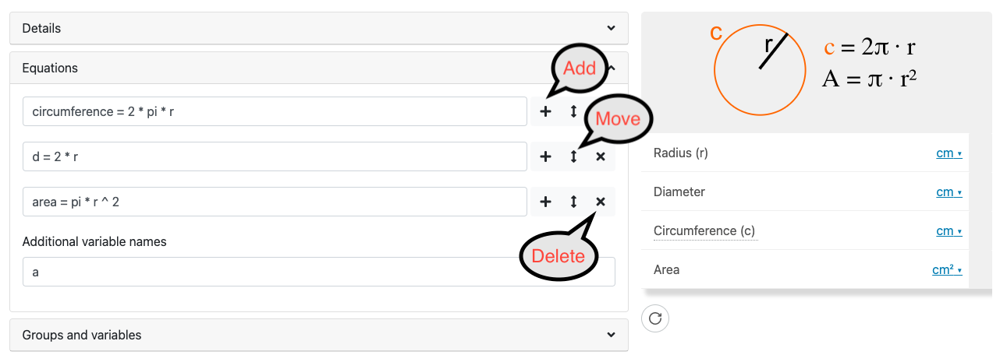
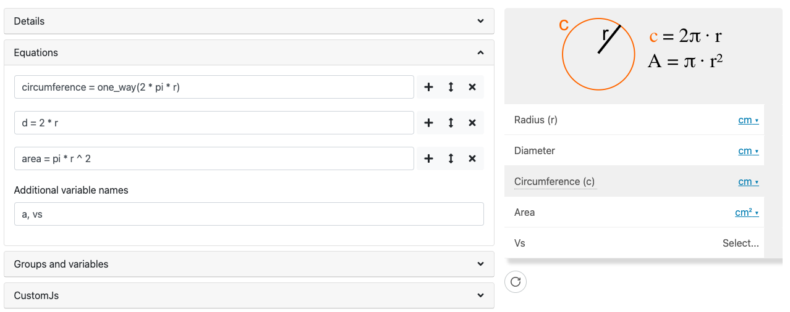

.. _calculatorStructureEquations:

Equations
=========

The equations section is the heart of most calculators. It defines variables and how they relate to each other mathematically. Let's look at a simple example; the circumference calculator.

.. _equationsExample:

    Example of the equations section from the circumference calculator.

We have three equations here, which you should immediately recognize. Each equation has three buttons to the right of them:

* A **plus button** to **add** another equation underneath the current one;
* A **reorder button** to **move** the current equation (useful for grouping similar equations); and
* A **delete button** to **remove** the equation from the calculator (this may also delete the variables, if they don't appear in other equations or the additional variable names section).

Always save after making changes to the equations section
---------------------------------------------------------

When adding, deleting and editing equations, you need to **save the calculator** for these changes to be reflected in the calculator preview. Note that this is not the case for changes made to the following sections: *Groups and variables*; *CustomJS*, *Value selects and Tests*.

Additional variable names field
-------------------------------

If you want to introduce any variables that are not related to the variables in the equations, you can add them here (see in the :ref:`figure above <equationsExample>`) as a comma separated list. Here are some common reasons you might want to do that:

* Add a variable for the sole purpose of **displaying an image or message** below the variable. This dummy variable should be **hidden** for this purpose.
* The calculator has a lot of **JavaScript** to handle the calculations, instead of using equations. So to create the variables in the calculator without writing them as equations, they need to be listed here.

Variable names
--------------

Generally, you should try to use **descriptive names** so someone else reading your calculator quickly knows what it is. For common equations, such as the circumference of a circle, it's OK to use the common algebraic representation (e.g. ``r`` rather than ``radius``).

.. warning::
  DON'T name any of your variable with a name from this list: https://www.tutorialspoint.com/What-are-Reserved-Keywords-in-Python

Reserved variable names
-----------------------

You may find that using a certain variable name gives an error. For example, trying to use the variable name`EulerGamma`gives the following error:

* ``Undefined symbol EulerGamma``

This is because it is present in the underlining Python library, but not available to us to use.

You should **change your variable name** to avoid this kind of name collision.

Constants
---------

In the equations section, you have access to a few special constants. One example is ``pi`` that gives you the value pi. Here's the full list:

* ``pi`` — the ratio of the diameter to the circumference of a circle (3.1416...).
* ``E`` — base of the natural logarithm e (2.7183...). 

Operators
---------

The following operators are available to you in the equations you write:

* ``=`` — equals operator;
* ``+`` — addition operator;
* ``-`` — subtraction operator;
* ``*`` — multiplication operator; 
* ``/`` — divide operator;
* ``^`` — power operator (e.g. ``2^2 = 4``); and
* ``!`` — factorial operator (one way).

Math functions
--------------

The following math functions are supported equations, organized by type.

Trigonometric Functions
^^^^^^^^^^^^^^^^^^^^^^^

* ``sin(x)`` — sine function;
* ``cos(x)`` — cosine function;
* ``tan(x)`` — tangent function;
* ``cot(x)`` — cotangent function;
* ``sec(x)`` — secant function; and
* ``csc(x)`` — cosecant function.

Inverse trigonometric functions
^^^^^^^^^^^^^^^^^^^^^^^^^^^^^^^

* ``asin(x)`` — inverse sine function (arcsin, sin\ :sup:`-1`);
* ``acos(x)`` — inverse cosine function (arccos, cos\ :sup:`-1`);
* ``atan(x)`` — inverse tangent function (arctan, tan\ :sup:`-1`);
* ``acot(x)`` — inverse cotangent function (arccot, cot\ :sup:`-1`);
* ``asec(x)`` — inverse secant function (arcsec, sec\ :sup:`-1`);
* ``acsc(x)`` — inverse cosecant function (arcscs, csc\ :sup:`-1`);
* ``atan2(y, x)`` — computes atan(𝑦/𝑥) taking two arguments 𝑦 and 𝑥. Signs of both 𝑦 and 𝑥 are considered to determine the appropriate quadrant of atan(𝑦/𝑥). The range is (−𝜋,𝜋].

Hyperbolic Functions
^^^^^^^^^^^^^^^^^^^^

* ``sinh(x)`` — hyperbolic sine of ``x``;
* ``cosh(x)`` — hyperbolic cosine of ``x``;
* ``tanh(x)`` — hyperbolic tangent of ``x``;
* ``coth(x)`` — hyperbolic cotangent of ``x``;
* ``sech(x)`` — hyperbolic secant of ``x``; and
* ``csch(x)`` — hyperbolic cosecant of ``x``.

Hyperbolic Inverses
^^^^^^^^^^^^^^^^^^^

* ``asinh(x)`` — inverse hyperbolic sine function;
* ``acosh(x)`` — inverse hyperbolic consine function;
* ``atanh(x)`` — inverse hyperbolic tangent function;
* ``acoth(x)`` — inverse hyperbolic cotangent function;
* ``asech(x)`` — inverse hyperbolic secant function; and
* ``acsch(x)`` — inverse hyperbolic cosecant function;

Rounding functions
^^^^^^^^^^^^^^^^^^

* ``round(x)`` — rounds ``x`` to the nearest integer (e.g. 2.5 become 3);
* ``ceiling(x)`` — rounds ``x`` up to the nearest integer (e.g. 2.3 becomes 3); and
* ``floor(x)`` — rounds ``x`` down to the nearest integer (e.g. 8.8 becomes 8).

All rounding functions return a **one-way variable** (user can't edit the variable).

Exponential function
^^^^^^^^^^^^^^^^^^^^

* ``exp(x)`` — exponential function, e\ :sup:`x`.

Logarithm functions
^^^^^^^^^^^^^^^^^^^

* ``log(x)`` and ``ln(x)`` — natural logarithm function ln(𝑥) or log(𝑥); and
* ``log10(x)`` — base 10 logarithm function. *One-way function.*

Minimum and maximum functions
^^^^^^^^^^^^^^^^^^^^^^^^^^^^^

* ``min(x, y, z, ...)`` — returns the minimum from the list of variables (any quantity); and
* ``max(x, y, z, ...)`` — returns the maximum from the list of variables (any quantity).

These are one-way functions.

Root functions
^^^^^^^^^^^^^^

* ``sqrt(x)`` — returns the principal square root of ``x``.
* ``cbrt(x)`` — returns the principal cube root of ``x``.
* ``root(x, n, k)`` — returns the *k*-th *n*-th root of ``x``. E.g., the cube root of 27 is ``root(27, 3)``.

Factorial function
^^^^^^^^^^^^^^^^^^

* ``factorial(x)`` — returns the factorial of the non-negative integer ``x``.

Forcing a one-way function
--------------------------

There is a special function, ``one_way()``, that turns whatever is inside into a variable that the user cannot edit. So instead of the default case where the user can edit both inputs and outputs, the user can only edit the inputs.

For example, let's modify the circumference equation so that circumference is only an output. We do this by changing the circumference equation to ``circumference = one_way(2 * pi * r)``, saving, and the preview of the calculator will look like this:

.. _equationsOnewayExample:

    Example use of the special function ``one_way()``.

The circumference variable is now **greyed out**, and the user cannot edit its value. This doesn't really make sense in this case, but there are a few reasons to do it:

* You really don't want the user to be able to input or edit a variable;
* You need to simplify the system of equations because the calculator can't be saved; and
* To make a variable read-only (another way is to lock the variable (see variable section)).

Troubleshooting
---------------

My calculator won't save
^^^^^^^^^^^^^^^^^^^^^^^^

For calculators with many equations, you may find you can't save the calculator. Some ideas that might help are to **simplify complex equations**, use the ``one_way()`` function if it is not essential that the user would need to input certain variables, or use **CustomJS**  to handle the calculations instead.

Some variables are not calculated as I expected
^^^^^^^^^^^^^^^^^^^^^^^^^^^^^^^^^^^^^^^^^^^^^^^

In the case where not all the variables are calculated as you expect, you are probably missing a relation between some variables. Remember the general math equation principle that you can only solve an equation if it has **one unknown**. If you have two unknowns, then you need another equation. So check your equations and see if they can be linked together via their variables. 
