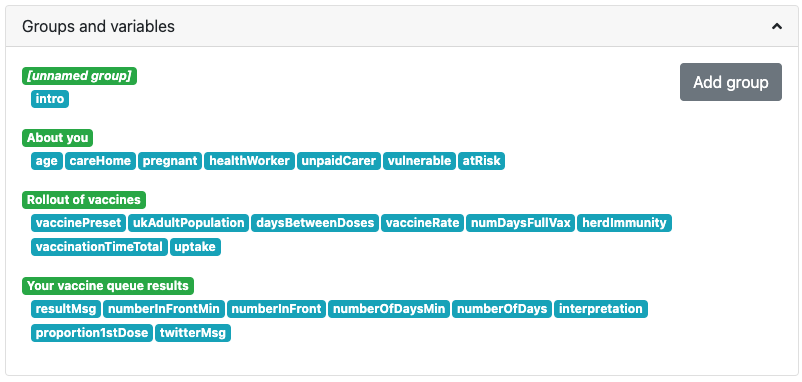
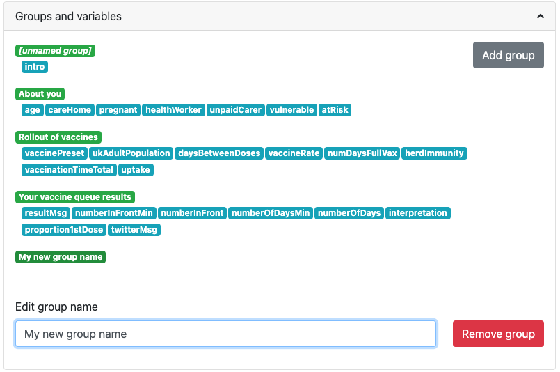
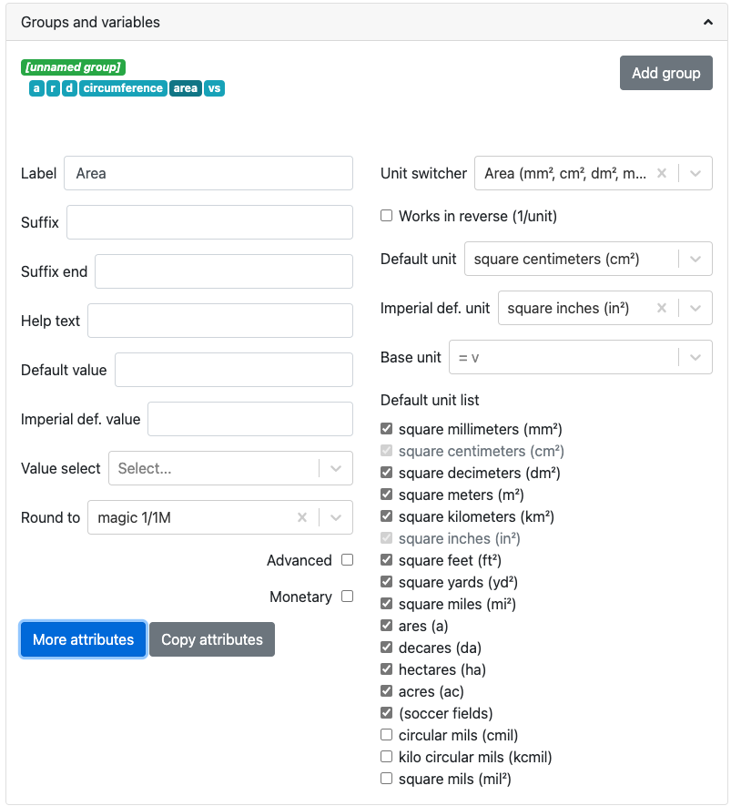
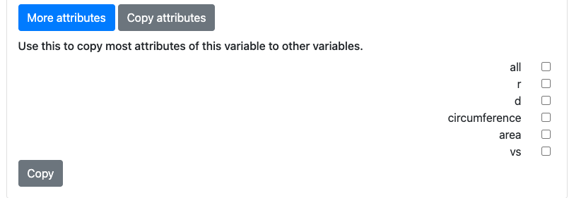

.. _groupsAndVariables:

Groups and variables
====================

The **Groups and variables** section defines the layout of the calculator variables, their units and other properties and attributes. 

.. _groupsAndVariablesExample:

  An example of the **Groups and variables** section of the edit calculator page.

In the screenshot above, green labels are groups and blue labels are variables. You can **drag and drop** them to move them around and to change their order. After a few seconds, the calculator preview will update to reflect the changes you have made.

Variables are added to this section when they are either **entered into an equation** or added to the **Additional variable names** list and the calculator is **saved**.

Groups
------

.. _groupsAndVariablesAddGroup:

  This is how the **Groups and variables** section looks after pressing the **Add group** button.

To add a new group, press the **Add group** button. You can then give it a name if you like, which will be used as the heading for its variables in the calculator. If you don't give it a name, it will be an **unnamed group** and no heading will be shown in the calculator.

To **add** variables to a group, simply drag and drop them so they are under a group.

To remove a group, click on it to select it (turns dark green) and press the red **Remove group** button.

.. tip::
  You can move groups of variables around by dragging and dropping them, just like variables.

Variable attributes
-------------------

.. _groupsAndVariablesVarAttributes:

  Click on a variable to display its basic attributes.

Click on a variable to select it (turns dark blue) and its properties/attributes will be displayed (as above). If you click on another variable, then its attributes will be displayed. To **hide** the attributes, click on the variable label again.

Here are is a summary of the **DOs and DON'TS** when it comes to variables:

* DO **capitalize the first word** in each variable (but not more).
* DO capitalize the first word in every header.
* DO try to list the variables in a **logical order**; information supplied by the user should be at the top, the result — at the bottom.
* DO make sure that you're **not using more units than necessary** - uncheck any you don't need from the variable's unit list.
* DO spend a few seconds thinking about the **default unit** and the **Imperial default unit** - which ones will make the most sense?

Let's now go through each of the variable attributes to see what then do.

Label
^^^^^

This is the name of the variable as **displayed to the user**. Make sure it will be easily understood by the user and starts with a capital letter (but no more). If the variable is associated with an equation in the calculator text, it's a good idea to put the algebraic reference in brackets after the name.

Suffix
^^^^^^

The suffix is a piece of text that is placed *before* any units symbol. This can be useful when creating a compound unit where the first one is fixed.

It can also be used to quickly **add a unit** where there is **only one choice**.

Suffix end
^^^^^^^^^^

The suffix end text gets placed *after* any units symbol. Again, this is useful for creating compound units where the second part doesn't change. E.g., dollars per day ($/d) — so suffix end would equal "/d".

Help text
^^^^^^^^^

Enter text here to appear in a **tooltip when the user hovers over the variable label**. This allows you to describe in more detail what input is required, say what limits there are on its value or better explain a result.

Default value
^^^^^^^^^^^^^

You can specify a default value for the variable, given in its default unit.

Imperial def. value
^^^^^^^^^^^^^^^^^^^

Set a **default value** for users in countries who use the Imperial measurement system (e.g., the US). The value should be given in the Imperial default unit.

Generally, if you have set a **default unit** and you have specified an **Imperial default unit**, you should set an Imperial default value. Otherwise, your calculator may not work as expected in Imperial unit countries.

Value select
^^^^^^^^^^^^

If the variable is to be a dropdown menu, rather than a number, here you select which value select to use. Value selects are defined in the **Value select** section of the edit calculator page.

Round to
^^^^^^^^

Here you can select the **rounding** of variable values. You have a choice of different levels of relative error (the magic ones) or 0 to 10 decimal places.

When choosing **magic rounding** and you don't like the default setting, have a play around with entering different values into the calculator and seeing the results. We don't want them too long or too short.

.. tip::
  🤑 For monetary values, it's usually a good idea to round to two decimal places.

.. _advancedCheckbox:

Advanced checkbox
^^^^^^^^^^^^^^^^^

Checking this option puts the variable into **advanced mode only**. If any variables are in advanced mode, the calculator will gain an **advanced mode button** underneath it. When this button is pressed, variables with this checkbox checked will appear. Go back to simple mode and they will disappear.

Unit switcher
^^^^^^^^^^^^^

Choose the units for the variable from the list. Start typing in the unit switcher name to find the one you are looking for.

:ref:`Unit switchers <unitSwitchers>` can be edited and added on the `unit switcher page <https://www.omnicalculator.com/adminbb/unit-switchers>`_. However, it is best to ask someone before making any changes, as they might affect other calculators.

Works in reverse checkbox
^^^^^^^^^^^^^^^^^^^^^^^^^

Check this box if you have a variable where the unit is the reciprocal unit. For example, wavenumber has units of m\ :sup:`-1`. This example can be found in the `wavelength calculator <https://www.omnicalculator.com/adminbb/calculators/421>`_.

Default unit
^^^^^^^^^^^^

Set the default unit of the variable from the dropdown list. **A default unit always needs to be specified.**

Imperial def. unit
^^^^^^^^^^^^^^^^^^

Set an optional Imperial default unit. This will be the default unit displayed to users in countries who use the Imperial measurement system, e.g., the US.

Base unit
^^^^^^^^^

This is the base unit in which **calculations are performed**. Usually this can be left to the default base unit of the unit switcher (e.g., meters for the length unit switcher).

However, if you have an equation based on feet, you can specify to **use feet as the base unit**. This has the advantage of not having to rewrite the equation for meters (a problem if the equation contains constants).

.. warning::
  If the calculator contains a value setter in the CustomJS code, you should **explicitly set the base unit**, if even it is the default (e.g., specify meters for the length unit switcher). This makes sure that those users in Imperial unit countries will get the correct value for variables set by the value setter.

Default unit list
^^^^^^^^^^^^^^^^^

For each unit switcher, a list of all its units are displayed. Depending on the application, some units will make sense, while others won't (e.g., somebodies weight in terms of solar masses). Check the units you want the user to be able to choose from, and uncheck others to hide them.

.. note::
  You will see that the **default unit** and **Imperial unit** (if set) are greyed out and cannot be unchecked.

If you make a change to the list of units, a **reset** button will appear at the top. This resets the unit list to the default list for that unit switcher.

More variable attributes
------------------------

Click on the blue **More attributes** button to show even more variable attributes. Let's explore them next.

.. _groupsAndVariablesMoreAttr:

  Click on the **More attributes** button to display even more attributes of the current variable.

.. note::
  To hide the extra attributes, click on the blue **Less attributes** button.

Auto saved
^^^^^^^^^^

When checked, the **variable value will be saved** in a cookie on the user's browser. So next time the user comes back to the calculator, the last value they entered will be already displayed.

This is useful for things that are not likely to change very often or by much, such as a person's **age**, **weight**, etc.

Locked
^^^^^^

The variable will not be recalculated as other variables are changed and the user cannot enter its value. This is good for variables that are meant to be **outputs only**.

The **user can override this setting** in the variable menu (displayed when you click the grey area to the right of the variable.

Locked permanently
^^^^^^^^^^^^^^^^^^

Same as the locked function above, but now the **user cannot override** the setting.

Don't format
^^^^^^^^^^^^

When checked, **formatting will not be applied to the number** after the user has finished entering the number. For example, the number 123456 is usual displayed as 123,456. With formatting turned off, it's displayed as 123456.

This is useful, for example, if you have a binary input variable, so using the thousand separator doesn't make sense.

Field type
^^^^^^^^^^

This sets the type of the variable. Here are the currently available types:

* ``default`` — regular **numbers**. This is the setting for the majority of variables.
* ``date`` — allows the user to enter a **date**, using a calendar date picker or typing one in manually.
* ``date \ time`` — allows the user to enter a **date and time**.
* ``time`` — allows a user to enter a **time**, either using a time picker or entering it manually.

.. note::
  Dates and times are actually numbers in the `UNIX time format <https://www.omnicalculator.com/conversion/unix-time>`_. 

Copy attributes button
----------------------

If you have a calculator with many variables with **very similar attributes**, such as unit switcher, custom unit list, rounding, etc., it can get pretty tedious to set them all up.

Don't worry! The **Copy attributes** button is here to save you a load of time.

.. _groupsAndVariablesCopyAttributes:

  Click on the **Copy attributes** button to be able to copy most of the current variable's attributes to other variables.

After clicking the **Copy attributes** button, a list of the other variables in the calculator will appear. Check each one you want to copy this variables attributes to. Then click the **Copy** to copy the attributes.

.. note::
  This feature will copy most of the attributes, but **not all of them**. [WAITING FOR A LIST]