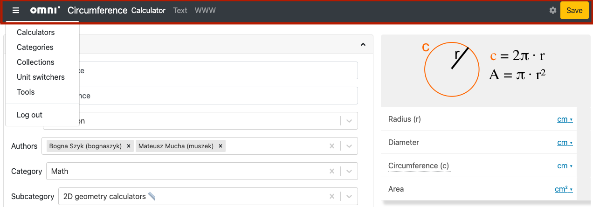

.. _upperPanel:

Upper panel, shortcut, preview
==============================

.. _upperPanelScreenshot:

  The upper panel of the edit calculator page is highlighted in red.

The upper panel of the edit calculator page contains the following items on the left, from left to right:

* **Three-bar hamburger menu** — access other parts of adminBB.
* **Omni logo** — clicking the logo will take you to the calculator index page.
* **Name** — name of the calculator, followed by the word "calculator".
* **Text** — takes you to the text editing page.
* **www** — takes you to frontend web page rendering of the calculator.

Save button
-----------

On the right-hand side there is the all important **save** button. When you first open a calculator, this button will be **grey**. If you make a change to the calculator, it will turn **yellow**, indicating that there are unsaved changes. Once you press the button to save the changes, the button then turns **green**.

When you press the save button, look out for the **message** in the bottom right corner, which tells you whether the save was successful, or if there is an error that needs correcting.

.. warning::
  After making a change, please **wait for the preview to reload** before pressing the save button. It should only be a few seconds. Pressing the save button before will mean your changes are not saved.

Calculator tools ⚙️
-------------------

The little gear icon opens a menu with the following items:

* **Clone** — makes a temporary copy of the current calculator. Useful for testing a change out before saving it to the live calculator.
* **Merge to other calculator** — allows you to merge this calculator with another one. Useful for copying some changes from a cloned calculator to a published calculator. *If you can't see this option, get your reviewer/proofreader to do the merge.*
* **Show revisions (soon)** — will allow you to see all the different revisions of a calculator. A revision will be stored each time the calculator is saved.
* **Show redundant children (soon)** — will show the redundant, sub-calculators that are associated with this calculator.

Let's explore each of these tools in detail next.

Clone
^^^^^

Cloning a calculator is useful if you need to add a new feature to an existing calculator. Here are step-by-step instructions to clone a calculator:

1. Click on the gear cog icon and select **Clone**.
2. A draft of the new cloned calculator is then displayed. The slug and name are pre-filled with today's date and current time. You are free to **change the slug/name to something more meaningful**. You can also make changes to the calculator at this stage, but it's probably best to save first.
3. Click the **Save** button. Your new cloned calculator will then load.

Merge to other calculator
^^^^^^^^^^^^^^^^^^^^^^^^^

After cloning a calculator and implementing its new feature(s), it's time to **apply these to the original, published calculator**. An easy way to do this is to merge the clone with the original.

.. note::
  If you can't see this option, get your reviewer/proofreader to do the merge for you.

Here are step-by-step instructions to merge a cloned calculator with its original:

1. Click on the gear cog icon and select **Merge to other calculator**.
2. Search for the original calculator; you can either search by name or id number. Click **Continue**.
3. To avoid any mistakes, enter the slug of the original calculator that will be changed, then press **Confirm**.
4. You should then see a green success feedback message.

.. _upperPanelMerge:

  Choose the original calculator to copy the current calculator to.

.. note::
  Properties in the **Details section** are not changed in the original calculator. So all attributes except Name, Slug, Type, Is published, Status, Authors, Category & Subcategory, Kind, Show ads, and Is redundant.

The cloned calculator will **not be automatically deleted**. If you are not planning to add another feature to the calculator, please go ahead an delete the calculator to keep our BB nice and tidy.

.. _calculatorPreview:

Preview
-------

On the right-hand side of the page, a **full preview** of your calculator is shown. As you make changes to the calculator, these will be reflected in the preview.

.. note::
  The preview waits a few seconds before updating to avoid excessive re-rendering, so please be patient when seeing if a changed worked.

.. _upperPanelPreviewError:
.. figure:: upper-panel-preview-error.png
  :alt: edit calculator page with the upper panel highlighted
  :align: center

If there is an error in rendering the preview, you should see a useful error message. You also get two buttons: one to reload the entire page and another that reloads the preview. To avoid losing any changes, it's best **click the reload preview button**.