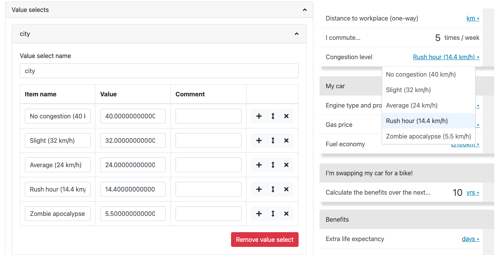
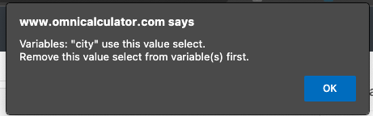

.. _valueSelects:

Value selects
=====================

Value selects allow you to create a **drop-down menu of textual options** for the user to select from, instead of entering a number.

This is great for specifying common **presets for a variable**, or to create switches that turn calculator features on and off (e.g., combined with CustomJS, you can add a value select to show and hide a graph, depending on the user's preference).

How to define a value select
----------------------------

.. _valueSelectsExample:

  Example of a value select used to create presets for a variable.

In the **Value selects** section of the edit calculator page, here are the steps to create a value select:

1. Click the **Add value select** button to start creating a new value select.
2. Give your new value select a descriptive name. It will be used in the variable attribute **Value select**.
3. Enter a name for the first item of the value select. This name is what the **user sees in the drop-down menu**, so make sure it will make sense to the user.
4. Next, **enter a value** to associate with this first option. The variable that uses this value select will take this value when this option is selected by the user.
5. You can also add a comment to the item, which only appears on the calculator edit page.
6. Go ahead and add other value select items. **Press the plus icon** to add another one.
7. Finally, associate a variable with this value select by setting the attribute **Value select** to the name of this value select.

By selecting an option from the drop-down list, the variable takes the value defined in value select. So the variable can **still be used in equations** as usually.

.. note::
  You can **add**, **move** or **delete** items of a value select using the plus, up-down arrow and cross icons, respectively.

.. tip::
  If you also want the user to also be able to **enter any value for a variable associated with a value select**, link it together with a non-value select variable by adding another equation. For example:

  .. code-block:: javascript

    foo_number = foo_valueSelect

  If the calculator is then too cluttered, put the ``foo_number`` variable in :ref:`advanced mode <advancedCheckbox>`.

How to delete a value select
----------------------------

To delete a value select, open it open and click the red **Remove value select** button.

Make sure no variables are associated with this value select. If there are, you will see the following warning alert, letting you know which variables are current using it.

.. _valueSelectsError:

  Example of the error you get if a variable is using the value select you are trying to delete.

Value selects in CustomJs
-------------------------

You can define value selects using code in the CustomJs section. However, **using the methods above are preferred**.