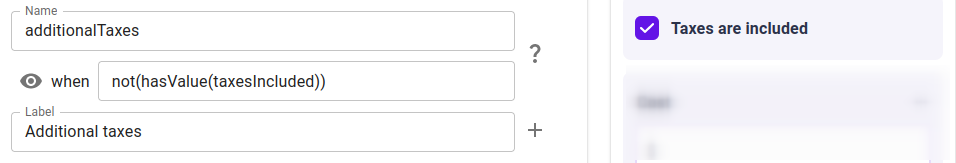
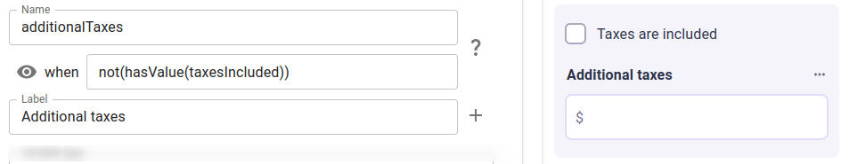
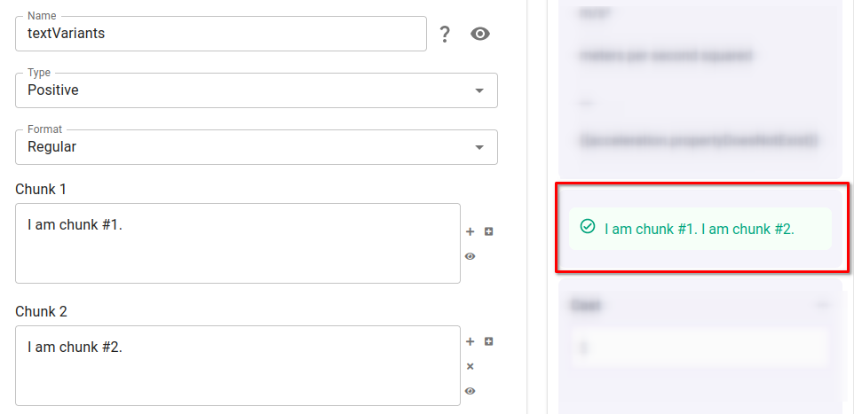
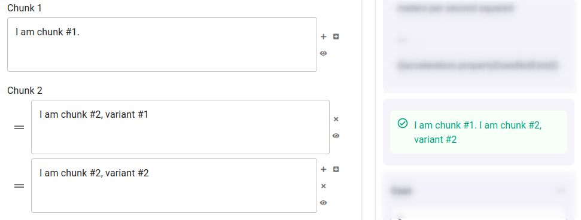
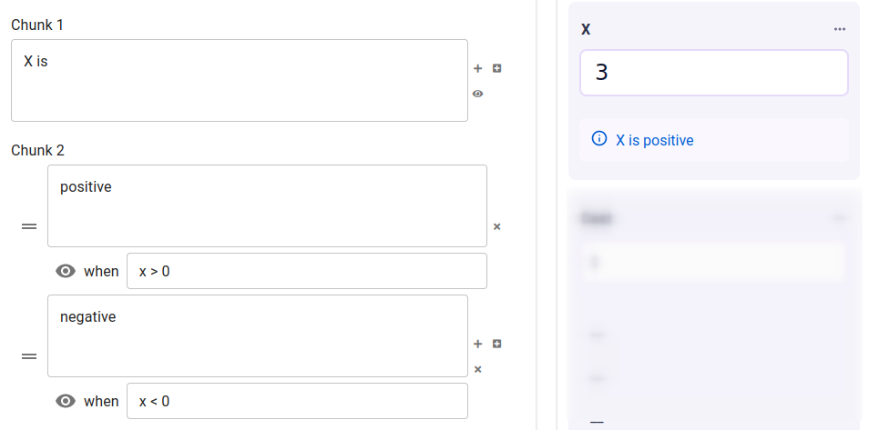
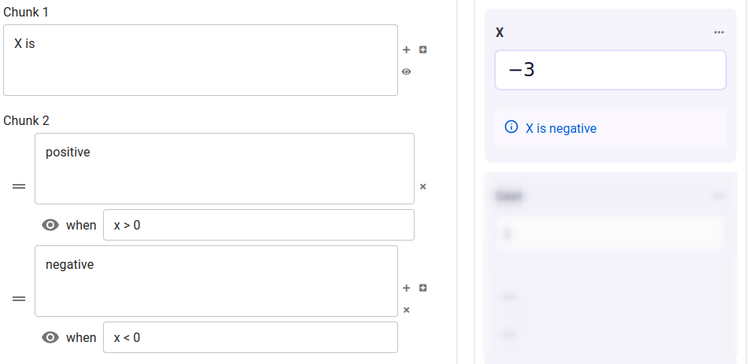
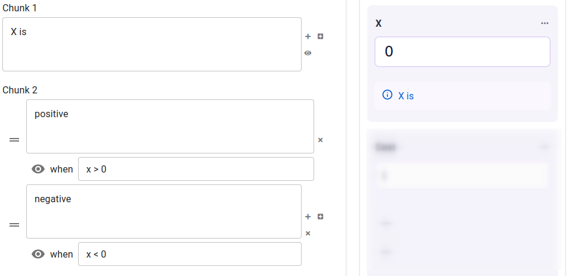
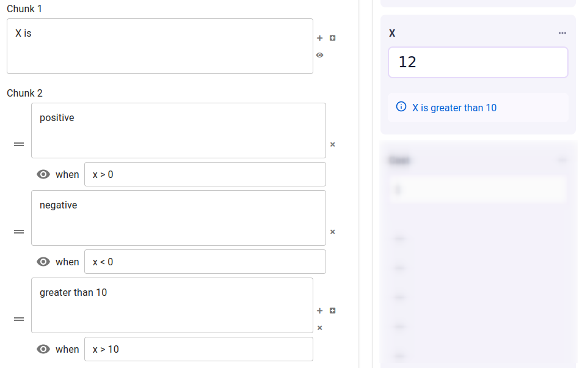
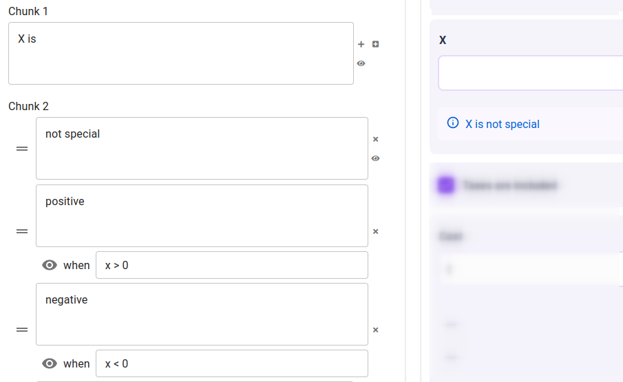

.. _calculatorsV2ConditionalVisibilityAndAlternatives:

Conditional visibility and conditional alternatives
===================================================

In many cases, you may wish to adjust a calculator based on variable values, on the user's locale data, or on other dynamic data.
For example:

* You may wish to set variables' default units to metric/imperial units depending on what the user's country uses.
* You may wish to display a message that interprets the user's input data in words (such as interpreting in which health category a user's BMI falls).

Conditional alternatives and conditional visibility allows such behaviour by connecting these dynamic behaviours to conditional language.
This lets you adjust what is presented to the user, while using clear language in the calculator editor.

Note that conditional alternatives are different from :ref:`input conditions <conditionsv2>`, although the conditional language of alternatives uses the same expressions, syntax, and general rules as input conditions do.

.. _calculatorsV2ConditionalVisibility:

Conditional visibility
----------------------

:ref:`Blocks and groups <groupsAndVariablesV2>` may have visibility conditions attached.
Whenever an item's visibility condition evaluates to true, the item is shown to the user;
whenever the condition evaluates to false, the item is hidden from the user.
This is only user-facing visibility --- variable blocks hidden from the user will still work in equations etc.

Example: variable block visibility
~~~~~~~~~~~~~~~~~~~~~~~~~~~~~~~~~~

Given that the checkbox value-select has a value when it is checked and not when unchecked, the variable "Additional taxes" will only display when "Taxes are included" is unchecked, thanks to its visibility condition:

؜

؜

.. _calculatorsV2ConditionalAlternatives:

Conditional alternatives
------------------------

In this paradigm, one item in the calculator editor is provided with many alternative options, each with an conditional expression attached.
Upon any change in the calculator, these expressions are evaluated, and **the last option whose expression evaluates to** ``true`` **is selected**.
This option is then used in the calculator, while the rest are ignored.

It may happen that among all alternatives provided, no expression evaluates to ``true``.
In this case, no option will be used.
In addition, a conditionless option will be treated as if its condition always evaluates to ``true``.

Many fields in the calculator editor support conditional alternatives.
These fields include:

- :ref:`Variable block labels <variableAttributesV2Label>`;
- :ref:`Variable block default values <variableAttributesV2DefaultValue>`;
- :ref:`Variable block unit switchers <variableAttributesV2UnitSwitcher>`;
- :ref:`Text blocks <textBlocks>`' chunk variants; and
- :ref:`Image block URLs and captions <imageBlocks>`.

Example: text block chunks and variants
~~~~~~~~~~~~~~~~~~~~~~~~~~~~~~~~~~~~~~~

One text block consists of multiple chunks, whose contents are stitched together in-line:

؜

One chunk can have multiple variants, and up to one variant per chunk may be selected.
Below, both variants' conditions are not provided, so they are both treated as ``true``:

؜

When conditions are provided, they are evaluated top-to-bottom and the last item whose condition evalautes to ``true`` is selected.

؜

؜

It may happen that no expression evaluates to ``true`` and no item is selected:

؜

It may happen that multiple items' expressions all evaluate to ``true``, in which case the last of these items will be selected:

؜

If a catch-all "fallback" item should be shown when no other item's condition is ``true``, it should be the first item in the list and it should have no condition attached.
This is contrary to how most programming patterns, where the ``else`` case comes last.

