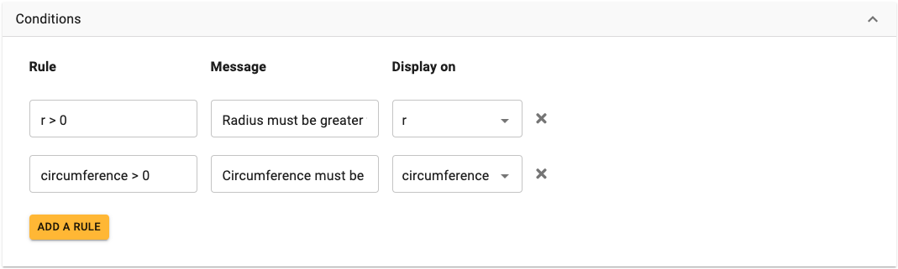

.. _conditionsV2:

Conditions
==========

**NOT FULLY WORKING YET IN V2**

We can enforce conditions on what the user can input for certain variables. We might want to do this for a variety of reasons:

* Avoid division by zero (an output of ``Infinity`` otherwise appears);
* Avoid NaN (not a number) results (e.g., certain trigonometry functions and values);
* Commonsense variable ranges (e.g., a person's age is probably not going to be more than 120 years); and
* Math definitions (e.g., percentages run from 0 to 100% – normally, anyway).

How to define a condition
-------------------------

.. _conditionsExampleV2:

  Example of the conditions section of the edit calculator page. 

Type a rule you **don't** want users to break and a message they'll see if they do.
For example: rule ``a < 5`` enforces ``a`` to be smaller than 5. This means user will see a warning (message) when they input ``a`` greater than or equal to 5.

In more detail, here are step-by-step instructions:

#. Open the **Conditions** tab and press the **Add rule** button.
#. Use the variable's name and inequality sign and a number to define the condition. For example, ``age <= 120`` says that the variable ``age`` needs to be less than or equal to 120 years.
#. Provide a **helpful message** to the user about why their input was rejected and what they can do to correct it. For this age condition, the message is "Age should be 120 or less."
#. Select a **variable** to display the error message on.
#. To apply a new or changed condition, you **need to refresh the preview or save** the calculator before it is reflected in the calculator preview.

.. note::
  You need to **define the condition in terms of the base unit** of the variable. So if you change a variable's base unit, the values in its conditions would need to be converted to the new base unit.

.. warning::
  When a condition is triggered, the **calculator and any CustomJS code you have written is never run!** The calculator is stopped until the user enters the correct input the condition is looking for. Therefore, the condition message needs to give enough detail to let the **user know how to fix the problem**. E.g., give the range that is accepted.

Condition inequality operators
------------------------------

You can use the following inequality operators in your conditions:

* ``<`` – Less than;
* ``>`` – Greater than;
* ``<=`` – Less than or equal to; and
* ``>=`` – Greater than or equal to.

Specifying multiple conditions
------------------------------

To save writing serval rules, all with the same message, you can combine them into on rule by specifying more than one inequality in the **Rule** input field.

You do this by using a **comma** to separate each rule. For example, ``a > 3, a < 5`` means than ``a`` should be greater than 3, but less than 5.

Using functions in conditions
-----------------------------

You can use all of the :ref:`functions<calculatorStructureEquationsMath>` and :ref:`constants<calculatorStructureEquationsConstants>` that are available in the main :ref:`equations section<calculatorStructureEquations>` of the calculator.

Using math.js functions as condition tests
------------------------------------------

You can use some `math.js functions <https://mathjs.org/docs/reference/functions.html>`_ in your condition rules. Two of the most useful are:

* ``isInteger(a)`` – The value ``a`` must be an integer;
* ``isPrime(a)`` – The value ``a`` must be a prime number; and
* ``unequal(a, b)`` — The values ``a`` and ``b`` must not be equal. 

Using Omni.define functions as condition tests
----------------------------------------------

If the simple inequality operators are not enough for a very complex condition, you can use Omni.define functions, as long as they return ``true`` or ``false``.

Detailed information on how to do that is covered in the CustomJS documentation section :ref:`customCondition`.

