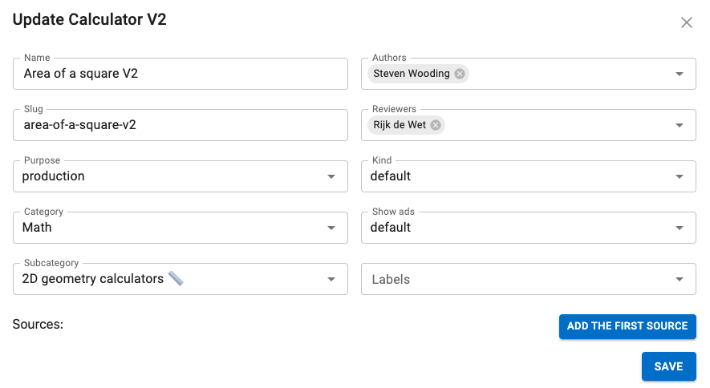
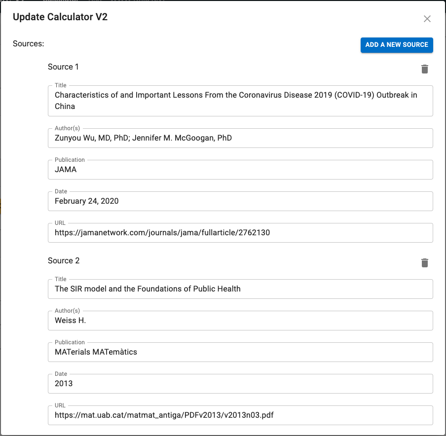

.. _detailsV2:

Details
=======

The **Details** panel contains all of the main properties of the calculator, such as name, author, category, etc. Let's go through each field and describe each one in detail.

.. _detailsExampleV2:

  Example of the details panel.

.. _detailsNameV2:

Name
----

This is the name of your calculator. It is used on the index of calculators and in links on the website to other related calculators. See below for the rules you should follow when naming your calculator.

Name rules
^^^^^^^^^^

* **DON'T** use the word "calculator" (if it's a converter, use the word "converter", though);
* **DO** capitalize the first word; and
* **DON'T** capitalize other words (unless they're "naturally" capitalized).

*Examples of good names:* BMI, Length converter, Acceleration, Ideal transformer.

*Examples of bad names:* bmi calculator, Ideal Transformer Calculator.

.. _detailsSlugV2:

Slug
----

The slug is the **last part of the URL** of your calculator's page on the website. It's usually the same as the name of the calculator, but with all lower case letters and hyphens replacing spaces.

Slugs are **unique site-wide**, even if the calculators are in different categories. You will get an error message on saving if the slug is unavailable.

.. tip::
  When creating a new calculator, just type in the **name** of the calculator and a slug will be automatically generated based on it. Pretty clever, right?

.. warning::
  **DON'T change the slug of a published calculator!** Doing so will negatively affect it's ranking on search engines, break any links that have been sent out to journalists or people's bookmarks.

Slug rules
^^^^^^^^^^

Here are the rules to help you create a great slug:

* DO use only **lowercase** letters;
* DO use **hyphens** between words;
* DON'T use underscore or spaces between words;
* DON'T use the word "calculator"; and
* DO try to keep the slug as **short** as possible.

*Examples of good slugs*: ``sphere``, ``roi``, ``sodium-correction``

*Examples of bad slugs*: ``spherevolumecalculator``, ``Return_on_Equity``, ``sodium-correction-for-hyper-and-hyponatremia``

.. note::
   For **conversion calculators**, follow this additional guidance:

   * If it's a **one-word/short calculator name**, and from the slug you can't recognize if it's a converter or calculator (and potentially it can be both), then **use the word "converter" within slug**. For example: ``area-converter``, ``celsius-converter``, and ``square-feet-converter``.
   * If it's a **long calculator name**, and it clearly shows it's a converter (most probably by using word 'to'), we **don't** need the word 'converter' in a slug. Such as: ``square-miles-to-square-km`` and ``centigrade-to-celsius``.

.. _detailsPurposeV2:

Purpose
-------

The purpose attribute of a calculator helps us organize them in terms of why they were created. The purpose attribute has the following options:

* ``production`` – This is the option to use for regular calculators that are to be published on the site.
* ``non production`` – Calculators used for testing, documentation, etc. Non-production are not destined to be published on the site.
* ``temporary`` – The calculator is not meant to be around for very long. This is the **default** purpose when you **clone** a calculator. Bear in mind that your old temporary calculators may be deleted in the future. This label will also help you clear up old temporary calculators that you no longer need.

.. _detailsCategoryV2:

Category and subcategory
------------------------

Select the main category that your calculator falls into best. If you are not sure, ask on Slack. If that doesn't help, there is always the "**Other**" category for subjects that are hard to categorize.

Once you select a category, the field "**Subcategory**" will appear and you go through the same process again. Note, that you don't have to set a subcategory if your calculator doesn't fit any of them.

See :ref:`here<listCategoriesSubcategories>` for a full list of categories and subcategories.

Authors
-------

When you create a calculator, this field will be filled in with your name. If you write a calculator with the help of a fellow calculatorian, you can add them by clicking on this field and selecting them from the dropdown menu.

If you need to delete an author from a calculator, click the cross at the end of their name. Clicking the large cross at the end of the field will delete all the authors.

.. _detailsReviewersV2:

Reviewers
---------

Reviewers and proofreaders should add their name to this field. Your name will be added underneath the author list and appear as "Reviewed by Your Name". This will help us show Google that we are a website that takes quality seriously.

Kind
----

This setting is used to include a calculator in a special collection of calculators (e.g. the `Discover Omni <https://www.omnicalculator.com/discover>`_ collection). You should  probably leave this setting to the default, unless you are told otherwise.

Show ads
--------

This setting controls whether adverts are displayed on the calculator page. You should generally only change this setting if you are told to do so. This setting has the following three options:

* ``default`` — The calculator will use the current site-wide setting of whether ads are shown.
* ``yes`` — Forces adverts to be shown.
* ``no`` — Force adverts not to be shown.

.. note::
  Marketing calculators usually start off with not showing ads while pitches are being sent to journalists. Once the traffic picks up, adverts will usually be turned on.

.. _detailsSourcesV2:

Sources
-------

Here you can add details of any research papers or other external sources that the calculator is based upon. It is essential for SEO purposes to get authority and credibility. But it's for sure important for our users too 😀 You only need to add sources you've directly based the calculator on. **It's OKAY not to have sources**, so don't force it. Probably most of our calculators won't need them.

For further guidance on what sources to include, see section :ref:`addingSourcesV2`.

.. _detailsSourcesEgV2:

  Example of the sources section of the details panel.

Click the **Add source** button and a form will appear with the following input fields:

* Title
   * The title of the source (required).
   * Title should be capitalized (e.g., American Journal of Public Health).
* Authors(s)
   * List the authors of the source.
   * Format the author list using the Vancouver method – surname and then initials:
      * Surname AB, Lastname CD, et al.
* Publication
   * The name of the publication, journal, website, etc. **DO NOT** enter a URL here. It will look ugly and the user can't click on it.
* Date
   * Publication date, but the input field is a string. Use a date format that isn't confusing (e.g., June 2021).
* URL
   * Link to the publication, if it is available online. **DO NOT** link to an external file store (e.g., Dropbox).

If you have more than one source, click the **Add source** button again.

To delete a source, click on the trash can icon.

