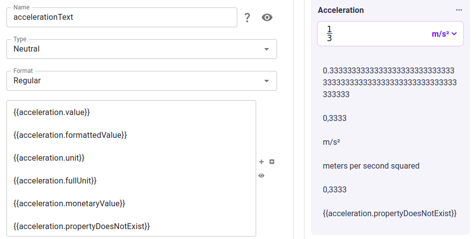
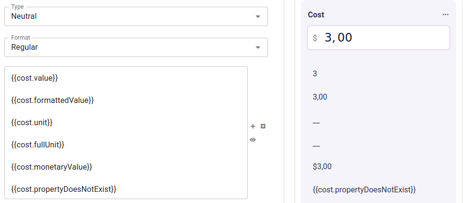

.. _calculatorV2DynamicPrintFunctions:

Dynamic print functions
=======================

**Dynamic print functions** allow the injection of variable values and other properties into various text-based parts of the calculator.
Using the template syntax ``{{variable.property}}``, you can place the specified property of the specified variable in text, and it will be updated reactively and dynamically as the user interacts with the calculator.

Available functions
-------------------

The following dynamic print functions are available for variables.

- ``{{variable.value}}`` is the raw numeric value.

    E.g. "1/3" will be presented as "0.33333...".

- ``{{variable.formattedValue}}`` is the numeric value as formatted by the user's locale data (which affects the thousands and decimal separators) and the variable's rounding rules --- in other words, ``.formattedValue`` will display what the user sees in the variable's input field.
    
    E.g. "1/3" with :ref:`Omni Rounding <calculatorStructureV2OmniRounding>` 1/10K will be presented as "0.3333".

- ``{{variable.unit}}`` is the short version of the variable's selected unit, i.e. the unit's text in the unit switcher.

- ``{{variable.fullUnit}}`` is the full name of the variable's selected unit.

    E.g. when the unit "m/s\ :sup:`2`" is selected, this function will read "meters per second squared".

- ``{{variable.monetaryValue}}`` will prefix/suffix the currency symbol of the user's locale to the numeric value.  This will only work for variables set to the :ref:`monetary type <variableAttributesV2Monetary>` --- non-monetary variables will not display a currency symbol.

    E.g. for a user in the USA, this function will output text such as "$10.00".  For a user in Poland, the function will output "10,00zł".

In addition, the following "global" dynamic print function is available:

- ``{{global.currencySymbol}}`` will be replaced with the currency symbol of the user's location, e.g. "$" for users in the USA.

Edge cases
----------

If the specified variable and property **exists but has no value yet** (e.g. when its input field is empty), then the template string will be replaced with "__".

If either the variable or the property does not exist, the template string will not be replaced at all.

Supported calculator elements
-----------------------------

The following variable attributes and other calculator elements support dynamic prints:

- Text blocks
- Variable label

.. note::
    Use dynamic prints sparingly in variable labels -- consult the :ref:`UX guidelines<uxvariableblocklabel>` when in doubt.

Examples
--------

    The output of all the dynamic print functions for a non-monetary variable.  Note the behaviour of unknown functions and the ``.monetaryValue`` function.

    ؜

    The output of all the dynamic print functions for a monetary variable.  Note the behaviour of unknown functions and undefined values (in this case, the units).