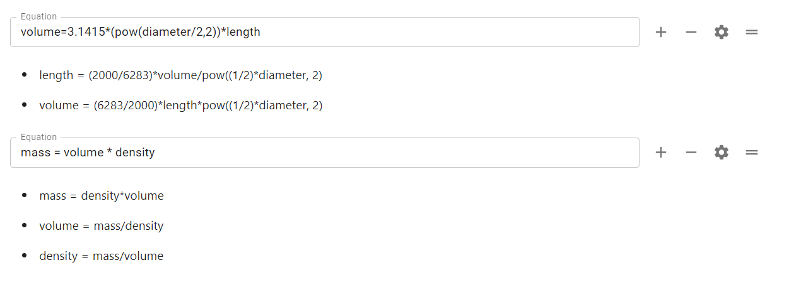

.. _calculatorStructureEquationsV2:

Equations
=========

The equations section is the heart of most calculators. It defines variables and how they relate to each other mathematically. Let's look at a simple example; the circumference calculator.

.. _equationsExampleV2:

  Example of the equations section from the circumference calculator.

We have two equations here, which you should immediately recognize. Each equation has four buttons to the right of them:

* A **plus button** to **add** another equation underneath the current one;
* A **minus button** to **remove** the equation from the calculator (this may also delete the variables, if they don't appear in other equations or is a variable block);
* A gear button that shows/hides equation variants upon clicking. Equation variants are the list of all possible equations generated by Sympy based on the current equation, which is used in the engine mechanism to allow for omnidirectional inputs in our tools; and
* A **reorder drag-and-drop handle** to **move** the current equation (useful for grouping similar equations).

Additional variables
--------------------

Unlike in Engine v1, there is no additional variables field in v2. Instead, this feature has been moved to the **Groups and blocks** section. To learn how to create a variable that doesn't appear in an equation, see the section :ref:`Creating a variable block<groupsAndVariablesV2CreatingAVariableBlock>`.

Always refresh the preview or save after making changes to the equations section
--------------------------------------------------------------------------------

When adding, deleting and editing equations, you need to either  **refresh the preview or save the calculator** for these changes to be reflected in the calculator preview. Note, that this is **also the case** for changes made to the following sections: *Groups and variables*; *CustomJS*, *Value selects and Tests*.

Variable names
--------------

Generally, you should try to use **descriptive names** so someone else reading your calculator quickly knows what it is. For common equations, such as the circumference of a circle, it's OK to use the common algebraic representation (e.g. ``r`` rather than ``radius``).

.. warning::
  DON'T name any of your variable with a name from this list: https://www.tutorialspoint.com/What-are-Reserved-Keywords-in-Python

.. note::
  The default label of a newly created variable consists of the variable name with underscores replaced with spaces and only the first letter is capitalized.

Reserved variable names
-----------------------

You may find that using a certain variable name gives an error. For example, trying to use the variable name `EulerGamma` gives the following error:

* ``Undefined symbol EulerGamma``

This is because it is present in the underlining Python library, but not available to us to use.

You should **change your variable name** to avoid this kind of name collision.

**In addition, you cannot use the following variable names:**

* ``N``
* ``I``
* ``O``
* ``S``
* ``input``
* ``mean``

.. tip::
  You can't use the variable name ``test`` in equations. You'll get a parse error if you do.

.. _calculatorStructureEquationsConstantsV2:

Constants
---------

In the equations section, you have access to a few special constants. One example is ``pi`` that gives you the value pi. Here's the full list:

* ``pi`` — The ratio of the diameter to the circumference of a circle (3.1416...).
* ``E`` — Base of the natural logarithm e (2.7183...). 

Operators
---------

The following operators are available to you in the equations you write:

* ``=`` — Equals operator;
* ``+`` — Addition operator;
* ``-`` — Subtraction operator;
* ``*`` — Multiplication operator; 
* ``/`` — Divide operator;
* ``^`` — Power operator (e.g. ``2^2 = 4``); and
* ``!`` — Factorial operator (one way).

.. _calculatorStructureEquationsMathV2:

Math functions
--------------

The following math functions are supported equations, organized by type.

Arithmetic functions
^^^^^^^^^^^^^^^^^^^^

* ``abs(x)`` — Takes the absolute value of ``x`` (e.g., -4 becomes 4);
* ``round(x)`` — Rounds ``x`` to the nearest integer (e.g., 2.5 becomes 3);
* ``ceiling(x)`` — Rounds ``x`` up to the nearest integer (e.g., 2.3 becomes 3); and
* ``floor(x)`` — Rounds ``x`` down to the nearest integer (e.g., 8.8 becomes 8).

All these functions return a **one-way variable** (user can't edit the variable).

Trigonometric Functions
^^^^^^^^^^^^^^^^^^^^^^^

* ``sin(x)`` — Sine function;
* ``cos(x)`` — Cosine function;
* ``tan(x)`` — Tangent function;
* ``cot(x)`` — Cotangent function;
* ``sec(x)`` — Secant function; and
* ``csc(x)`` — Cosecant function.

Inverse trigonometric functions
^^^^^^^^^^^^^^^^^^^^^^^^^^^^^^^

* ``asin(x)`` — Inverse sine function (arcsin, sin\ :sup:`-1`);
* ``acos(x)`` — Inverse cosine function (arccos, cos\ :sup:`-1`);
* ``atan(x)`` — Inverse tangent function (arctan, tan\ :sup:`-1`);
* ``acot(x)`` — Inverse cotangent function (arccot, cot\ :sup:`-1`);
* ``asec(x)`` — Inverse secant function (arcsec, sec\ :sup:`-1`);
* ``acsc(x)`` — Inverse cosecant function (arcscs, csc\ :sup:`-1`);
* ``atan2(y, x)`` — Computes atan(𝑦/𝑥) taking two arguments 𝑦 and 𝑥. Signs of both 𝑦 and 𝑥 are considered to determine the appropriate quadrant of atan(𝑦/𝑥). The range is (−𝜋,𝜋].

Hyperbolic Functions
^^^^^^^^^^^^^^^^^^^^

* ``sinh(x)`` — Hyperbolic sine of ``x``;
* ``cosh(x)`` — Hyperbolic cosine of ``x``;
* ``tanh(x)`` — Hyperbolic tangent of ``x``;
* ``coth(x)`` — Hyperbolic cotangent of ``x``;
* ``sech(x)`` — Hyperbolic secant of ``x``; and
* ``csch(x)`` — Hyperbolic cosecant of ``x``.

Hyperbolic Inverses
^^^^^^^^^^^^^^^^^^^

* ``asinh(x)`` — Inverse hyperbolic sine function;
* ``acosh(x)`` — Inverse hyperbolic cosine function;
* ``atanh(x)`` — Inverse hyperbolic tangent function;
* ``acoth(x)`` — Inverse hyperbolic cotangent function;
* ``asech(x)`` — Inverse hyperbolic secant function; and
* ``acsch(x)`` — Inverse hyperbolic cosecant function;

Exponential function
^^^^^^^^^^^^^^^^^^^^

* ``exp(x)`` — Exponential function, e\ :sup:`x`.

Logarithm functions
^^^^^^^^^^^^^^^^^^^

* ``log(x)`` and ``ln(x)`` — Natural logarithm function ln(𝑥) or log(𝑥); and
* ``log10(x)`` — Base 10 logarithm function. *One-way function.*

Minimum and maximum functions
^^^^^^^^^^^^^^^^^^^^^^^^^^^^^

* ``min(x, y, z, ...)`` — Returns the minimum from the list of variables (any quantity); and
* ``max(x, y, z, ...)`` — Returns the maximum from the list of variables (any quantity).

These are one-way functions.

Root functions
^^^^^^^^^^^^^^

* ``sqrt(x)`` — Returns the principal square root of ``x``;
* ``cbrt(x)`` — Returns the principal cube root of ``x``; and
* ``root(x, n, k)`` — Returns the *k*-th *n*-th root of ``x``. E.g., the cube root of 27 is ``root(27, 3)``.

Factorial function
^^^^^^^^^^^^^^^^^^

* ``factorial(x)`` — Returns the factorial of the non-negative integer ``x``.

Forcing a one-way function
--------------------------

There is a special function, ``one_way()``, that turns whatever is inside into a variable that the user cannot edit. So instead of the default case where the user can edit both inputs and outputs, the user can only edit the inputs.

Basic conditional statement
---------------------------

Within an equation, we can have a basic ``if-else`` block using the ``if_else()`` function. Its basic syntax is:

``variable1 = if_else(variable2 > n, [expr_true], [expr_false])``

where ``n`` is some value, variable or function, ``[expr_true]`` is what to evaluate if the condition is true, and ``[expr_false]`` is the value to return if the condition is false. These can be any expression we want: numbers, variable, formulas and even another ``if_else`` function call.

For the condition, you can only have either ``>`` or ``<``, but not equals.

For more information on using ``if_else()``, see :ref:`this part<customFunctionsIfElse>` of the customJS part of this handbook.
