.. _globalValueSelectsV2:

Global value selects
====================

Global Value Selects (GVS) are used for data sets that can be used across multiple calculator tools.

**Guidelines:**
Create a Global Value Select for dynamic data that may be needed across multiple tools, and can change over time. This ensures that when the data needs to be changed, it can be changed only in the Global Value Select, and not within each individual calculator tool that uses it.

**Examples:**
Average Solar hours in different cities/countries, GDP of countries, population density of cities/countries, etc.

The **Global Value Select option** can be found under the hamburger menu on top left:

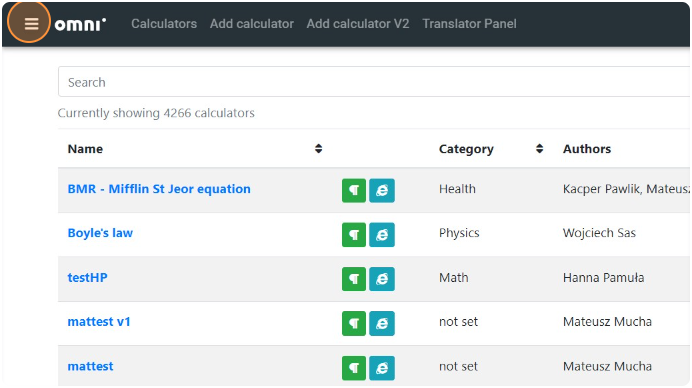

  ؜

Click "Global Value Selects" to go to the Global Value Selects panel where we can create, edit or view Global Value Selects.

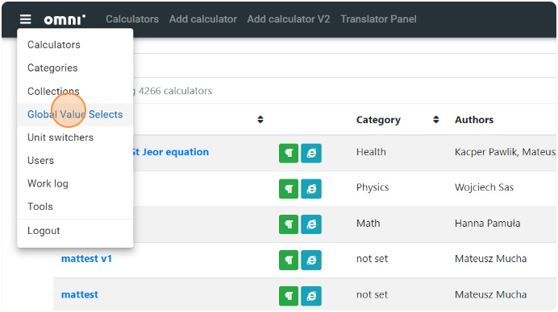

  ؜

.. note::
  Since changes in Global Value Selects can affect multiple tools where they are used, **Create/Edit/Delete permissions for Global Value Selects are currently available only to admins**. Calculatorians can view all the Global Value Selects. If you'd like to create or modify a Global Value Select, please reach out to **Hania/Dominik** with the dataset.

Creating a new Global Value Select
----------------------------------

1. Click "Add global value select" if you want to create a new Global Value Select.

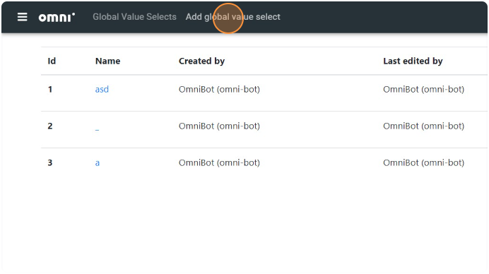

2. Provide an appropriate descriptive name for the Global Value Select.

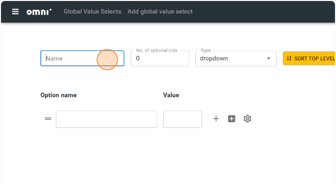

3. Populate the options in the value select.

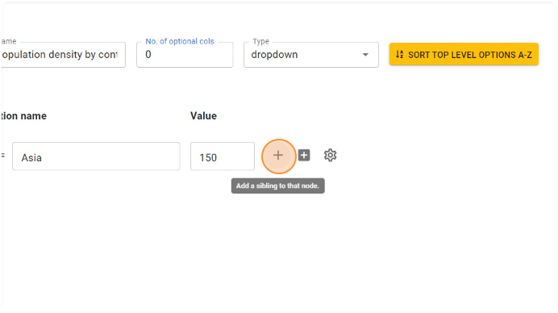

4. Once you're done with adding all the options for the Global Value Select, **click Save**.

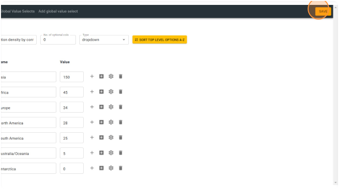

  ؜

Using a Global Value Select
---------------------------

1. To use the Global Value Select in a variable block, select the variable block.

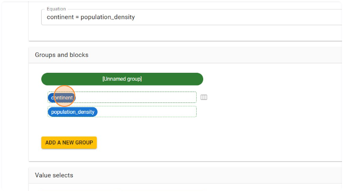

  ؜

2. Choose the variable type as "Value select".

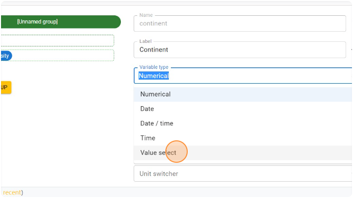

  ؜

3. Choose the Global Value Select you'd like to use. All Global Value Selects are listed under the heading "GLOBAL VS".

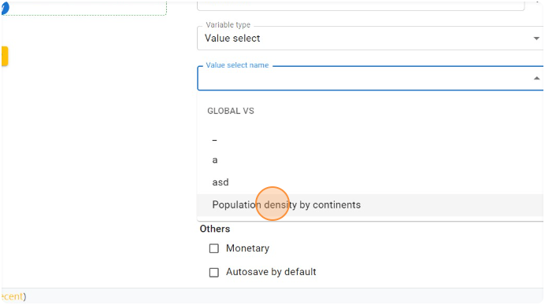

  ؜

4. After selecting the Global Value Select, you will notice an **additional warning** that the value select is dynamic and is subject to change in future.

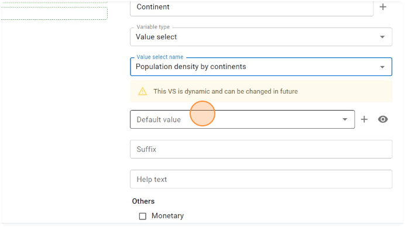

  ؜

5. Click "Done" in the variable block to confirm the changes.

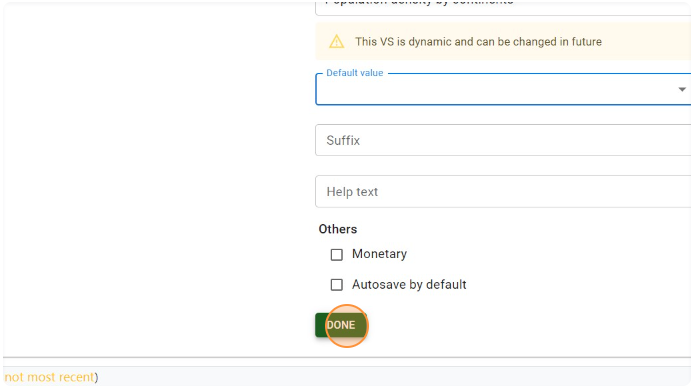

  ؜

6. Click the Reload button or the Save button to refresh the calculator preview.

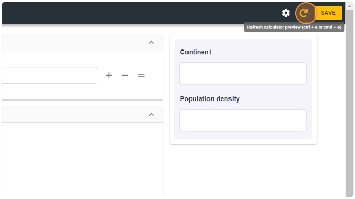

  ؜

7. The variable block will now show options configured in the Global Value Select.

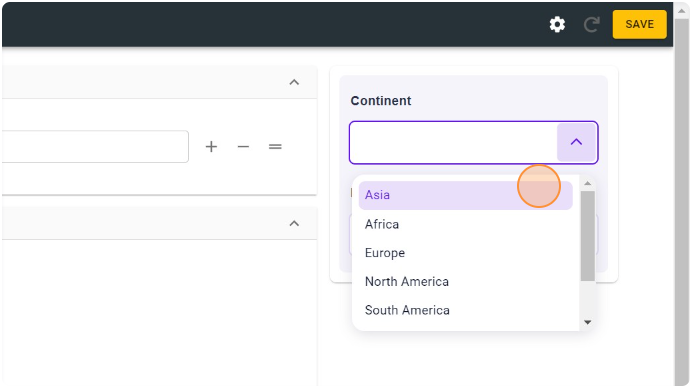

  ؜

8. The value of the variable block will always be tied to the Global Value Select it was linked to, and is not local to the calculator tool.

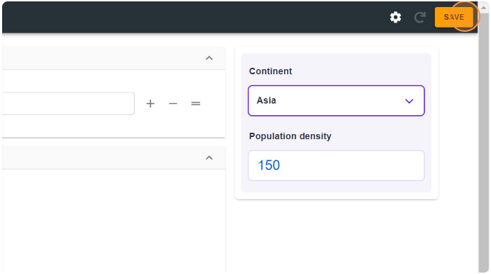

  ؜

Editing and deleting GVS options
--------------------------------

1. To edit/delete options from a Global Value Select, go to the Global Value Selects panel from the hamburger menu.

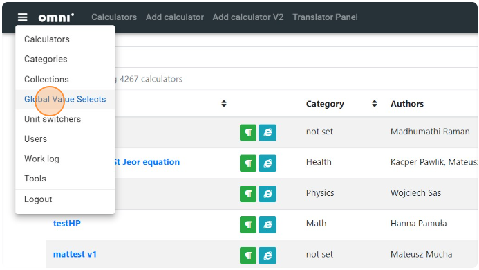

  ؜

2. Click the Global Value Select you'd like to edit.

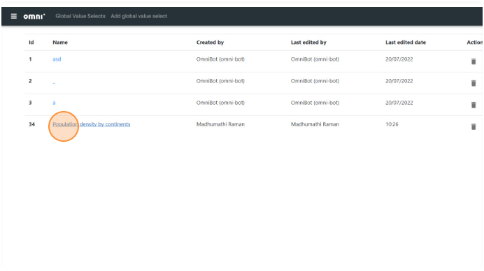

  ؜

3. Modify the value or option name, as needed.

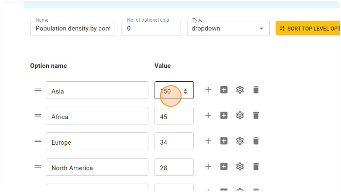

  ؜

4. Then click "Save" to save the Global Value Select. Now all variable blocks across all calculators that are linked to this specific Global Value Select will have the updated options and values.

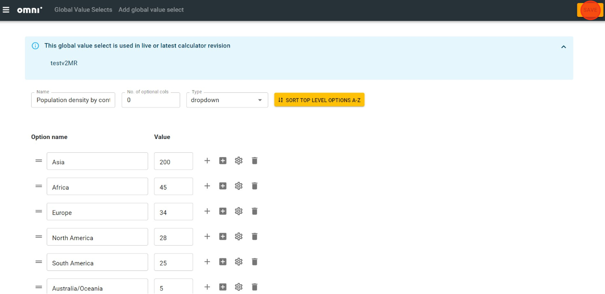

  ؜

.. warning::
  Please exercise caution while editing or deleting entries from a Global Value Select, since this would affect multiple tools which are linked to it.

  **Additional note:** Global Value Selects that are used in live or latest revisions of any calculator cannot be deleted.
  
  Information about which tools use the specific Global Value Select is shown on top of the screen:

  .. figure:: ../img/global-vs-20.png
    :align: center

    ؜

