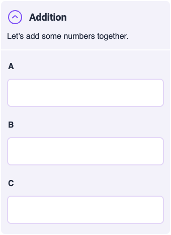
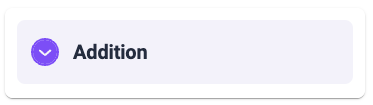
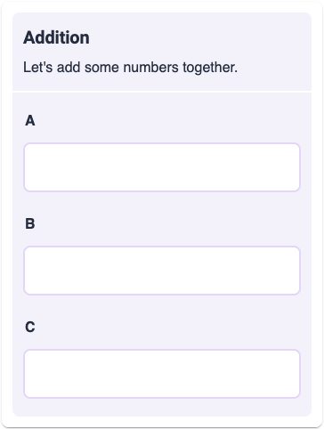

.. |plus icon| image:: img/plus-icon.png
  :alt: Plus icon

.. |eye icon| image:: img/eye-icon.png
  :alt: Eye icon

.. _groupsAndVariablesV2:

Groups and blocks
=================

The **Groups and blocks** section of the V2 edit calculator page defines the layout of calculator variables, their units and other properties and attributes. 

Groups
------

Groups hold a number of variables that are logically related or should appear under a heading within the calculator. A group can be **collapsible** so the user can hide/show its variables (this replaces "advanced mode" in Engine V1).

Creating a group
^^^^^^^^^^^^^^^^

1. To create an additional group for the variable/text/image blocks, click the "**Add a new group**" button.

.. figure:: img/create-group-1.png
  :alt: Click "add new group" button
  :align: center

  ؜

2. Click the header of the newly-formed group ("**[Unnamed group]**") to edit its name.

.. figure:: img/create-group-2.png
  :alt: Click "add new group" button
  :align: center

  ؜

3. Set an appropriate **name** for the group in the "**Name**" field. This will be visible to users.

.. figure:: img/create-group-3.png
  :alt: Add a name for the new group
  :align: center

  ؜

4. You may also make the group name conditionally visible by clicking the "eye" icon next to the Name field, and enter the trigger condition. The group name will show up only when the condition evaluates to "True".

.. figure:: img/group-conditional-visible.png
  :alt: Add a name for the new group
  :align: center

  ؜

5. You may also **add a short description** about the group in the "**Description**" field. This will also be visible to users.

.. figure:: img/create-group-4.png
  :alt: Add a name for the new group
  :align: center

  ؜

6. Decide if the group will be **collapsable** by the user using the collapse/uncollapse icon. 

|collapsible| |collapsed|

If the collapsable option is **not checked**, then no such icon is display and the group's contents is always displayed (baring other conditional visibility settings).

   How the group will look if its contents is not collapsable.

7. Once you've added the appropriate group name and description as needed, **click "Done"**.

.. figure:: img/create-group-5.png
  :alt: Add a name for the new group
  :align: center

  ؜

Moving blocks (e.g., variables) between groups
^^^^^^^^^^^^^^^^^^^^^^^^^^^^^^^^^^^^^^^^^^^^^^

You may drag and drop the blocks to move them between groups or within a
group.

.. figure:: img/move-group.png
  :alt: Click and drag a block to another group
  :align: center

  ؜

.. figure:: img/move-group-2-delete-1.png
  :alt: Block has been moved to another group
  :align: center

  ؜

Deleting a group
^^^^^^^^^^^^^^^^

1. To delete a group, click on the group header.

.. figure:: img/move-group-2-delete-1.png
  :alt: Click on the group header you wish to delete
  :align: center

  ؜

2. Then click "**Remove item**" to remove the group.

.. figure:: img/delete-group-2.png
  :alt: Click remove item button
  :align: center

  ؜

.. warning::
  If you delete a group that **contains some variable/image/text blocks**, those blocks will **NOT be deleted**. They will automatically move to the group above the deleted one.

Reviewing changes to groups
^^^^^^^^^^^^^^^^^^^^^^^^^^^

At any time, you may click the "**Refresh**" button to preview how the group will look like to the user.

.. figure:: img/group-reload.png
  :alt: Click the refresh button to see the changes in the calculator preview
  :align: center

**UPDATE FOR V2 COMING SOON...**

Blocks
------

Along with variable blocks that are created automatically when a new equation is added to the calculator, there are also text and image blocks. Let's start with exploring variable blocks.

Variable blocks
^^^^^^^^^^^^^^^

Variable blocks handle the core component of out calculators where inputs are entered and results are displayed. For more information about all of the attributes that are available for variables, visit the variable attributes section of the handbook:

.. toctree::
    :maxdepth: 2

    variableAttributes

Creating a variable block
"""""""""""""""""""""""""

Besides variable blocks beginning created automatically from equations, you may also manually create them (for example, for selecting different modes of a calculator and displaying different variables). *This feature replaces the Additional variables feature on the V1 Engine.*

1. Click the **+ icon** on the header bar of the group in which you want to add your additional variable block.

.. figure:: img/add-variable-block-1.png
  :alt: Click on the plus icon in the group header you wish to add a block variable to
  :align: center

  ؜

2. Click the "Add variable block" option.

.. figure:: img/add-variable-block-2.png
  :alt: Click on the Add variable block option.
  :align: center

  ؜

3. Select the newly-created variable block to edit its name and label.

.. figure:: img/add-variable-block-3.png
  :alt: Select the newly-created variable block
  :align: center

  ؜

4. Give the variable a name (required field), which will be used to refer to the variable in all other places of the calculator based on your need.

.. figure:: img/add-variable-block-4.png
  :alt: Give the variable a name
  :align: center

  ؜

5. The **Label** field is optional. If left blank, no label would show up for that variable.

.. figure:: img/add-variable-block-5.png
  :alt: Add optional Label
  :align: center

  ؜

6. You could also **provide variants for the variable label** that trigger a different choice based on some condition. To do this, click the + icon next to the label field ("**Add an item variant**").

.. figure:: img/add-variable-block-6.png
  :alt: Add label variants
  :align: center

  ؜

7. Provide an alternative label in the "**Alternative label**" field.

.. figure:: img/add-variable-block-7.png
  :alt: Provide an alternative label
  :align: center

  ؜

8. To set the trigger condition for the label variant, click the |eye icon| icon ("**Open item condition settings**").

.. figure:: img/add-variable-block-8.png
  :alt: Add trigger condition
  :align: center

  ؜

9. Enter an **appropriate condition** statement in the condition box that appears. When this condition evaluates to "True", the corresponding label variant will be displayed.

.. figure:: img/add-variable-block-9.png
  :alt: Add trigger condition
  :align: center

  ؜

.. note::
  The choice of variant to be used is evaluated in a **bottom-up fashion**. So the first variant from the bottom whose condition evaluates to true will be used, in case more than one variant's conditions evaluate to true.

**MORE UPDATES FOR V2 COMING SOON...**

