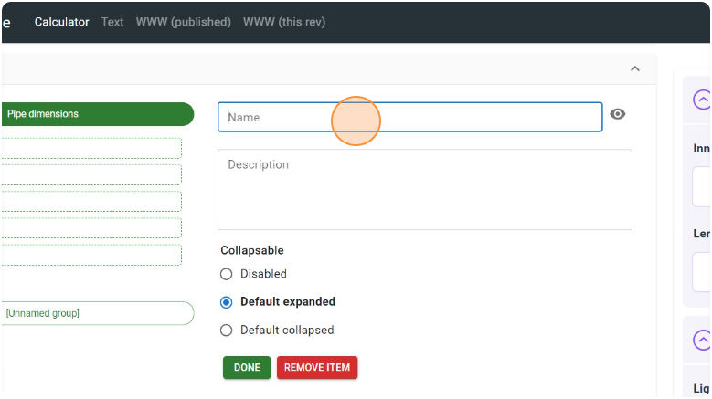
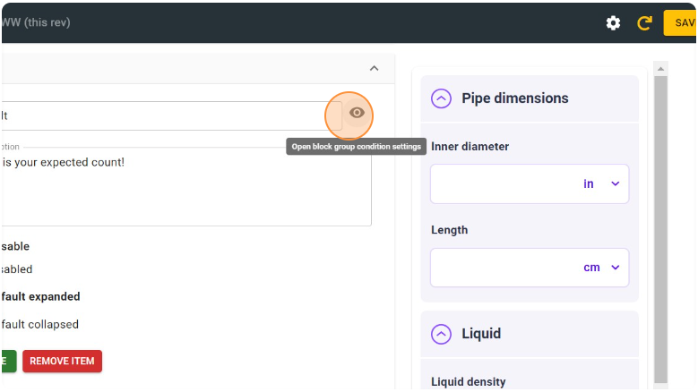
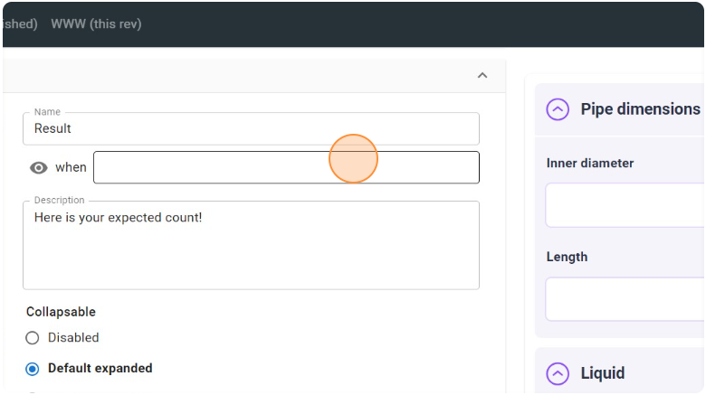
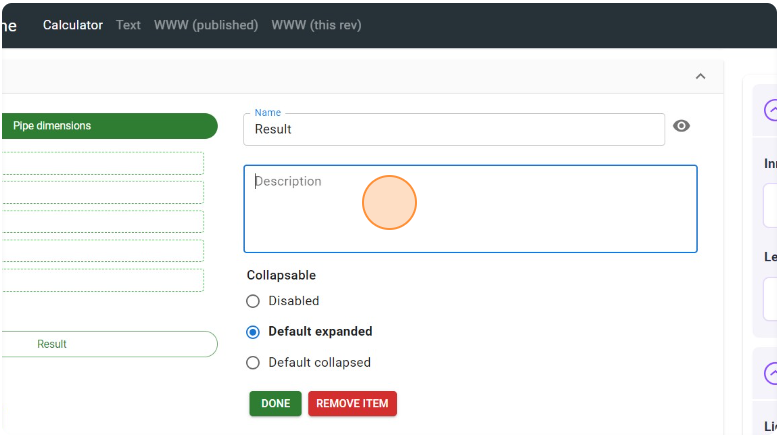
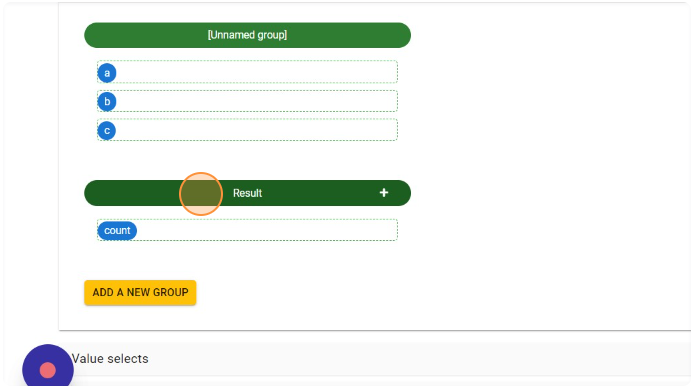
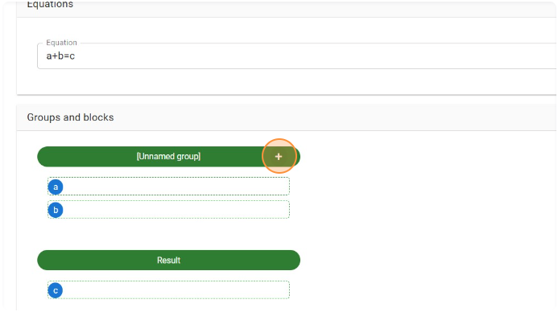
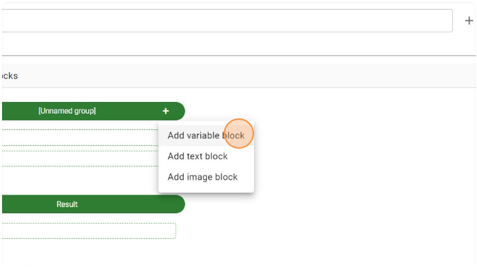
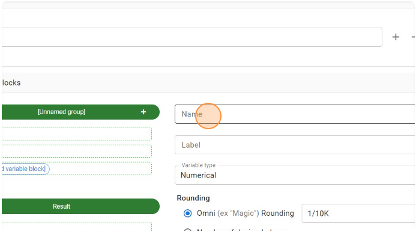
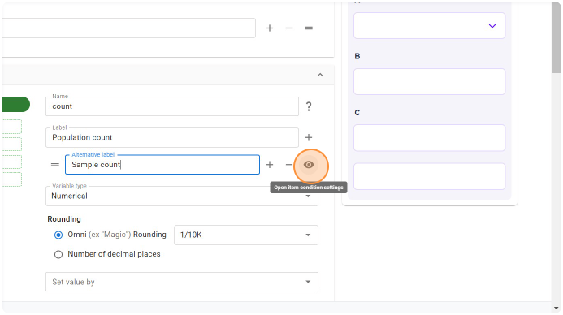

.. |plus icon| image:: img/plus-icon.png
  :alt: Plus icon

.. |eye icon| image:: img/eye-icon.png
  :alt: Eye icon

.. _groupsAndVariablesV2:

Groups and blocks
=================

The **Groups and blocks** section of the V2 edit calculator page defines the layout of calculator variables, their units and other properties and attributes. 

Groups
------

Groups hold a number of variables that are logically related or should appear under a heading within the calculator. A group can be **collapsible** so the user can hide/show its variables (this replaces "advanced mode" in Engine V1).

Creating a group
^^^^^^^^^^^^^^^^

1. To create an additional group for the variable/text/image blocks, click the "**Add a new group**" button.

  ؜

2. Click the header of the newly-formed group ("**[Unnamed group]**") to edit its name.

.. figure:: img/create-group-2.png
  :alt: Click "add new group" button
  :align: center

  ؜

3. Set an appropriate **name** for the group in the "**Name**" field. This will be visible to users.

  ؜

4. You may also make the group name conditionally visible by clicking the "eye" icon next to the Name field, and enter the trigger condition. The group name will show up only when the condition evaluates to "True".

  ؜

  The group name will show up only when the condition evaluates to "True".

  ؜

5. You may also **add a short description** about the group in the "**Description**" field. This will also be visible to users.

  ؜

6. Decide if the group will be **collapsable** by the user using the collapse/uncollapse icon. 

|collapsible| |collapsed|

If the collapsable option is **not checked**, then no such icon is displayed and the group's contents are always displayed (barring other conditional visibility settings).

   How the group will look if its contents is not collapsable.

7. Once you've added the appropriate group name and description as needed, **click "Done"**.

.. figure:: img/create-group-5.png
  :alt: Add a name for the new group
  :align: center

  ؜

Moving blocks (e.g., variables) between groups
^^^^^^^^^^^^^^^^^^^^^^^^^^^^^^^^^^^^^^^^^^^^^^

You may drag and drop the blocks to move them between groups or within a
group.

  ؜

  ؜

Deleting a group
^^^^^^^^^^^^^^^^

1. To delete a group, click on the group header.

  ؜

2. Then click "**Remove item**" to remove the group.

.. figure:: img/delete-group-2.png
  :alt: Click remove item button
  :align: center

  ؜

.. warning::
  If you delete a group that **contains some variable/image/text blocks**, those blocks will **NOT be deleted**. They will automatically move to the group above the deleted one.

Reviewing changes to groups
^^^^^^^^^^^^^^^^^^^^^^^^^^^

At any time, you may click the "**Refresh**" button to preview how the group will look like to the user.

.. figure:: img/group-reload.png
  :alt: Click the refresh button to see the changes in the calculator preview
  :align: center

Blocks
------

Along with variable blocks that are created automatically when a new equation is added to the calculator, there are also text and image blocks. Let's start with exploring variable blocks.

.. toctree::
      :maxdepth: 1
      :hidden:

      multicolumn-layout

Showing and hiding blocks and groups
^^^^^^^^^^^^^^^^^^^^^^^^^^^^^^^^^^^^

To show or hide blocks depending on the output of a condition, click on the |eye icon| icon at the end of the block name.

  ؜

Then enter a condition for when this block will be shown. It can refer to any of the other variables in the calculator.

.. figure:: img/show-hide-blocks-3.png
  :alt: Enter a condition for when the block should be visible
  :align: center

  ؜

.. tip::
  To only show a block if another variable is **equal** to a specific value (such as a variable acting as a switch with a value select), use the ``==`` operator.

In this example, we have radio buttons that switch the calculator between addition mode and multiplication mode. When the variable ``operator`` equals 1, the result for addition is shown. When it equals 2, the variable that contains the result for multiplication is shown.

.. figure:: img/show-hide-blocks-4.png
  :alt: Variable c shows when its value is less than 10
  :align: center

  The variable holding the result for addition is shown when **operator == 1** is true.

.. figure:: img/show-hide-blocks-5.png
  :alt: Variable c is hidden when its value is 10 or more
  :align: center

  The variable holding the result for multiplication is shown when **operator == 2** is true.

.. tip::
  If you need to have a variable that is always hidden, set the condition to ``false``.

.. tip::
  A similar method can be used to show and hide groups of blocks conditionally.

.. seealso::

  To place blocks next to each other on the same row, checkout the page on :ref:`multicolumn layout<multicolumnLayout>`.

Variable blocks
^^^^^^^^^^^^^^^

Variable blocks handle the core component of our calculators where inputs are entered and results are displayed. For more information about all of the attributes that are available for variables, visit the variable attributes section of the handbook:

.. toctree::
    :maxdepth: 2

    variableAttributes

Creating a variable block
"""""""""""""""""""""""""

Besides variable blocks beginning created automatically from equations, you may also manually create them (for example, for selecting different modes of a calculator and displaying different variables). *This feature replaces the Additional variables feature on the V1 Engine.*

1. Click the **+ icon** on the header bar of the group in which you want to add your additional variable block.

  ؜

2. Click the "Add variable block" option.

  ؜

3. Select the newly-created variable block to edit its name and label.

  ؜

4. Give the variable a name (required field), which will be used to refer to the variable in all other places of the calculator based on your need.

  ؜

5. The **Label** field is optional. If left blank, no label would show up for that variable.

.. figure:: img/add-variable-block-5.png
  :alt: Add optional Label
  :align: center

  ؜

6. You could also **provide variants for the variable label** that trigger a different choice based on some condition. To do this, click the + icon next to the label field ("**Add an item variant**").

.. figure:: img/add-variable-block-6.png
  :alt: Add label variants
  :align: center

  ؜

7. Provide an alternative label in the "**Alternative label**" field.

.. figure:: img/add-variable-block-7.png
  :alt: Provide an alternative label
  :align: center

  ؜

8. To set the trigger condition for the label variant, click the |eye icon| icon ("**Open item condition settings**").

  ؜

9. Enter an **appropriate condition** statement in the condition box that appears. When this condition evaluates to "True", the corresponding label variant will be displayed.

.. figure:: img/add-variable-block-9.png
  :alt: Add trigger condition
  :align: center

  ؜

.. note::
  The choice of variant to be used is evaluated in a **bottom-up fashion**. So the first variant from the bottom whose condition evaluates to true will be used, in case more than one variant's conditions evaluate to true.

Copying variable attributes to other variables
""""""""""""""""""""""""""""""""""""""""""""""

To help you save time when creating similar variables, you can copy attributes to other variables. Here's how to do it:

1. Click the "COPY ATTRIBUTES TO" button.

.. figure:: img/copy-attributes-step-1.png
  :alt: Click on copy attribute to button
  :align: center

  ؜

2. Click the down-pointing arrow icon to select the target variables to copy attributes to.

.. figure:: img/copy-attributes-step-2.png
  :alt: Click the down-pointing arrow icon to select the target variables to copy attributes to.
  :align: center

  ؜

3. Click checkboxes corresponding to each variable that you want to copy to.

.. figure:: img/copy-attributes-step-3.png
  :alt: Click checkboxes corresponding to each variable that you want to copy to.
  :align: center

  ؜

4. Select the attributes to copy. All attributes apart from help text and variable label are selected by default. To remove any attributes, **click the cross next** to each attribute name. To select other attributes, click the down-pointing icon.

  ؜

5. Then you have the list of variable attributes to select from.

  ؜

6. Click the "APPLY" button to perform the copying of the selected attributes to the target variables.

  ؜

**MORE UPDATES FOR Engine v2 COMING SOON...**

