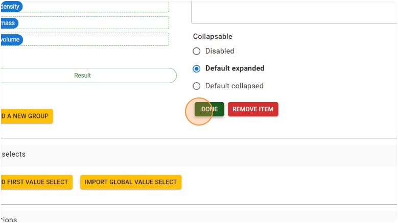
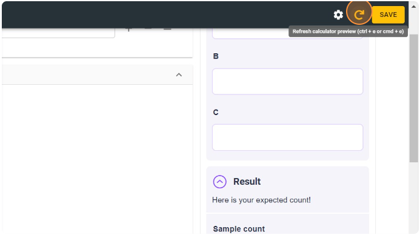
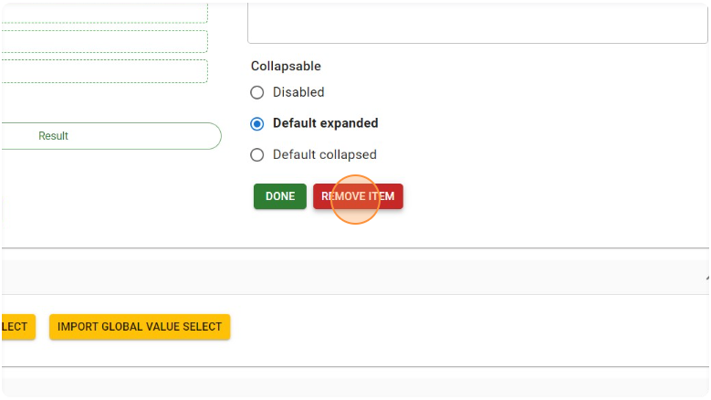
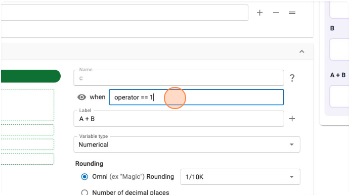
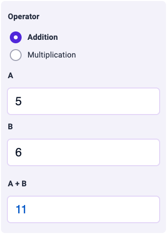
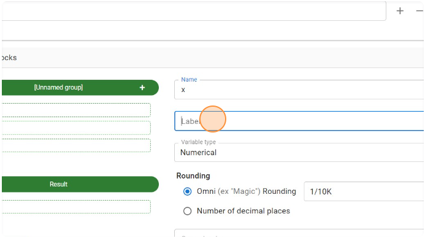
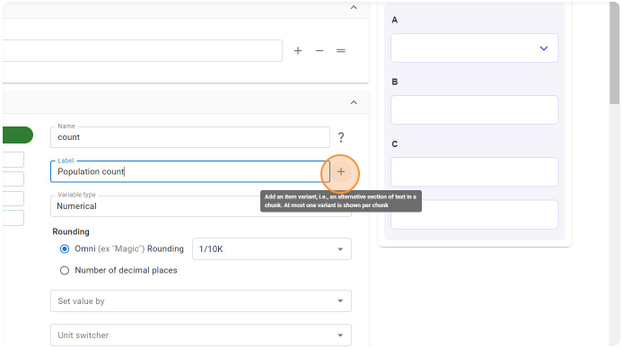
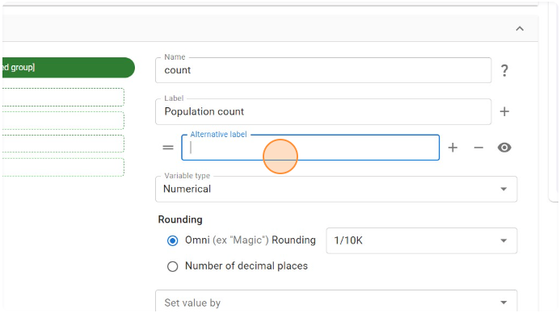
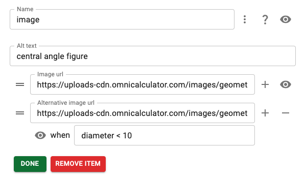

.. _groupsAndVariablesV2:

Groups and blocks
=================

The **Groups and blocks** section of the V2 edit calculator page defines the layout of calculator variables, their units and other properties and attributes. 

Groups
------

Groups hold a number of variables that are logically related or should appear under a heading within the calculator. A group can be **collapsible** so the user can hide/show its variables (this replaces certain use cases of "advanced mode" in Engine V1).

Creating a group
^^^^^^^^^^^^^^^^

1. To create an additional group for the variable/text/image blocks, click the "**Add a new group**" button.

.. figure:: img/create-group-1.png
  :alt: Click "add new group" button
  :align: center

  ؜

2. Click the header of the newly-formed group ("**[Unnamed group]**") to edit its name.

  ؜

3. Set an appropriate **name** for the group in the "**Name**" field. This will be visible to users.

.. figure:: img/create-group-3.png
  :alt: Add a name for the new group
  :align: center

  ؜

4. You may also **add a short description** about the group in the "**Description**" field. This will also be visible to users.

.. figure:: img/create-group-4.png
  :alt: Add a name for the new group
  :align: center

  ؜

5. **Group Collapsibility**: Defines if the group should be collapsable, and also the initial state of a collapsable group (collapsed or expanded).

  The different options are explained below:

  a. **Disabled** — Collapsibility is disabled, so these groups are **always expanded fully** when the calculator is loaded, and the user will **NOT be able to collapse** these groups. Select this option when there is ONLY ONE group in the calculator, as well as under other circumstances where you always want the group to be fully displayed.

  .. figure:: img/group-collapse-disabled.png
    :alt: Example of the group collapsable disabled setting
    :align: center

    ؜

  An example of which looks like...

  .. figure:: img/group-not-collapsible.png
    :alt: Example of a non-collapsable group
    :align: center

    How the group will look if its contents is not collapsable.

  b. **Default expanded** — These groups are always expanded fully when the calculator is loaded, but the user WILL be able to collapse these groups if needed. This is the default choice for a newly created group.

  .. figure:: img/group-collapse-expanded.png
    :alt: Default expanded setting
    :align: center

    ؜

  An example of which looks like...

  .. figure:: img/group-collapsible.png
    :alt: Example of a collapsable group
    :align: center

    ؜

  c. **Default collapsed** — These groups are always collapsed fully when the calculator is loaded, but the user WILL be able to expand these groups if needed, to view the contents. This addresses some of the use cases surrounding advanced mode in Engine V1.

  .. figure:: img/group-collapse-collapsed.png
    :alt: Default collapsed setting
    :align: center

    ؜

  An example of which looks like...

  .. figure:: img/group-collapsed.png
    :alt: Example of a collapsed group
    :align: center

    ؜

6. Once you've added the appropriate group name and description, and selected the required nature of collapsibility **click "Done"**.

  ؜

Moving blocks (e.g., variables) between groups
^^^^^^^^^^^^^^^^^^^^^^^^^^^^^^^^^^^^^^^^^^^^^^

You may drag and drop the blocks to move them between groups or within a
group.

.. figure:: img/move-group.png
  :alt: Click and drag a block to another group
  :align: center

  ؜

.. figure:: img/move-group-2-delete-1.png
  :alt: Block has been moved to another group
  :align: center

  ؜

Conditional visibility of a group
^^^^^^^^^^^^^^^^^^^^^^^^^^^^^^^^^

You may also make the group name **conditionally visible** by clicking the |eye icon| icon next to the Name field, and enter the trigger condition. The group name will show up only when the condition evaluates to "True".

.. figure:: img/group-conditional-visible.png
  :alt: Add a name for the new group
  :align: center

  ؜

  The group name will show up only when the condition evaluates to "True".

.. figure:: img/group-conditional-visible-2.png
  :alt: Add a name for the new group
  :align: center

  ؜

Reviewing changes to groups
^^^^^^^^^^^^^^^^^^^^^^^^^^^

At any time, you may click the "**Refresh**" button to preview how the group will look like to the user.

  ؜

Deleting a group
^^^^^^^^^^^^^^^^

1. To delete a group, click on the group header.

.. figure:: img/move-group-2-delete-1.png
  :alt: Click on the group header you wish to delete
  :align: center

  ؜

2. Then click "**Remove item**" to remove the group.

  ؜

.. warning::
  If you delete a group that **contains some variable/image/text blocks**, those blocks will **NOT be deleted**. They will automatically move to the group above the deleted one.

Blocks
------

Along with variable blocks that are created automatically when a new equation is added to the calculator, there are also text and image blocks. Let's start with exploring variable blocks.

.. toctree::
      :maxdepth: 1
      :hidden:

      multicolumn-layout

.. _showingAndHidingBlocksGroups:

Showing and hiding blocks and groups
^^^^^^^^^^^^^^^^^^^^^^^^^^^^^^^^^^^^

To show or hide blocks depending on the output of a condition, click on the |eye icon| icon at the end of the block name.

.. figure:: img/show-hide-blocks-1.png
  :alt: Click on the eye icon at the end of the block name
  :align: center

  ؜

Then enter a condition for when this block will be shown. It can refer to any of the other variables in the calculator.

  ؜

.. tip::
  To only show a block if another variable is **equal** to a specific value (such as a variable acting as a switch with a value select), use the ``==`` operator.

In this example, we have radio buttons that switch the calculator between addition mode and multiplication mode. When the variable ``operator`` equals 1, the result for addition is shown. When it equals 2, the variable that contains the result for multiplication is shown.

  The variable holding the result for addition is shown when **operator == 1** is true.

  The variable holding the result for multiplication is shown when **operator == 2** is true.

.. tip::
  If the condition **depends on more than one variable** or function, use the logic operators ``and`` and ``or``.

.. tip::
  If you need to have a variable that is **always hidden**, set the condition to ``false``.

.. tip::
  A similar method can be used to **show and hide groups** of blocks conditionally. Click on the green group bar and then click on the |eye icon| icon to set when the group should be visible.

.. seealso::

  To place blocks next to each other on the same row, checkout the page on :ref:`multicolumn layout<multicolumnLayout>`.

Variable blocks
^^^^^^^^^^^^^^^

Variable blocks handle the core component of our calculators where inputs are entered and results are displayed. For more information about all of the attributes that are available for variables, visit the variable attributes section of the handbook:

.. toctree::
    :maxdepth: 2

    variableAttributes

.. _groupsAndVariablesV2CreatingAVariableBlock:

Creating a variable block
"""""""""""""""""""""""""

Besides variable blocks beginning created automatically from equations, you may also manually create them (for example, for selecting different modes of a calculator and displaying different variables). *This feature replaces the Additional variables feature on the V1 Engine.*

1. Click the **+ icon** on the header bar of the group in which you want to add your additional variable block.

.. figure:: img/add-variable-block-1.png
  :alt: Click on the plus icon in the group header you wish to add a block variable to
  :align: center

  ؜

2. Click the "Add variable block" option.

.. figure:: img/add-variable-block-2.png
  :alt: Click on the Add variable block option.
  :align: center

  ؜

3. Select the newly-created variable block to edit its name and label.

.. figure:: img/add-variable-block-3.png
  :alt: Select the newly-created variable block
  :align: center

  ؜

4. Give the variable a name (required field), which will be used to refer to the variable in all other places of the calculator based on your need.

.. figure:: img/add-variable-block-4.png
  :alt: Give the variable a name
  :align: center

  ؜

5. The **Label** field is optional. If left blank, no label would show up for that variable.

  ؜

6. You could also **provide variants for the variable label** that trigger a different choice based on some condition. To do this, click the + icon next to the label field ("**Add an item variant**").

  ؜

7. Provide an alternative label in the "**Alternative label**" field.

  ؜

8. To set the trigger condition for the label variant, click the |eye icon| icon ("**Open item condition settings**").

.. figure:: img/add-variable-block-8.png
  :alt: Add trigger condition
  :align: center

  ؜

9. Enter an **appropriate condition** statement in the condition box that appears. When this condition evaluates to "True", the corresponding label variant will be displayed.

  ؜

.. note::
  The choice of variant to be used is evaluated in a **bottom-up fashion**. So the first variant from the bottom whose condition evaluates to true will be used, in case more than one variant's conditions evaluate to true.

Copying variable attributes to other variables
""""""""""""""""""""""""""""""""""""""""""""""

To help you save time when creating similar variables, you can copy attributes to other variables. Here's how to do it:

1. Click the "COPY ATTRIBUTES TO" button.

  ؜

2. Click the down-pointing arrow icon to select the target variables to copy attributes to.

  ؜

3. Click checkboxes corresponding to each variable that you want to copy to.

  ؜

4. Select the attributes to copy. All attributes apart from help text and variable label are selected by default. To remove any attributes, **click the cross next** to each attribute name. To select other attributes, click the down-pointing icon.

.. figure:: img/copy-attributes-step-4.png
  :alt: Select the attributes to copy.
  :align: center

  ؜

5. Then you have the list of variable attributes to select from.

.. figure:: img/copy-attributes-step-5.png
  :alt: Select from list of variable attributes
  :align: center

  ؜

6. Click the "APPLY" button to perform the copying of the selected attributes to the target variables.

.. figure:: img/copy-attributes-step-6.png
  :alt: Click the "APPLY" button to perform the copying
  :align: center

  ؜

Image blocks
^^^^^^^^^^^^

Image blocks allow you to display an image within the calculator widget and is very similar to the image block in the text editor.

Creating an image block
"""""""""""""""""""""""

To add an image to your calculator:

1. Hover over the group you wish to add the image and **click the plus icon**.
2. Select **"Add image block"** from the dropdown list. A new empty image block will added to the group.
3. Click on it and fill in the following details:

  * **Name** — Give the image block a unique name;
  * **Alt text** — Add a good alt text for the image, according to these :ref:`guidelines<textStylingGuideAltText>`; and
  * **Image url** — The full URL of the image (short path option currently doesn't work).

4. Other settings for the image can be reached by **clicking on the three-dot icon** after the name field. Here you can set:

  .. figure:: img/image-block-details.png
    :alt: Image block details
    :align: center

    ؜

  * **Alignment** — Sets the horizontal alignment of the image, which is typically centered.
  * **Caption** — Add an optional caption to be displayed under the image. This is the place to add any attribution if Omni didn't create the image.
  * **Copyright by Omni** — Check the box if we created the image.
  * **Width** — Enter the width of the image as a percentage of the width of the calculator widget.

Showing different images conditionally
""""""""""""""""""""""""""""""""""""""

To show and hide an image block as a whole, see the instructions in the :ref:`Showing and hiding blocks and groups <showingAndHidingBlocksGroups>` section.

If you want an image block to show different images depending on the value of some variable, here is what you do:

1. Click on the |plus icon| after the image url field and **provide the URL for the alternative image**.
2. The click the |eye icon| to add a **condition when this alternative image should be shown** instead of the default image of this image block.

  Example: If the variable diameter is less than 10, then the alternative image will be shown instead of the default.

Text blocks
^^^^^^^^^^^

Text blocks are content blocks (the same as variable blocks and image blocks) that contain **exclusively text**.

Text blocks support the addition of **multiple chunks of text** in sequential order. Each chunk can have **multiple alternatives** selected through standard visibility rules.

Text block's supports both Markdown and LaTeX. Restrict the use of the latter only in situations where it's the only option left.

Creating a text block
"""""""""""""""""""""

1. To create a text block, click the + button on the group header.

  .. figure:: img/text-block-create-1.png
    :alt: Text block step 1 - click on group + icon
    :align: center

    ؜

2. Click **"Add text block"** to add a new text block within the group.

  .. figure:: img/text-block-create-2.png
    :alt: Text block step 2 - click on Add text block
    :align: center

    ؜

3. Click on the newly created text block to edit its details.

  .. figure:: img/text-block-create-3.png
    :alt: Text block step 3 - click on the new text block
    :align: center

    ؜

4. Provide a **name** for the text block. This is not visible to the user. Spaces are not allowed in the name.

  .. figure:: img/text-block-create-4.png
    :alt: Text block step 4 - give the text block a name
    :align: center

    ؜

5. Each text block has two possible options: **type** and **format**. You can choose **only one** value for each option for all the chunks of a block.

  To define the style of the text block, click the "Type" dropdown.

  .. figure:: img/text-block-create-5.png
    :alt: Text block step 5 - click the "Type" dropdown
    :align: center

    ؜

6. There are 5 different types available for a text block.

  .. figure:: img/text-block-create-6.png
    :alt: Text block step 6 - select type
    :align: center

    ؜

  Here is information and examples about each type:

  * **Information** — Short paragraph. Inside calculator. To build awareness in user.

    .. figure:: img/text-block-eg-info.png
      :alt: Example of information text block
      :align: center

      ؜

  * **Positive** — Short paragraph. A positive message for user.

    .. figure:: img/text-block-eg-pos.png
      :alt: Example of positive text block
      :align: center

      ؜

  * **Neutral** — Without icon. Long paragraph. Suitable for text at the top of the calculator.

    .. figure:: img/text-block-eg-nue.png
      :alt: Example of neutral text block
      :align: center

      ؜

  * **Negative** — Short paragraph. A negative information for the user.

    .. figure:: img/text-block-eg-neg.png
      :alt: Example of negative text block
      :align: center

      ؜

  * **Warning** — Short paragraph. A warning for the user.

    .. figure:: img/text-block-eg-warn.png
      :alt: Example of warning text block
      :align: center

      ؜

7. We use 2 different **font sizes** for text, and the choice can be made using the "Format" dropdown.

  .. figure:: img/text-block-create-7.png
    :alt: Text block step 7 - choose the format of text
    :align: center

    ؜

  The choices are:

  * **Regular (default)** — Used for introduction, result interpretation, etc.
  * **Fine print (smaller size)** — Used for minor notes/tips, etc.
  
    **Note: Don't use it for validation of inputs.**

  .. figure:: img/text-block-eg-fine.png
    :alt: Comparing regular and fine print text blocks
    :align: center

    Comparing regular and fine print text blocks.

8. Add the text content to be displayed to the user in the text chunk box.

  .. figure:: img/text-block-create-8.png
    :alt: Text block step 8 - enter the content of the text block
    :align: center

    ؜

9. Once you're done configuring the text block as needed, **click "Done"** and **Refresh** or **Save** the calculator to preview the changes.

  .. figure:: img/text-block-create-9.png
    :alt: Text block step 9 - click done to close the text block
    :align: center

    ؜

