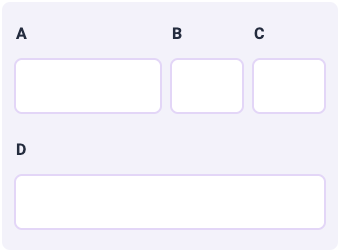

.. _multicolumnLayout:

Multicolumn layout of blocks
============================

Multicolumn layouts are useful to **show multiple variable blocks and/or text/image blocks on the same line**. This feature is especially useful for calculators involving matrices (where each row represents all numbers in a row in the matrix), or calculators that require a set of coordinate points in 2D or 3D geometry, etc. (where each row represents all coordinates of a point).

.. warning::
  When using multicolumn layout, **check if the preview provides a cohesive view**. If the variable blocks in multicolumn view have prefixes and/or suffixes and/or unit switchers, the multicolumn view might get crowded and become unusable. In such cases, please default to the regular single-column view to ensure usability. Multicolumn views are recommended for variable blocks that **do not have any prefix/suffix/unit switchers** (e.g., matrices, coordinates of a point, etc.).

Two-column layouts
------------------

To create a multicolumn layout, **drag and drop the block** on to the additional column space that gets highlighted. For a 2-column layout, the default split is 1/2 - 1/2 for each block.

Click the **multicolumn icon** to change this split, as shown in the screenshot below:

  Click the multicolumn icon (hover on a row to make it appear) to change the split between each of the blocks on a row.

Click the "Refresh calculator" button to preview the new layout.

  ؜

For a **2-column layout**, the following are the column width distribution choices available:

* 1/2 - 1/2
* 1/4 - 3/4
* 1/3 - 2/3
* 3/4 - 1/4
* 2/3 - 1/3

Depending on the requirement, you may use any of these choices to configure the column widths.

Here is the same calculator with a **1/4 - 3/4 split** for a 2-column layout:

  ؜

And here are the rest of the available layouts:

.. centered:: *Left: 1/3 - 2/3 split. ؜؜ Middle: 3/4 - 1/4 split. ؜؜ Right: 2/3 - 1/3 split.*

Three-column layouts
--------------------

For **3-column layouts**, the default column width split is **1/3 - 1/3 - 1/3**. You may choose any other column width distributions by **clicking on the table icon** next to the row containing 3 columns.

The choices available for 3-column layouts are:

* 1/3 - 1/3 - 1/3
* 1/4 - 1/4 - 2/4
* 1/4 - 2/4 - 1/4
* 2/4 - 1/4 - 1/4

  ؜

Here is what all the options for a 3-column layout look like:

.. centered:: *Top-left: 1/3 - 1/3 - 1/3 split. ؜؜ Top-right: 1/4 - 1/4 - 2/4 split. ؜؜ Bottom-left: 1/4 - 2/4 - 1/4 split.  ؜؜ Bottom-right: 2/4 - 1/4 - 1/4 split.*

Four-column layouts
-------------------

Multicolumn view can be used for **up to 4 columns** in a row in the calculator widget.

For a 4-column layout, the default column width split is **1/4 - 1/4 - 1/4 - 1/4**. If you'd like to make one of the columns marginally wider than the others, you may use any of the other available width split options:

* 1/4 - 1/4 - 1/4 - 1/4
* 3/9 - 2/9 - 2/9 - 2/9
* 2/9 - 3/9 - 2/9 - 2/9
* 2/9 - 2/9 - 3/9 - 2/9
* 2/9 - 2/9 - 2/9 - 3/9

  ؜

Here is what all the options for a 4-column layout look like:

.. centered:: *Top-left: 1/4 - 1/4 - 1/4 - 1/4 split. ؜؜ Top-right: 3/9 - 2/9 - 2/9 - 2/9 split. ؜؜ Bottom-left: 2/9 - 3/9 - 2/9 - 2/9 split.  ؜؜ Bottom-middle: 2/9 - 2/9 - 3/9 - 2/9 split. ؜؜ Bottom-right: 2/9 - 2/9 - 2/9 - 3/9 split.*
