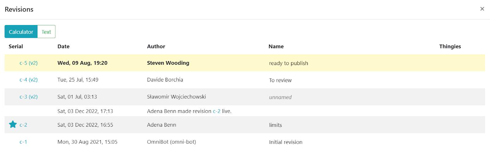

.. _calcRevisionsV2:

Revisions
=========

The revisions section of the calculator editor page helps you **manage the various revisions** of a calculator that are created as it is developed. You can do things like: go back to old revisions, experiment with a new feature without affecting the published version, see who made a certain change, and see the differences between revisions.

.. tip::
  Here is a full video demonstration of the revisions feature, as a supplement to this section of the Handbook.

  .. raw:: html

    
<iframe width="560" height="315" src="https://www.youtube.com/embed/9uAwERwwHNg" title="YouTube video player" frameborder="0" allow="accelerometer; autoplay; clipboard-write; encrypted-media; gyroscope; picture-in-picture" allowfullscreen></iframe>

Each time you click the save button, **a new revision is born** and given a sequential number, as shown in the example below.

.. _revisionsExampleV2:

  Example of revisions of draft a calculator.

.. note::
  Changes to anything in the **Details** section of the calculator does not generate a new revision and changes are not tracked. This matches the behavior of cloning/merger calculators.

To see the list of revisions, you can either **click on the gear icon** in the top-right of the screen and click **Show revisions**, or click on the current revision status in the **bottom left-hand corner**.

.. _revisionsMenuV2:

  Use the gear icon menu and click on **Show revisions** to show the revision list.

.. _revisionsStatusV2:

  Click on the revision status indicator to display the list of revisions.

For each revision, you can see the **serial number**, the **date** when it was saved, **who** saved it, it's optional **name** (or tag) and some **icons** for functions such as viewing a preview of the webpage and viewing differences between revisions.

To switch between revisions, simply **click on the desired revision serial number**.

To see the **web page based on a particular revision**, click on the globe icon in the **Thingies** column.

.. _revisionsWebpageV2:

  Clicking on the global icon will display the web page for the calculator at that revision.

Note that the accompanying text article used for the web page preview will be the latest or live text revision.

.. tip::
  You might find it convenient to open the preview web page in a **new tab or window**, so you don't navigate away from the edit calculator page. You can do that by **right-clicking** and selecting open in new tab or window.
  
  A shortcut to opening links in a new tab is to **hold down the control key** (command key on Macs) and clicking the link. 
  
  Alternatively, if you use a mouse with a **scroll wheel**, pressing the scroll wheel down while hovering over the link should open it in a new tab.

Revision status indicator
-------------------------

In the bottom-left corner of the calculator editor page, you'll find the revision status indicator. This tells you which revision is currently loaded, whether it is the live version or not, and whether it is the most recent version of the calculator. Here are some examples that illustrate these different states.

.. _revisionsStatusEg1V2:

  This revision status indicator tells us that we are looking at revision 1, that it's not live, and it's the most recent revision.

.. _revisionsStatusEg2V2:

  This one tells us that we are looking at revision 5, that it's not live, and it's not the most recent revision.
  
.. _revisionsStatusEg3V2:

  This final one tells us that we are looking at revision 3, that it's the live revision, but not the most recent revision.
    

Comparing revisions
-------------------

To more easily see what things have changed between revisions, you can perform a difference check between any two revisions. You do this by clicking on the **dd** icon in the **Thingies** column to select the first one (**dd** icon will turn blue and sticky), then do the same to select another revision to compare it with.

.. _revisionsDdIconV2:

  Click on the **dd** icon of the first revision you wish to compare, then click the **dd** icon on the second revision.

Once you click on the second **dd** icon, a page is displayed in a new tab showing you all the differences between the two calculators.

.. _revisionsDiffEgV2:

  Example of displaying the differences between two calculator revisions. Here the unit switcher and default units have been changed.

You can go back to one of the revisions by clicking the links at the top of the page, or close it if you are done looking at the differences.

Branched revisions
------------------

As you build your calculator and press the save button, you will naturally use the latest revision as the basis for the next revision.

But what if some feature you've tried to add is not working and you'd like another try at it using another idea (e.g., use customJS instead of engine equations)?

You just need to load the revision you had **before** you stated adding the new feature, try again and save. The new revision will now have a **P** icon in the **Thingies** column (as shown below), which tells you that this revision was based on another revision (its parent is not the previous numbered revision).

.. _revisionsParentV2:

  Example of a revision which has a different parent.

.. note::
  Saving further revisions based on c-7 will not have the **P** icon.

Revisions with other calculators as parents
-------------------------------------------

If you :ref:`clone <upperPanelClone>` a calculator (clone no yet available in Engine v2) or merge the contents of another calculator to a calculator, a new revision is created with a special yellow **P** icon, indicating that the parent of a revision is another calculator (at a particular revision).

Hovering your mouse over this icon with tell you the name and id of the other calculator, as well as the revision that was cloned/merged. You may click on the yellow **P** icon to be taken to that other calculator and revision.

.. _revisionsClonedV2:

  Example of a revision which has been cloned from another calculator.

.. _revisionsNameARevisionV2:

Naming a revision
-----------------

Naming revisions is an important part of creating a calculator as only named revisions can be made live and eventually published. You'll also name a revision for your reviewer to review, or you could name a revision after a key feature has been completed for large calculators.

.. warning::
  Any revisions that are **not named** are **deleted after 90 days**. This gives enough time for you to go back to any revision while you are actively developing your calculator, but cuts down on clutter in the long term.

Note however that the **latest revision is never deleted**, even if it is unnamed. So if you start creating a calculator but then leave it for a few months, the last revision will remain for you to pick up again. 

To **name a revision**, click in the **Name** field of the revision and give it a meaningful name, such as "To review", if you are marking it for your reviewer to assess. Click the tick icon to save the name.

.. _revisionsNameV2:

  Example of naming a revision of draft a calculator.

.. _revisionsLiveRevisionV2:

Live revision
-------------

The concept of the live revision depends on whether the calculator is published or not. For **unpublished** calculators, the live revision will be the revision used when you navigate to the preview web page of the calculator at ``all/calculator-slug``, when no revision number is specified.

.. note::
  The URL for a particular revision has the format ``all/calculator-slug?calculatorSerial=n`` for unpublished calculators, when ``n`` is the revision number. For published calculators, this changes slightly to ``category/calculator-slug?calculatorSerial=n``.

Once a calculator is **published**, the live revision will be the one that loads when the user navigates to ``category/calculator-slug`` (i.e., from a link on the website).

To make a revision live, **click on the star icon** that appears next to the revision number when you hover over it. However, **only named revisions** are allowed to made live.

.. warning::
  You need to :ref:`name a revision <revisionsNameARevisionV2>` to be able to make it **live**, and a calculator needs a live revision in order to be **published**.

.. note::
  While the calculator author should name revisions, generally, **only reviewers and proofreads** should make a revision live and publish calculators.

Now, **clicking on a unfilled blue star** will make the revision live, though note that it is still not published on the public website. The live revision is denoted with a filled blue star and the action is logged, as shown below.

.. _revisionsLiveV2:

  Example of making a revision live.

.. _revisionsPublishingACalculatorV2:

Publishing a calculator
-----------------------

With the **live revision loaded**, click on the gear icon in the top-right corner on the page and select **Publish**.

To prevent accidental publishing, you need to provide the **calculator's slug**.

If all went well, now the calculator can be reached by its final URL path (using its category slug) and appear in the site index and search.

At a later date, if further changes need to be made, the live revision can be **changed to a later revision**, which will then become the new published calculator.

.. note::
  This is different to the previous behavior, when simply saving a published calculator would immediately be reflected on the website.

.. warning::
  It is **not currently possible to unpublish a calculator** using the AdminBB interface. If a calculator is mistakenly published, you would have to ask the developers to take it down, which is not convenient, both for you or them. Note that you cannot delete a published calculator either. So think **very carefully** before publishing.