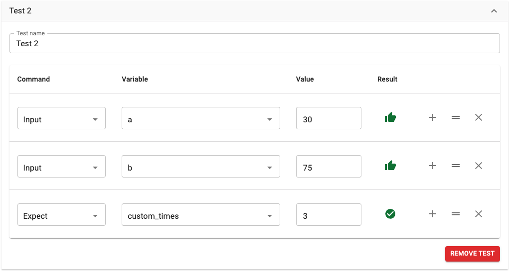

.. _testsV2:

Calculator tests
================

The **Tests** section allows you to set-up tests for your calculator. This is useful for double checking that your calculator gives the correct result and to check that any future changes you make still give the same correct result.

The test section is also the way a preview image is generated, which may be used to show the user what the calculator will look like before they embed it.

.. _testsExampleV2:

  Example of a test for a calculator.

How to create a test
--------------------

#. Open the **Calculator tests** section and click the **Add test** button.
#. Give the test a useful name, though this is optional.
#. You start off with one line of input. **Select a variable** as this input.
#. Then give this variable a **value**, in the default unit. You should see a **thumbs up icon** if the value is valid (doesn't violate any conditions).
#. Next press the **plus icon** to either add another input, or an output.
#. To specify an output, set the **Command** column to **Expect**, choose the variable and value. You can have as many outputs as you need.
#. You should see a **green tick** if the expected value of the output variable is correct.

.. tip::
  If you don't get a green tick for a seemly correct value, enter the values into the calculator preview and make a note of the exact value of the variable. Use this value exactly, without any rounding, in the test. Then the green tic should appear.

To re-arrange the order of the variables in a test, click on the **up-down arrow icon** and drag the item up or down.

To delete an variable from the test, **press the cross icon** on the right of the variable row.

Specifying values in different units
------------------------------------

If you want to give any values in units that are not in the default unit of the variable, you can use the command **Select unit**. Then choose the variable and the unit you would like to use.

Then when you specify the **Input/Expect** value, the number should be given in the unit you selected above.

Removing a test
---------------

To remove a test, simply press the **Remove test** button.

.. tip::
  You may need to remove a test if you delete equations/variables from your calculator that are used in a test. If variables have changed name, then re-select them from the drop-down list of variables.
