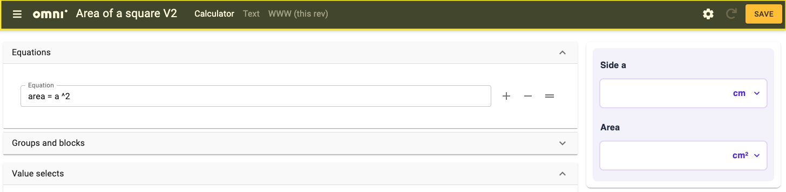
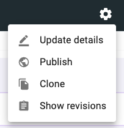
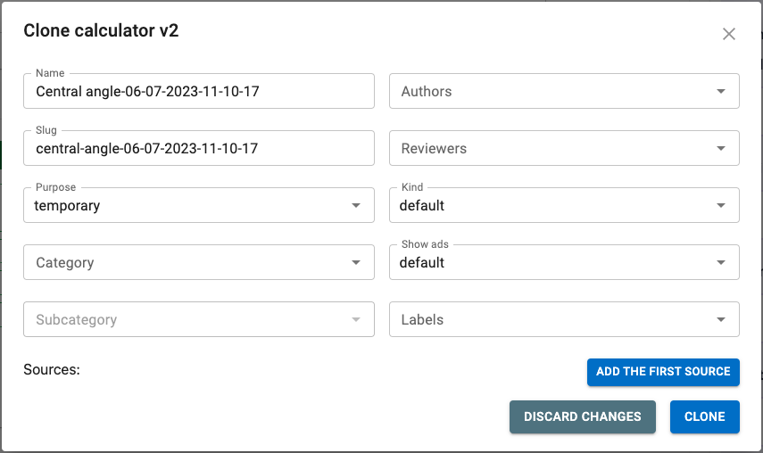

.. _upperPanelV2:

Upper panel and preview
=======================

.. _upperPanelScreenshotV2:

  The upper panel of the edit calculator page is highlighted in yellow.

The upper panel of the edit calculator page contains the following items on the left, from left to right:

* **Three-bar hamburger menu** — Access other parts of adminBB.
* **Omni logo** — Clicking the logo will take you to the calculator index page.
* **Name** — Name of the calculator.
* **Calculator** — This becomes a clickable link back to the edit calculator page in the text editor.
* **Text** — Takes you to the text editing page.
* **www** — Takes you to frontend web page rendering of the calculator. Two links will be shown if the published revision is different to the current revision. **NOT YET WORKING IN Engine v2**

Save button |save button|
-------------------------

On the right-hand side there is the all-important **save** button. When you first open a calculator, this button will be **grey**. If you make a change to the calculator, it will turn **yellow**, indicating that there are unsaved changes. Once you press the button to save the changes, the button then turns **green**.

When you press the save button, look out for the **message** in the bottom right corner, which tells you whether the save was successful, or if there is an error that needs correcting.

Saving adds a new revision to the revision history and saves the calculator to Omni servers.

In a change from Engine v1, a save is no longer required change adding or making changes to the Equations or Conditions section of the calculator editor page. You can use the reload button instead (see next section).

.. note::
  You may also use the keyboard shortcut ``Ctrl+S`` (``Cmd+S`` on Macs) to save the calculator.

Reload preview button |reload button|
-------------------------------------

After making a change to the calculator, you need to **press the Refresh calculator preview button** to see the change reflected in the calculator preview.

.. note::
  You may also use the keyboard shortcut ``Ctrl+E`` (``Cmd+E`` on Macs) to reload the calculator.

Calculator tools ⚙️
-------------------

  Calculator tools menu.

The little gear icon opens a menu with the following items:

* **Update details** — Opens the details of the calculator so that you can edit them. See the :ref:`Details <detailsV2>` section for more information.
* **Show revisions** — Shows the list of revisions of the calculator. Learn all about the revisions feature here: :ref:`Revisions <calcRevisions>`.
* **Publish** — Publishes the calculator onto the website. To avoid accidental publishing, you need to enter the slug of the calculator. **Don't publish any V2 calculators yet, as we don't have the V2 website.**
* **Clone** — Makes a temporary copy of the current calculator. Useful for testing a change out before saving it to a live calculator. See :ref:`next section <cloningCalculatorV2>` for more details.
* **Merge to other calculator** — *Coming soon.*

.. _cloningCalculatorV2:

Cloning a calculator
^^^^^^^^^^^^^^^^^^^^
Cloning a calculator is useful if you need to add a new feature to an existing calculator. Here are the step-by-step instructions to clone a calculator:

1. Click on the gear cog icon and select **Clone**.

  Details panel of a cloned calculator.

2. The details panel of the new calculator will be displayed. The slug and name are pre-filled with today's date and current time. You are free to change the slug/name to something more meaningful. The purpose is set to "temporary", as it is assumed this will not be a production calculator. If that's not the case, then change the purpose.
3. Click the **clone button** and you will be taken to the newly created cloned calculator.

.. _calculatorPreviewV2:

Preview
-------

On the right-hand side of the page, a **full preview** of your calculator is shown. When you press the reload or save button, any changes made will be reflected in the preview.

.. figure:: img/preview.png
  :alt: calculator preview
  :align: center

  Calculator preview on the right-hand side of the edit calculator page.

Under the preview of the calculator, there are two useful buttons that **help you in testing your calculator** (resetting it without having to make a change to it).

Reload calculator button
^^^^^^^^^^^^^^^^^^^^^^^^

Pressing this button will **reload the calculator** but keep default and auto-saved values. In future it will also remember the last units set by the user.

Clear all changes button
^^^^^^^^^^^^^^^^^^^^^^^^

This button **clears all of the user data**, including :ref:`auto-saved<variableAttributesV2AutoSave>` values and user selected units. It does not clear default values. 