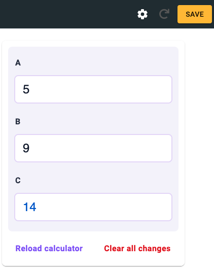

.. _upperPanelV2:

Upper panel and preview
=======================

.. _upperPanelScreenshotV2:

  The upper panel of the edit calculator page is highlighted in yellow.

The upper panel of the edit calculator page contains the following items on the left, from left to right:

* **Three-bar hamburger menu** — Access other parts of adminBB.
* **Omni logo** — Clicking the logo will take you to the calculator index page.
* **Name** — Name of the calculator.
* **Calculator** — This becomes a clickable link back to the edit calculator page in the text editor.
* **Text** — Takes you to the text editing page.
* **www** — Takes you to frontend web page rendering of the calculator. Two links will be shown if the published revision is different to the current revision. **NOT YET WORKING IN V2**

.. |save button| image:: img/save-button.png
  :alt: Save button

Save button |save button|
-------------------------

On the right-hand side there is the all-important **save** button. When you first open a calculator, this button will be **grey**. If you make a change to the calculator, it will turn **yellow**, indicating that there are unsaved changes. Once you press the button to save the changes, the button then turns **green**.

When you press the save button, look out for the **message** in the bottom right corner, which tells you whether the save was successful, or if there is an error that needs correcting.

.. |reload button| image:: img/reload-button.png
  :alt: Reload button

Reload preview button |reload button|
-------------------------------------

After making a change to the calculator, you need to **press the Refresh calculator preview button** to see the change reflected in the calculator preview.

Calculator tools ⚙️
-------------------

.. figure:: img/calculator-tools.png
  :alt: calculator tools menu
  :align: center

  Calculator tools menu.

The little gear icon opens a menu with the following items:

* **Update details** — Opens the details of the calculator so that you can edit them. See the :ref:`Details <detailsV2>` section for more information.
* **Show revisions** — Shows the list of revisions of the calculator. Learn all about the revisions feature here: :ref:`Revisions <calcRevisions>`.
* **Publish** — *Coming soon.*
* **Clone** — *Coming soon.*
* **Merge to other calculator** — *Coming soon.*

.. _calculatorPreviewV2:

Preview
-------

On the right-hand side of the page, a **full preview** of your calculator is shown. When you press the reload or save button, any changes made will be reflected in the preview.

  Calculator preview on the right-hand side of the edit calculator page.
