.. _valueSelectsV2:

Value selects
=============

Value selects allow you to create a **drop-down menu of textual options** for the user to select from instead of entering a number.
 
This is great for specifying **common presets for a variable**, or to create switches that turn calculator features on and off.

How to define a value select
----------------------------

In Engine v2, there are 2 ways to define a value select:

* Create a value select specific to the calculator from scratch; or
* Import from a Global Value Select to store a **local copy** of it within the calculator.

Creating a value select
-----------------------

In Engine v2, you can create 2 different kinds of value selects:

* Simple value select; and
* Multi-level value select (documentation coming soon), of which there are two types:

   * Multi-level single value select; and
   * Multi-level split value select.

Simple value select
^^^^^^^^^^^^^^^^^^^

In the **Value selects** section of the edit calculator page, here are the steps to create a value select:

1. Click the **Add first value select** button to start creating a new value select.

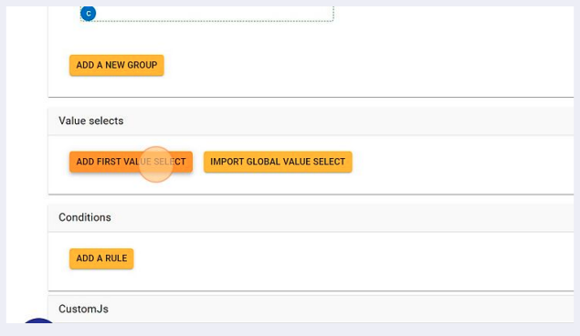

2. Give your new value select a descriptive name. It will be used in the variable attribute **Value select**.
3. Enter a name for the first item of the value select. This name is what the **user sees in the drop-down menu**, so make sure it will make sense to the user.

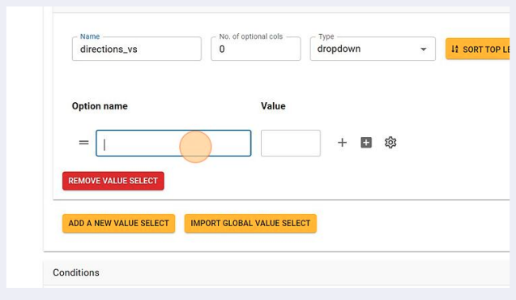

4. Next, **enter a value** to associate with this first option. The variable that uses this value select will take this value when this option is selected by the user.

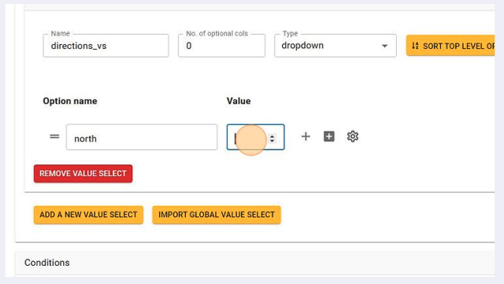

5. Go ahead and add other value select items. **Press the plus icon** (“Add a sibling”) to add another one.

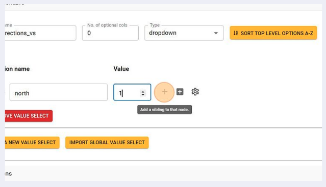

6. Continue adding all options...

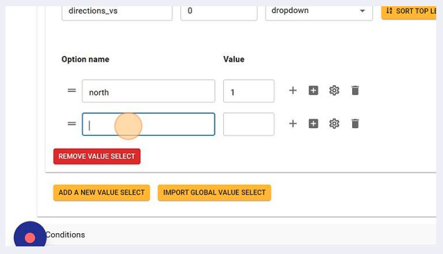

.. _valueSelectsV2TieToVariable:

7. Finally, associate a variable with this value select by setting the variable type to **Value select** in the variable attributes.

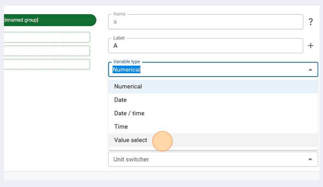

8. Then choose the name of the value select you created in the **Value select name** field, to tie it to the variable.

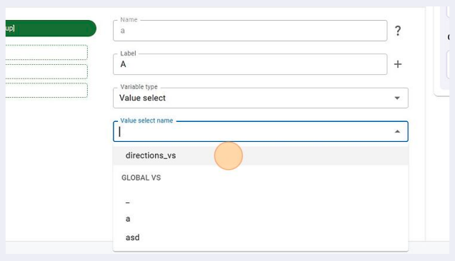

By selecting an option from the drop-down list, the variable takes the value defined in value select. So the variable can still be used in equations as usual.

Additional options in value select
""""""""""""""""""""""""""""""""""

You may configure the value select in different ways depending on your need. The available options are:

1. **Value select type**: The value select type can be any of the following:

   a. **Dropdown** — recommended when there are more than 5 options. Using this will display your choices as a dropdown menu from which the user can select their required option.

      .. figure:: img/vs-dropdown.png
       :alt: example of a dropdown list value select
       :width: 50%
       :align: center

      (You may also feel free to use the dropdown option for **5 or fewer** options as you see fit.)

   b. **Radio button** — recommended when there are **5 or fewer options**. Using this will display all choices as radio buttons from which the user can choose one. With this type, the user will be able to **see all options right away** without requiring them to click the dropdown.

      .. figure:: img/vs-radio.png
       :alt: example of a radio list value select
       :width: 50%
       :align: center

      .. note::
        1. You will **not** be able to use this option when there are **more than 5 options**.
        2. You will have to **set a default value** for the variable when using the radio button option.

.. _valueSelectsV2CheckboxOption:

   c. **Checkbox** — If there is only one option (later also two), you can select the checkbox option, which looks like this:

      .. figure:: img/checkbox-example.png
       :alt: example of a checkbox value select
       :width: 50%
       :align: center

      .. note::
        For Value Selects with only one option, that option's value represents the value of the connected variable in the "checked" state. The unchecked state is by default associated with a **NULL value**. So use value select checkbox with a single option only if you "want" the unchecked state to be NULL. If you need the unchecked state to be a different value such as 0, we need a value select with 2 options, which will be implemented later.

      For instructions on how to create a checkbox, see :ref:`Checkbox value select<valueSelectsV2Checkbox>` below.

2. **Optional additional columns**: You may configure additional columns to hold additional data about each choice. For example, if you are listing car models, you could use additional columns to configure each model's mileage, color, etc. *More about this option at a later date in the value setter section.*

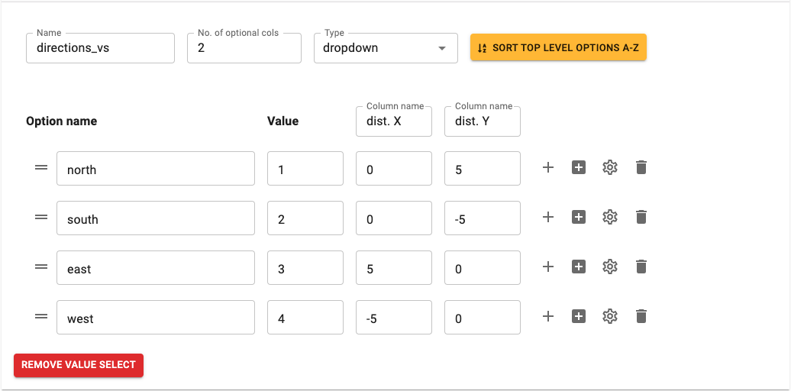

|

.. _valueSelectsV2Checkbox:

Checkbox value select
^^^^^^^^^^^^^^^^^^^^^

To create a checkbox type variable, we first need to **create a value select of type checkbox**. A value select with one option is configurable as a checkbox. *[Future update: In future, value selects with either one option or two options will be configurable as checkbox.]*

1. Create the value select checkbox by clicking "Add first value select".

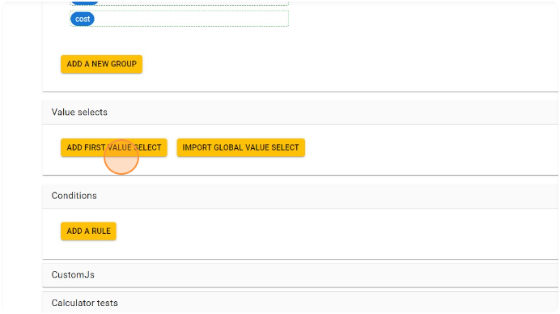

  ؜

2. Configure the value select with **only one** option.

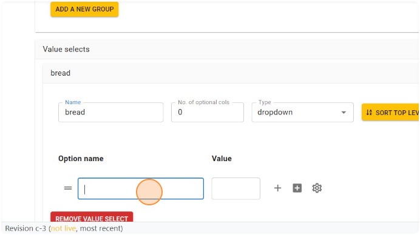

  ؜

3. The value of the option will represent the value of the connected variable in the **"checked" state**.

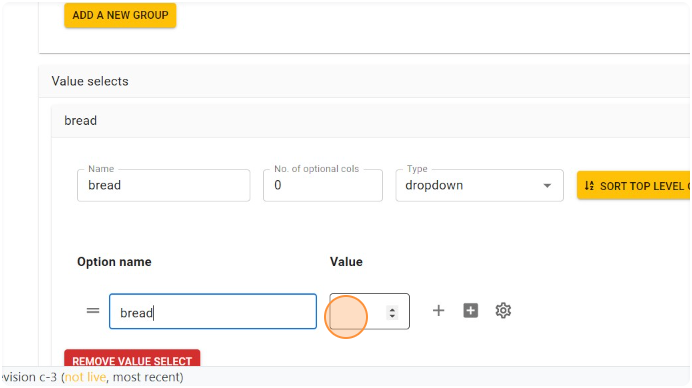

  ؜

4. From the "Type" dropdown, choose **"checkbox"**. This option will show up **only if** the value select has a single value. *[Future update: we plan to show it for value selects with 2 options too.]*

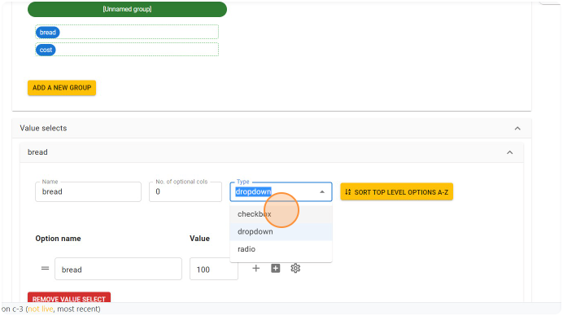

  ؜

5. Click on the variable that should be tied to the value select checkbox.

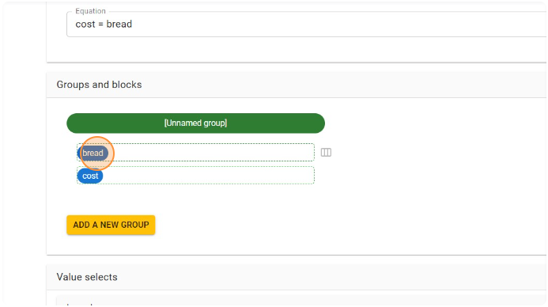

  ؜

6. Choose "Value select" option in the "Variable type" attribute.

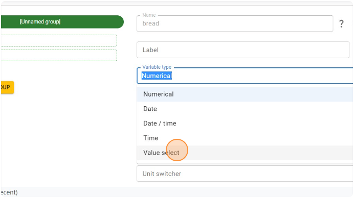

  ؜

7. Choose the value select checkbox that was created.

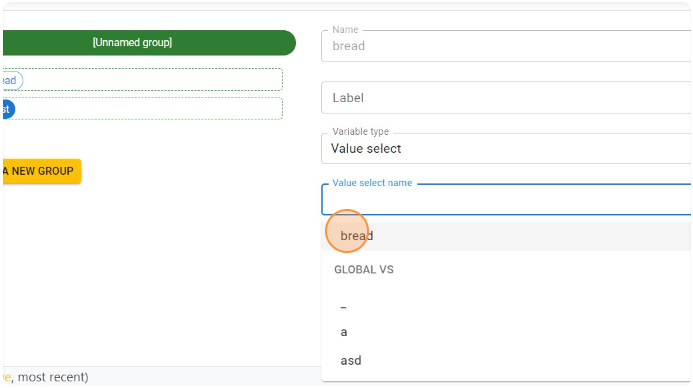

  ؜

8. Reload the calculator preview and now the variable will show up as a checkbox in the calculator panel.

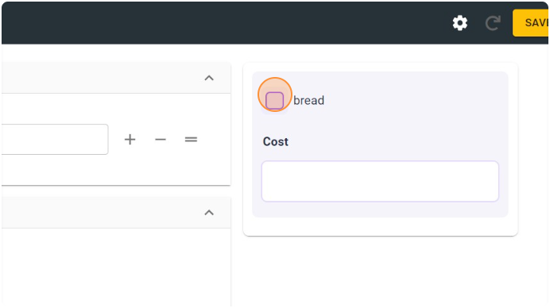

  ؜

9. Checking the checkbox will set the value of the variable to the one configured in the value select.

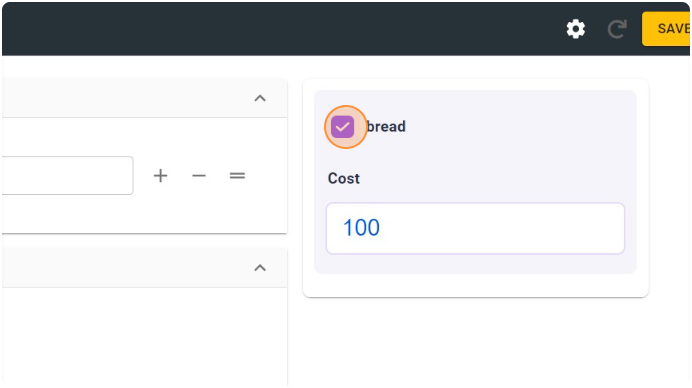

  ؜