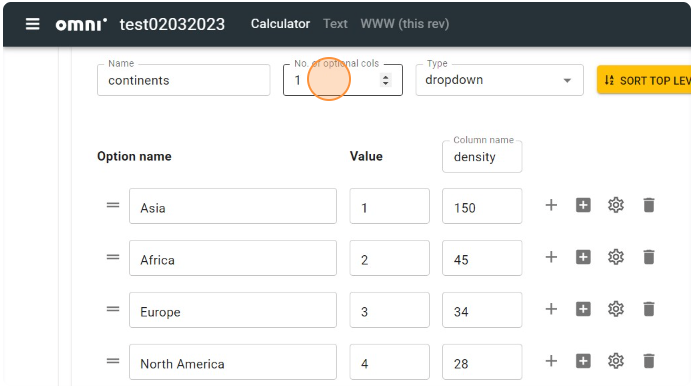
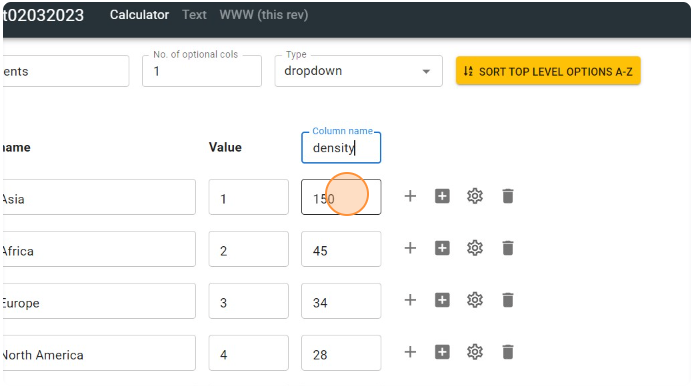
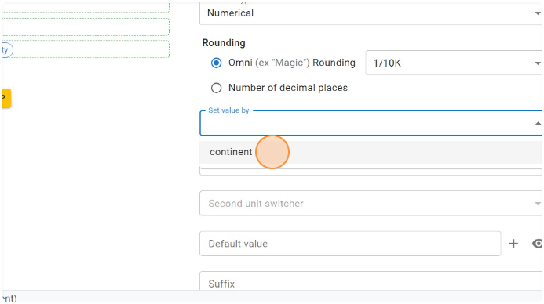
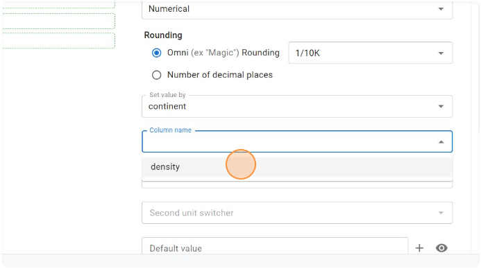

.. _valueSettersV2:

Value setters
=============

In Engine v2, value setting is achieved by **adding extra data to value selects**, rather than using customJS, as was the case in Engine V1.

Let's go through an example of setting the population density by continent.

1. To set value of a variable based on a value select, first **create an additional** column in the value select.

  ؜

2. Enter an appropriate name in the "**Column name**" field for easier reference.

  ؜

3. Populate the values for all options.

  ؜

4. Next, tie the value select to the variable block that will set the value select. More on how to do that :ref:`here<valueSelectsV2TieToVariable>`.

5. Then click the variable for which you want to set the value based on the value select variable.

  ؜

6. Click the dropdown in the "**Set value by**" field to view the available value select variables within this calculator.

  ؜

7. Select the **value select variable** based on which you want to set the value for this variable.

  ؜

8. Select the required column from the "**Column name**" field.

  ؜

After refreshing the calculator preview, as the user selects different continents, the population density value will be updated with values in the density column of the continents value select.