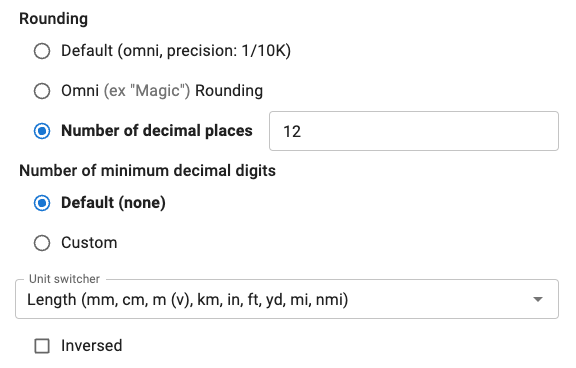

.. |plus icon| image:: img/plus-icon.png
  :alt: Plus icon

.. |eye icon| image:: img/eye-icon.png
  :alt: Eye icon

.. _variableAttributesV2:

Variable attributes
===================

.. _groupsAndVariablesVarAttributesV2:

  Click on a variable to display its basic attributes.

Click on a variable to select it (turns white) and its properties/attributes will be displayed (as above). If you click on another variable, then its attributes will be displayed. To **hide** the attributes, click on the variable label again.

Here are is a summary of the **DOs and DON'TS** when it comes to variables:

* DO **capitalize the first word** in each variable (but not more);
* DO capitalize the first word in every header;
* DO try to list the variables in a **logical order**; information supplied by the user should be at the top, the result — at the bottom;
* DO make sure that you're **not using more units than necessary** - uncheck any you don't need from the variable's unit list; and
* DO spend a few seconds thinking about the **default unit** and the **Imperial default unit** - which ones will make the most sense?

Let's now go through each of the variable attributes to see what then do.

Name
----

The name of the variable in the equations section of the calculator. This cannot be edited.

Label
-----

This is the name of the variable as **displayed to the user**. Make sure it will be easily understood by the user and starts with a capital letter (but no more). If the variable is associated with an equation in the calculator text, it's a good idea to put the algebraic reference in brackets after the name. Read more about styling variables labels :ref:`here<variableLabel>`.

Alterative label
^^^^^^^^^^^^^^^^

You can conditionally change or hide the label of a variable. Here's how:

1. Click on the |plus icon| icon at the end of the label input box.

  ؜

2. Enter an alternative label to be displayed or leave blank to make the label disappear.

  ؜

3. Enter a condition when the alternative label should be displayed.

  ؜

4. Now if the cost is greater than 100, a cheeky comment is displayed in the label.

  ؜

Variable type
-------------

This sets the type of the variable. Here are the currently available types:

* ``Numerical`` — Regular **numbers**. This is the setting for the majority of variables.
* ``Date`` — Allows the user to enter a **date**, using the calendar date picker or by typing one in manually. **NOT IN Engine v2 YET!**
* ``Date \ time`` — Allows the user to enter a **date and time**. **NOT IN Engine v2 YET!**
* ``Time`` — Allows a user to enter a **time**, either using a time picker or entering it manually. **NOT IN Engine v2 YET!**
* ``Value select`` — Allows a value select to be associated with the variable.

Rounding
--------

Here you can select the **rounding** method and amount of variable values. You have a choice of different levels of **relative rounding** (e.g., 1/10K — *see Omni rounding section below*) or up to any number of **decimal places**.

.. note::
  When the **default option** is selected, the variable will use whatever site-wide default rounding is. You can see what it currently is in brackets. Note that this might change in the future.

  Example of rounding to a number of decimal places. The setting 12 means that no more than 12 figures will appear after the decimal place.

Omni rounding
^^^^^^^^^^^^^

**Omni rounding** means that the difference between the rounded and original number may not be larger than 1/nth (for example 1/100) of the original number.

  Example of an Omni rounding setting.

Omni rounding is **relative** — it works differently on large numbers and small ones. The flaw of regular rounding is that while it's OK to round ``1.55334`` to 2 decimal places, it's far too precise to round ``9992383829238.234234234`` the same way and far too imprecise to round ``0.0000000000023423`` like that.

Let's have a look at the effect of different Omni rounding settings on the number ``2/3`` and ``4444.444 recurring``.

+------------------------+--------------------------+-----------------------------------------+
| **Round to setting**   | **2/3 becomes...**       | **4444.444 recurring becomes...**       |
+------------------------+--------------------------+-----------------------------------------+
| 1/10                   | 0.7                      | 4,444                                   |
+------------------------+--------------------------+-----------------------------------------+
| 1/100                  | 0.67                     | 4,444                                   |
+------------------------+--------------------------+-----------------------------------------+
| 1/1K                   | 0.667                    | 4,444                                   |
+------------------------+--------------------------+-----------------------------------------+
| 1/10K                  | 0.667                    | 4,444                                   |
+------------------------+--------------------------+-----------------------------------------+
| 1/100K                 | 0.66667                  | 4,444.4                                 |
+------------------------+--------------------------+-----------------------------------------+
| 1/1M                   | 0.666667                 | 4,444.44                                |
+------------------------+--------------------------+-----------------------------------------+
| 1/10M                  | 0.6666667                | 4,444.444                               |
+------------------------+--------------------------+-----------------------------------------+

The **default setting** for the **Round to** attribute is ``1/10K``, when no option is specifically selected.

When choosing **Omni rounding** and you don't like the default setting, have a play around with entering different values into the calculator and seeing the results. We don't want them too long or too short for the typical usage of the calculator.

Number of minimum decimal digits
^^^^^^^^^^^^^^^^^^^^^^^^^^^^^^^^

This setting pads a number with zeros until we reach the desired number of decimal digits specified.

For example, if you specify **Custom** value of 3 for **Number of minimum decimal digits**, every value of that variable will necessarily show three decimal digits: 12.345, 12.340, 12.300, 12.000, and so on.

If you select variable type as **Monetary**, you'll see that the minimum number of decimal digits is set by default to **2**. This will print monetary variables in the familiar form that shows 2 decimal places (e.g.: $12.50).

  Example of the minimum decimal setting.

Unit switcher
-------------

Choose the units for the variable from the list. Start typing in the unit switcher name to find the one you are looking for.

:ref:`Unit switchers <unitSwitchers>` can be edited and added to the `unit switcher page <https://www.omnicalculator.com/adminbb/unit-switchers>`_. However, it is best to **ask someone before making any changes**, as they might affect other calculators.

Imperial default unit
---------------------

Set an optional Imperial default unit. This will be the default unit displayed to users in countries that use the Imperial measurement system, e.g., the US.

In Engine v2, this is set using a combination of a default unit variant and the available helper function ``userUsesImperialUnits()``.

To set an imperial default unit, follow these steps:

#. Create a default unit variant by clicking the |plus icon| symbol next to that field ('Default unit').
#. Select the appropriate imperial default unit.
#. For this 'Alterative default unit', click the “eye” icon |eye icon| to specify the trigger condition.
#. In the condition box that shows up, enter ``userUsesImperialUnits()``.

  Setting a default imperial unit after following the above steps.

.. note::
  You can **use other conditions to set alternative default units**. However, the default value of another variable cannot be used in the conditions for a default unit variant. 

.. _groupsAndVariablesWorksInReverseV2:

Inversed checkbox
-----------------

Check this box if you have a variable where the unit is the reciprocal unit. For example, wavenumber has units of m\ :sup:`-1`. This example can be found in the `wavelength calculator <https://www.omnicalculator.com/adminbb/calculators/421>`_.

Unit prefix
-----------

The **Unit prefix** is a piece of text that is placed *before* any units symbol. This can be useful when creating a compound unit where the first one is fixed.

It can also be used to quickly **add a unit** where there is **only one choice**.

Supports Markdown formatting and inline LaTeX.

.. _variableAttributesV2UnitSuffix:

Unit suffix
-----------

The **Unit suffix** text gets placed *after* any units symbol. Again, this is useful for creating compound units where the second part doesn't change. For example, dollars per day ($/d) — so **Unit suffix** would equal "/d". Supports Markdown formatting and inline LaTeX.

Base unit
---------

This is the base unit in which **calculations are performed**. Usually this can be left to the default base unit of the unit switcher (e.g., meters for the length unit switcher).

However, if you have an equation based on feet, you can specify to **use feet as the base unit**. This has the advantage of not having to rewrite the equation for meters (a problem if the equation contains constants).

.. warning::
  If the calculator contains a value setter in the CustomJS code, you should **explicitly set the base unit**, if even it is the default (e.g., specify meters for the length unit switcher). This makes sure that those users in Imperial unit countries will get the correct value for variables set by the value setter.

Default unit
------------

Set the default unit of the variable from the dropdown list. **A default unit always needs to be specified.**

Default unit list
-----------------

For each unit switcher, a list of all its units are displayed. Depending on the application, some units will make sense, while others won't (e.g., somebodies weight in terms of solar masses). Check the units you want the user to be able to choose from, and uncheck others to hide them.

.. note::
  You will see that the **default unit** and **Imperial unit** (if set) are greyed out and cannot be unchecked.

If you make a change to the list of units, a **reset** button will appear at the top. This resets the unit list to the default list for that unit switcher.

Second unit switcher
--------------------

**DETAILS COMING SOON!**

Default value
-------------

You can specify a default value for the variable, given in its default unit.

You may specify more than one default unit to be used when certain conditions are true. The most common is when the user is coming from a country that users imperial units. **See the next section below for instructions** on how to set this up. Other helper functions in the future may also be applicable to multiple default units.

.. warning::
  The default value of another variable cannot be used in the conditions for a default value variant. 

Imperial default value
----------------------

Set a **default value** for users in countries who use the Imperial measurement system (e.g., the US). The value should be given as the Imperial default unit.

Generally, if you have set a **default unit** and you have specified an **Imperial default unit**, you should set an Imperial default value. Otherwise, your calculator may not work as expected in Imperial unit countries.

In Engine v2, this is set using a combination of default value variant and the available helper function ``userUsesImperialUnits()``
To set an imperial default value, follow these steps:

#. Create a default value variant by clicking the |plus icon| symbol next to that field ('Default value').
#. Input the appropriate imperial default value.
#. For this 'Alterative default value', click the “eye” icon |eye icon| to specify the trigger condition.
#. In the condition box that shows up, enter ``userUsesImperialUnits()``.

  Setting a default imperial value after following the above steps.

Prefix
------

This setting **inserts a text string before the variable's value**. Supports Markdown formatting and inline LaTeX.

Suffix
------

If a variable has no unit switcher assigned to it, you can use the **Suffix** setting to **add a text string after the value**. This is can be used when the value only has one unit and it isn't available in an existing unit switcher. Supports Markdown formatting and inline LaTeX.

.. note::
  If you later add a unit switcher to a variable, the **Suffix** text string defined here will not be shown. If you need some text after the unit, use the :ref:`Unit suffix<variableAttributesV2UnitSuffix>` setting.

.. _groupsAndVariablesHelpTextV2:

Help text
---------

Text inputted here will appear **when the user clicks on the info icon** after the variable name. This allows you to describe in more detail what input is required, say what limits there are on its value or better explain a result. Guidance on help texts can be found :ref:`here <calcStylingGuideHelpTexts>`.

Monetary
--------

Check this checkbox if the variable is a monetary amount. This will add the user's currency symbol as the main unit.

.. _variableAttributesV2AutoSave:

Auto saved by default
---------------------

When checked, the **variable value will be saved** in a cookie on the user's browser. So, next time the user comes back to the calculator, the last value they entered will be already displayed.

This is useful for things that are not likely to change very often or by much, such as a person's **age**, **weight**, etc.

Output only
-----------

This setting forces the variable to be output only and not allow the user to input values. You can use this setting instead of employing the ``one_way()`` function in the equations section.

Other attributes not yet implemented in v2
------------------------------------------

Locked
^^^^^^

**NOT IN Engine v2 YET!**

The variable will not be recalculated as other variables are changed. This is good for variables that are meant to be **inputs only**. For example, we don't want our calculators re-calculating someones measured height, weight, etc.

The **user can override this setting** in the variable menu (displayed when you click the grey area to the right of the variable).

Locked permanently
^^^^^^^^^^^^^^^^^^

**NOT IN Engine v2 YET!**

Same as the locked function above, but now the **user cannot override** the setting.

Don't format
^^^^^^^^^^^^

**NOT IN Engine v2 YET!**

When checked, **formatting will not be applied to the number** after the user has finished entering the number. For example, the number 123456 is usually displayed as 123,456. With formatting turned off, it's displayed as 123456.

This is useful, for example, if you have a binary input variable, so using the thousand separator doesn't make sense.
