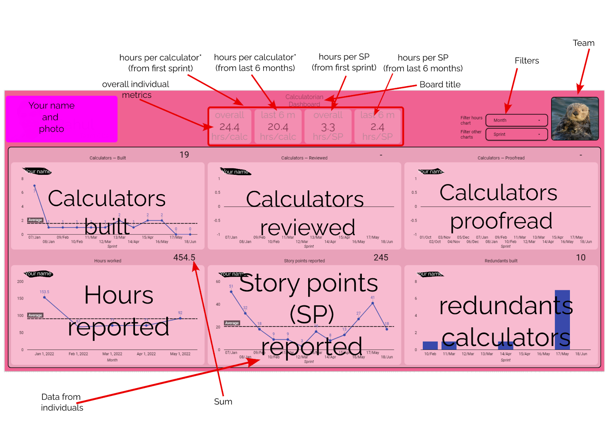
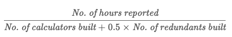
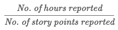

.. _dashboard:

Calculatorian dashboard
=======================

This chapter explains what the Calculatorian dashboard is, what it conveys, and how you can interpret the displayed data. The dashboard displays the data we **record after every sprint**, from the number of calculators built to the number of story points (SPs) consumed. The information is shown using Google data studio, and you will **receive a link** to your own personal dashboard via your Google email.

Your dashboard has a lot of numbers, so this section will deal with how to read the numbers that are visible and what's not visible. The dashboard is built with the objective of **tracking your progress and showing the amazing work you have done in terms of numbers**. The first row contains the individual metrics, which convey hours per calculator and hours per SP.

  Annotated Calculatorian dashboard.

Let's go through each of the metrics...

1. **Hours per calculator (overall)** – Denotes the number of hours spent on building a regular or a redundant calculator. This metric is calculated for a calculatorian using the formula:

2. **Hours per calculator (6 months)** – This is a recent version of the metric and hence utilizes the data only from the last six months or twelve sprints to calculate the above parameter.

.. note::
  The **hours per calculator metrics** are a rough measure obtained from the ratio of the number of hours reported at the end of the month to the number of calculators built. It is a **rough measure** because one must also understand that several types of tasks could be assigned to an individual in addition to calculator building. It could be **reviewing** these awesome calculators or **proofreading** amazing text, or any other tasks, so please keep those tasks in mind while looking at those metrics. To conclude, if you have a variety of tasks and responsibilities, it is normal that this metric is higher for you than others, and therefore you should **take it with a pinch of salt**.

3. **Hours per story point (SP) (overall)** – This metric represents the amount of time taken to perform work equivalent to one story point. It is calculated using the formula.

4. **Hours per story point (SP) (6 months)** – Number of hours spent to work to perform one SP equivalent of work. This metric uses the same formula as above but with the data restricted to only the last six months or twelve sprints.

.. note::
  The **story point-related metrics** shown on the dashboard are generated from the data reported by individuals and, in most cases, are personalized. Therefore they do not make sense when comparing each other – especially the metrics that are a function of story points. Since a story point is a personalized measure of capacity and depends on individual working style, such metrics must only be compared with one's own self. It must be seen in terms of individual progression.

5. **Calculators built**

  This chart shows the **number of calculators sent for first review during that particular sprint**. The sprint numbers on the X-axis have the convention of Sprint number/Month. Therefore, the number **08/May** would denote the **8th sprint**, and it took place in **May** (for your reference). The graphs display data from the past 12 sprints. The top right corner of the chart has the **sum of the calculators** you built in those last **12 sprints**.

6. **Calculators reviewed**
   
  Shows the **number of calculators reviewed during that particular sprint**. Since a calculator is usually reviewed twice or even more, the data shown is redundant in some cases. The top right corner of the graph has the **sum of calculators reviewed** in the **last 12 sprints**.

7. **Calculators proofread**

  This chart shows the **number of calculators proofread during that particular sprint**. The top right corner of the graph has the **sum of calculators proofread** in the **last 12 sprints**.

8. **Hours reported**

  The data shown in this graph are the numbers you input in BB at the end of each month. This data is also used for the calculation of hrs/calc and hrs/SP metrics. The top right corner of the graph has the **sum of the number of hours reported** in the **last ~6 months**.

9. **Story points reported**
  
  The story points reported at the end of each sprint are used to generate this chart, and the data shown is from the **last 12 sprints**. The story points shown in this chart is the sum of all the tasks (calculator and non-calculator based). This parameter is then used to calculate hours/SP, which is visible at the top of the dashboard. The top right corner of the chart has the **sum of the story points reported** in the last **~6 months**.

10. **Redundants**

  Redundants are special, short calculators that bring in extra traffic and are counted separately from the regular calculators. The chart at the bottom right of the dashboard shows the redundant calculators built in each sprint. The top right corner has the **sum of redundants made so far**.