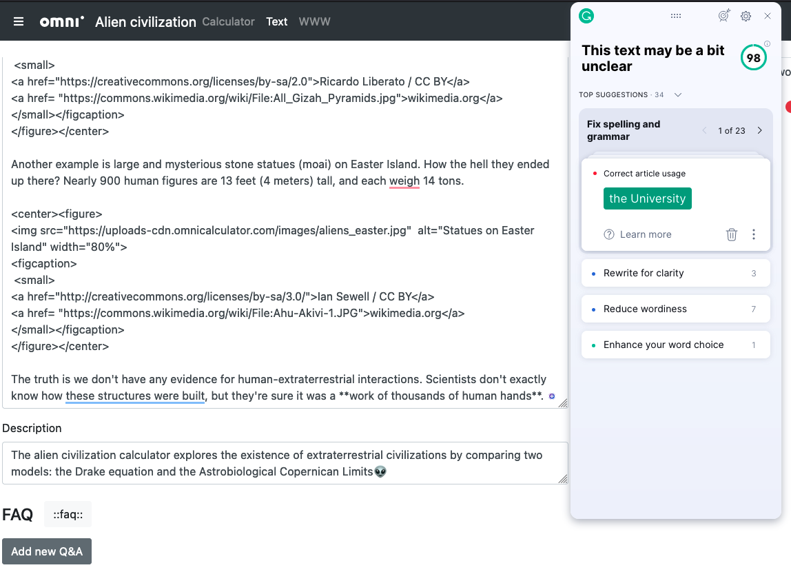

.. _grammarly:

Grammarly
=================================================

Checking the **spelling and grammar** of your calculator is a really important task. To stand out on the web, you have to present a quality product. If a page is littered with basic errors, users well think what else is wrong. Even with the calculator!

On the Trello card for a calculator, you'll see **Grammarly check**. That means you should check your text, description, FAQs, etc., with the Grammarly browser extension (normally).

What follows is a very quick guide. For more detail documentation, head over to Grammarly's `support page <https://support.grammarly.com/>`_.

Browser extension
-------------------------

The **Simple editor** tab supports the Grammarly browser extension. This should be available in your browser's extension store and easy to find.

Omni provides you with a **Premium Grammarly** account so you get all the bells and whistles. The details of these login details are available in the "`Omni Common <https://drive.google.com/drive/u/0/folders/1CW8H5OP9cdzvHRyO7IJR2tKHkBD20jUy>`_ → Shared Accounts" document.

.. tip::
  Set the language to **American English**. That's the language we target for most calculators, as 70% of our traffic comes from the US.

  If you need to use another language, don't forget to put the setting **back to American English** when you've finished. Since we are using a shared account, the settings are shared.

Once loaded on the text editor page, you'll see any issues Grammarly has with your text underlined with a specific color. Red for errors, blue for clarity and green for enhance. **Hover your mouse over the underlined text** to see what the issue is and if there are any suggestion for a fix.

Another way to check through the text is to click on **See more in Grammarly**. Doing that brings up the full Grammarly user interface.

.. _grammarlyFullUI:

    Grammarly's full browser extension user interface.

By default it shows you the top suggestions. To see all the suggestions, click on where it says **top suggestions** and then select **all suggestions**. Hey, you can never have enough suggestions.

Now go through each issue and decide whether to accept or reject Grammarly's suggested fix.

.. warning::
  Grammarly is **not foolproof** and may get things wrong. The main issue is that it didn't understand the context of your text and **reports an error when it shouldn't**.
  
  The opposite is also true. Sometimes it **accepts** what is **complete nonsense**.

  Grammarly is just a tool to assist you and shouldn't be totally relied upon.

.. tip::
  Find yourself repeating the some words in a text? Well help is at hand, as the Grammarly browser extension also contains a **dictionary and thesaurus**.

  Click on the gear cog settings icon, then turn on the **Show definitions and synonyms via double clicks (all sites)** setting. Now you can double click on any word in you text and get suggestions for other words that mean the same thing.

Text editor
-----------

Grammarly also has its **own text editor** for focused writing or checking other text you copy and paste there. You can reach it if you click on the browser extension icon.

At the bottom, you can either click on **New document** to create a new document, or **My Grammarly** to see all the Grammarly documents.

.. warning::
  Since we are all sharing one account, any text you enter into these documents **could be seen by the rest of the team**.

.. toctree::
    :maxdepth: 3
