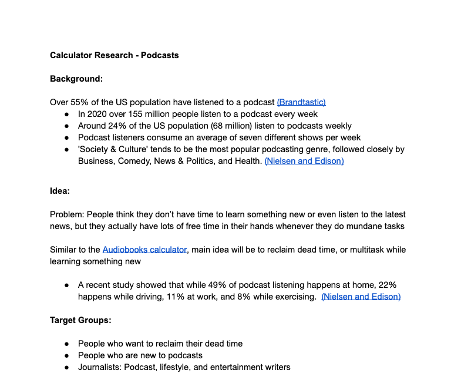

.. _research:

Research document
=====================

When you sign-up to create a marketing calculator, you should be sent a research document that has been prepared by the Marketing Team™. It'll look something like this:

.. _researchExample:

  Example of a research document for a marketing calculator.

It will have the following main sections, which we'll briefly summarize.

Background
----------

Features some key **background information** that supports why making this calculator is a good idea and what you might like to in your text.

Idea
----

A brief, **general idea** for the calculator. States the problem that it solves and what benefit the user will get from using the calculator.

Target groups
-------------

Lists what **target audience groups** the calculator is aim at, and what type of journalists serve these groups.

Calculator ideas
----------------

Contains ideas and suggestions for what **input fields** and **results** the calculator should have. It may have a link to a mock-up of what the calculator should look like.

Marketing campaigns
-------------------

Describes how the Marketing Team™ see the campaigns going for this calculator. Answers questions like: How many phases will there be? Who will it be sent to? What's the timing for each mailing.

.. note::
  The research document may also contain notes of things to **include in your text** to make it appealing to both user and journalists alike.