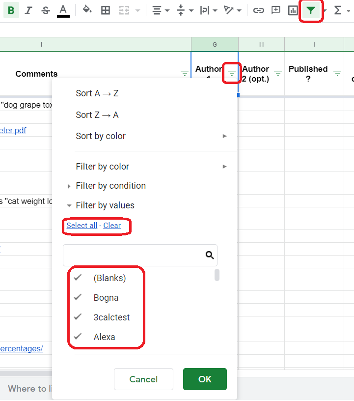

.. _instruction:

How to use mastermind worksheet?
================================

The mastermind worksheet consists of eleven columns:

1. **Calculator name** — It's ideally the name with the highest traffic.
2. **Category** — One of fourteen categories we currently have at Omni Calculator.
3. **Semrush** — It's the volume of the *Calculator name* phrase in the :ref:`SEMrush <semrushDashboard>` keyword research tool. In other words, it says how often do people search for that phrase in Google.
4. **Semrush (without the word "calculator")** — That should be self-explanatory. We use it to check how popular is the calculator's topic.
5. **Example of the calculator (link)** — Usually the link to the first calculator in the Google results. It should reflect what most likely people are expecting from the calculator.
6. **Comments** — Contains additional comments on the idea, ranging from alternative keywords and more calculators examples up to references to already existing calculators (to clone and modify) or user requests. Be sure always to check it closely since it often contains lengthy but essential information.
7. **Author 1** — A place where you can **type in your name** to reserve the calculator for yourself. Before you do it, make sure this calculator is not already created or in progress by checking the `adminBB calculators' list <calculators>`. We don't want to create the same calculator twice!
8. **Author 2 (opt.)** — If you create a calculator with another person, this is a place to mention it.
9. **Published?** — It says whether a calculator was already published. The blank box means the work is in progress and the word *yes* indicates that the calculator is already published (don't forget to add it!).
10. **Very difficult?** — If you see there *yes*, then a calculator might be difficult or even impossible to create with the current capability of Omni Calculator's calculator creator. If there is a blank box and after reviewing the idea you think the calculator is too difficult, feel free to input *yes*. Masterminders are not experts in every field, and they might add some too ambitious ideas. 
11. **Calculatorians comments** — If you have your reflections about the idea, here's the right place to put them.

.. rubric:: Filtering the spreadsheet

To quickly navigate within the Mastermind spreadsheet, you can use the filtering tool. The **icon should be green**; click it if it isn't. That allows you to select any column (click on the three horizontal lines symbol next to the column title) and apply the filter to the whole spreadsheet. For example, if you're looking for free ideas, open the filtering tool for the *Author 1* column, select the *Clear* button and then choose the *(Blanks)* option. In that way, you will see **only the calculators which don't have authors yet**. You can do the same thing with a **category** if, e.g., you're interested only in *math* and *physics* calculators, just click *Clear* and select the desired options.

It may happen that someone currently using the filter on the page. If that's the case, don't fight with other calculatorians and wait a little bit. We only have one spreadsheet to work at. Though, don't wait until their icon completely disappears because someone might not close the spreadsheet immediately, and it can still feel someone's presence. 

The last thing to remember is that filters are saved even after closing the spreadsheet. So, be sure to check if your category isn't **filtered out**!

