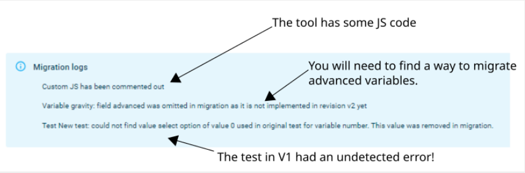
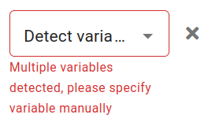

.. _migrationAuto:

Migration in 5 minutes
======================

No two tools migrate the same, but they all follow the same rough process.
Follow along below to migrate in the best way possible! For more information, you can refer to the more in-depth sections of the documentation — follow the links in these steps for quick access.

Initial checks and validation errors
------------------------------------

Upon starting a migration, you may see a log appearing at the top of the tool: read it so you're aware of what may have changed!

    The migration log of a calculator.

There may be errors in the revision --- to fix them, scroll through the BB interface and check for red-bordered panels (conditions, tests, etc.).

- Unnamed tests aren't allowed in V2.

- Conditions whose expressions involve multiple variables must specify which variable they should be displayed under.

    The error message resulting from an unallocated multi-variable condition.

After fixing any such issues, you should be able to reload the preview.

Fix variable visibility
-----------------------

This is only necessary if the v1 calculator contains :ref:`CustomJS code <CustomJs>`.

- **Understand the initial state of the calculator**

    Which variables are shown and which are hidden upon loading the calc? This usually happens in the first rows of CustomJS code.

- **Understand the conditions that control variable visibility.**

    Most of it will happen through conditional statements (`if`, `else if`, `else`) that execute the functions `ctx.showVariables` and `ctx.hideVariables`.
    Use these statements in the visibility fields of the variables.
    If a variable is always hidden, you can use `false` as a visibility condition, but consider implementing its source equation in the Formulas section of the calculator editor.

    .. figure:: images/blockVisibility.png
        :alt: The visibility condition of a variable block
        :align: center

        The visibility condition of a variable block.

- **Clean up "dummy variables".**

    Remove any variables with default values that were solely used to trigger `omni.onResult()` to hide variables or show text.

Variable properties
-------------------

It's time to finalize the variables of your tool.

- Check for :ref:`naming issues <migrationVariableNames>`.

- Fix possible rounding errors and use the minimum number of decimals where necessary.

- Check the unit switchers and bring them to V2 standards.

Create image blocks and text blocks
-----------------------------------

:ref:`Text blocks <textblocks>` and :ref:`image blocks <imageblocks>` replace the HTML outputs usually added with `ctx.addHtml`.
Set their visibility as it appears in the CustomJS of the original tool.
Remember that you can (but do not necessarily need to) use alternative URLs and alternative chunks with visibility conditions rather than different blocks.

Refine the appearance
---------------------

At this point, the V2 version should look almost like the V1 version.
Now, refine its appearance.
We do it in three steps:

- **Groups** — decide what to do with the groups of your tool. Refer to the Groups and Blocks section in this document [TODO link].

- **Multicolumn layout** — some tools may be enhanced by adopting the multicolumn layout. Jump to the related section to learn everything about it [TODO link].

- **Advanced mode** — V1 had the possibility of hiding variables in the advanced mode. In V2, we generally should put them in a group that is collapsed by default [TODO link]. However, this group must have a descriptive name other than "Advanced mode".

- **Value select type** — V1 had only dropdown menus. V2 also has radio buttons [TODO link] (a suitable replacement for dropdown menus with fewer than 5 items) and checkboxes [TODO link]. Be careful when changing a value select's mode — you might accidentally erase some options.

Related: UX guidelines for calculators [TODO link]

Check the conditions
--------------------

Conditions work slightly differently in V2 and many old tools don't have them.
So, scrutinize them.

- Be sure that they are comprehensive: if the tool is related to a physical problem, conditions should cover against “unphysical” inputs (i.e. negative masses...). Converters are allowed to have unrealistic inputs.

- In case of conditions with multiple variables, consult the dedicated section of the guidelines [TODO link].

Check the tests
---------------

V2 allows for tests with incomplete inputs to be saved.
Check for them, and be sure that the test completes with all steps green.
Make sure the tests are comprehensive and that they cover all variables needed in a computation — add tests where necessary to achieve full feature coverage.

Perform a final check of the tool
---------------------------------

Make sure everything works, especially in reference to the V1 version.
Use common sense, look for edge cases, and test your assumptions of the calc.

