.. _googleAnalytics:

Google Analytics
=====================

Google Analytics (GA) shows you **all the traffic to a calculator**, not just the traffic from Google search results.

This is generally useful for **marketing calculators**, which rely on incoming links from publications, social media and other random sources.

It is also useful to see how Omni is doing in general and how your calculators are performing in particular.

Here's what we'll cover in this section of the Handbook.

.. contents:: :local:
  :depth: 2

.. tip::
  If you prefer, you can **view** this content (apart from the last section) in `this presentation <https://omnic.slack.com/files/U2SDL2Z8E/F01NSB7D6PR/gmt20210224-125611_bogna-szyk_2560x1440.mp4>`_ given by Bogna. Please **skip to time code 17m:20s** to see the start of the presentation on GA. 

Where did the traffic come from?
--------------------------------

In GA, it describes how a visitor came to a webpage. Let's look at the different types:

* **Organic** — Google search and other search engines. This is basically the traffic as discussed in the :ref:`Google Search Console <searchConsole>` section of the Handbook.
* **Referral** — Links from other websites. In the case of marketing calculators, links on newspaper websites, Reddit, etc.
* **(none)** — Direct traffic or unknown. The visitor directly typed the URL into the browser or it is an unknown source. It is also common for some newspaper sites to be sneaky and **hide their links** from GA.
* **Emails** — Newsletters, etc. We won't get much in this category, as we don't send out newsletters any more.
* **Social** — Social media, such as Facebook, Twitter, etc. 

Opening Google Analytics for a calculator
-----------------------------------------

Click on the gear cog icon and select **Google Analytics** from the menu.

.. _googleAnalyticsOpen:
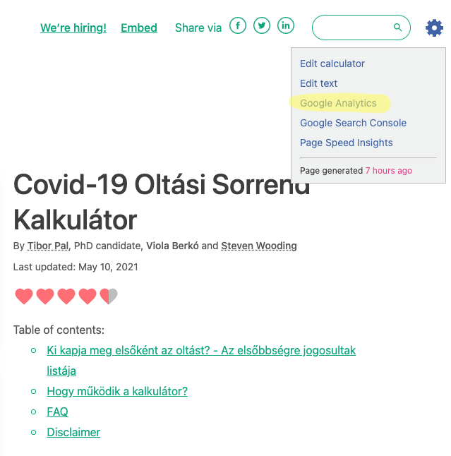

  Click on the menu item highlighted in yellow to open the GA for this calculator.

If you are logged into Google and you have been given access to see Omni's GA, you will see:

.. _googleAnalyticsExample:
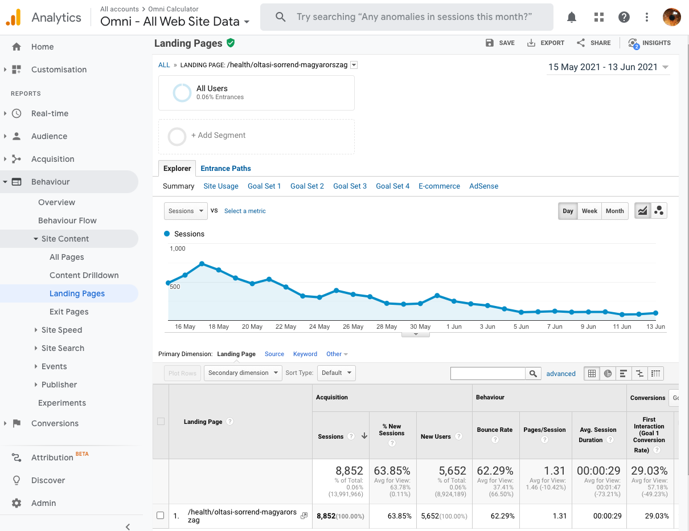

The default is to display the **Landing Pages** tab for the calculator. This helps us track where did people come from when they first arrived at the calculator.

.. _googleAnalyticsSourceMedium:

Viewing the source/medium of page visits
----------------------------------------

To get a break down of the source of all this traffic, we need to add a **Secondary dimension** by which we'll look at the data.

You do this by clicking on **Secondary dimension**, start typing in ``source``, then click on **Source/Medium**, as illustrated below.

.. _googleAnalyticsSource:
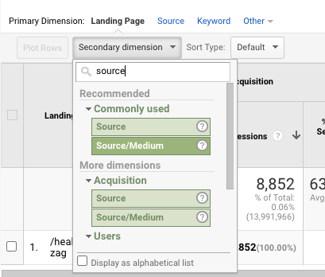

This will give the following results:

.. _googleAnalyticsSourceResult:
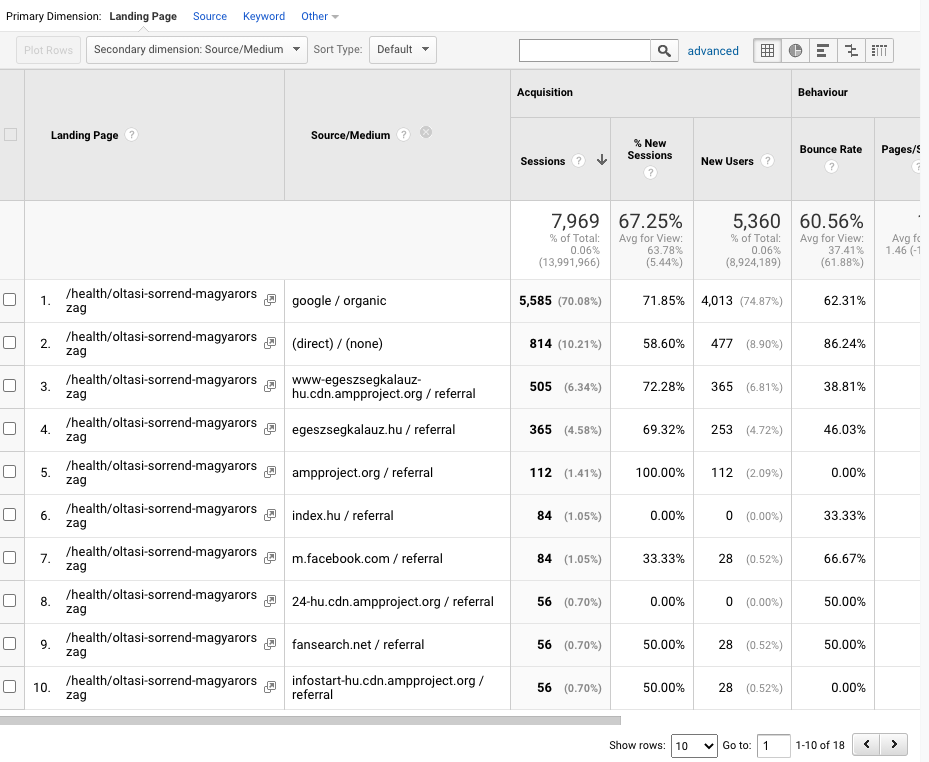

You can then see the different mediums mentioned above, as well as the specific sources. For example, ``google / organic`` means Google search traffic, while ``index.hu / referral`` means the source is a link from a Hungarian news website.

Full source links
-----------------

So far we've got which websites are linking to the calculator, but what if we want to know which page on that website the link is on?

We can do that by changing the secondary dimension to **Full Referrer**.

.. _googleAnalyticsFullRef:
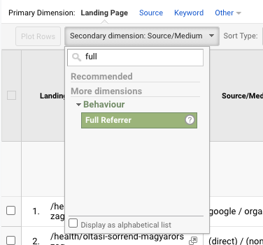

And this is the result:

.. _googleAnalyticsFullRefResult:
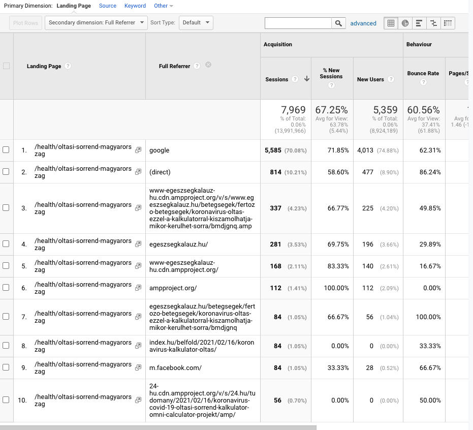

You can now see (in some cases) the **page on which the link** that points to this calculator is. This is useful for reporting the link to the Media channel on :ref:`Slack <slack>` or reading the story that was written about the calculator.

All pages report
----------------

So far we have been looking at landing pages, but there is also an **All pages** report which looks at all of the traffic to a page. Here is an example:

.. _googleAnalyticsAllPageviewsExample:
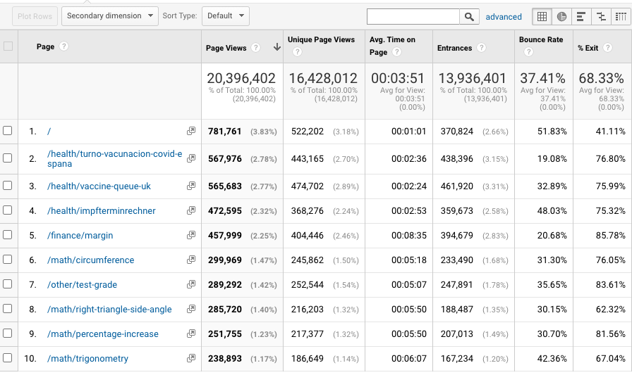

Let's now take some time to explain sessions, page views, unique page views and landing pages and how they fit together.

Sessions and pages
^^^^^^^^^^^^^^^^^^

A session consists of multiple pages visited by a single user.

.. _googleAnalyticsSessions:
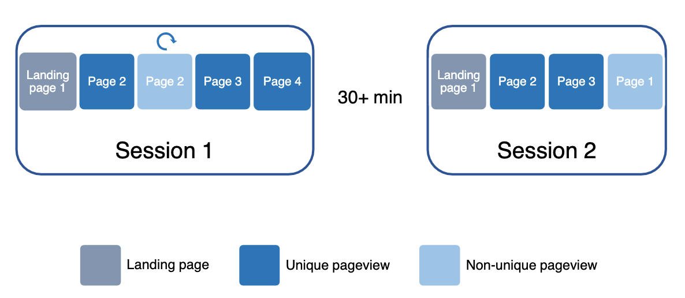

  An example of a couple of sessions and pages one user visits.

In the example above, a user has visited an **initial calculator** (landing page), then navigated to another one, which they refreshed once, then loaded two more pages.

They then go somewhere else for **more than 30 minutes** (this time away triggers Google to end a session). Then they come back and new session begins.

All page views
^^^^^^^^^^^^^^

The number of hits in the all page views report will include all of the pages visits, even non-unique ones. Every page is counted, without any filtering.

Unique page views
^^^^^^^^^^^^^^^^^

The unique page views report counts the number of non-repeating page views. So not page 2 when it was refreshed in session 1 and not the reload of page 1 in the second session.

.. _googleAnalyticsUniquePageViews:
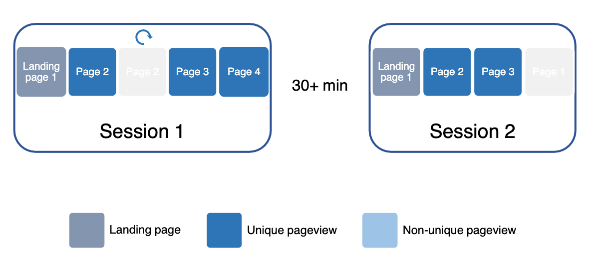

  The pages that have had repeated visits (those greyed out) are not counted in the unique page view figures.

This report captures traffic from the internal linking between calculators.

Landing pages report
^^^^^^^^^^^^^^^^^^^^

The landing pages report counts the number of landing pages (which is the same as the number of sessions, by definition).

.. _googleAnalyticsLandingPages:
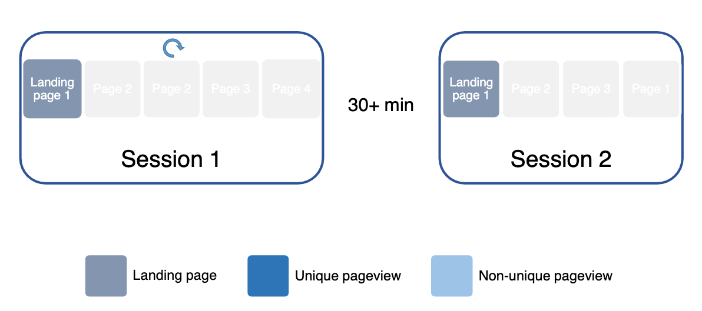

  The landing pages start each session, so they are the same as the number of sessions.

When to use each report
^^^^^^^^^^^^^^^^^^^^^^^

Each of these reports are useful for different situations and people.

.. _googleAnalyticsWhen:
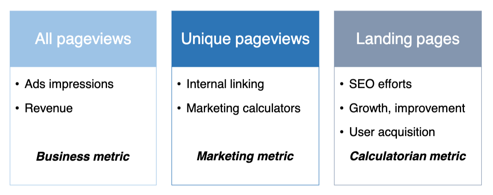

The **All page views** basically measures the ad impressions on the site, which is linked to revenue. So this is a **business metric** (for people like Matt).

The **Unique page views** report captures the internal linking between calculators. It is also useful for **marketing** to know if the user first visitor another calculator before hitting a marketing calculator.

The **Landing pages** report reflects the SEO efforts made by the **calculatorian**, the growth in the visitors to the calculator and how user acquisition is going. If you were to look at the unique page views, this includes the internal linking, which the individual calculatorian has less control over.

How is Omni doing in general?
-----------------------------

To measure how well Omni is doing in general, we compare one time period with another one (e.g. this month with last month). However, we need to be careful when making such comparisons. We need to watch out for:

* **Non-organic traffic** — Very successful marketing calculators can skew the general traffic data. They need to be weeded out when making general comparisons.
* **Seasonality** — Comparing a month in the summer wih one in the winter will give different results simply because people work less in the summer, trying to solve problems.
* **Weekdays vs. weekends** — Traffic tends to be significantly down on the weekends and people are not working and trying to solve problems. So, the minimum period of comparison should be a week and in blocks of 7 days (so not, for example, 12 days).
* **Holidays** — Website traffic will be down at times like Christmas and New Year. Apparently, there are more important things to do than calculate stuff.
* **Google updates** — From time to time Google updates its search algorithm. This can have a large effect to the up or down side to Omni's traffic depending on how lucky we are.
* **Weird things happening in America** — Since 70% of our traffic comes from the US, if something odd is happening there, it can affect our traffic.

How well are my calculators doing?
----------------------------------

For each calculatorian, we keep track of the traffic each of their calculators receive. You can take a look at this data too.

You will need to login with a special Google account to do this though. Details of this account are in "`Omni Common <https://drive.google.com/drive/u/0/folders/1CW8H5OP9cdzvHRyO7IJR2tKHkBD20jUy>`_ → Calculatorians → Google analytics - personal segments"

First, load up the landing pages report (Behavior → Site Content → Landing Pages).

Click on **Add segment**.

.. _googleAnalyticsAddSegment:
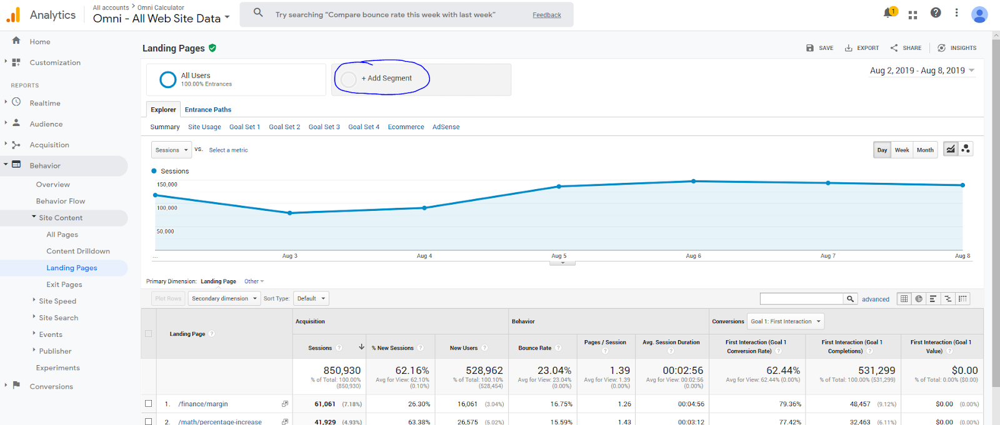

Pick your segment (you can find it easily in the “Starred” ones ⭐️).

.. _googleAnalyticsPickSegment:
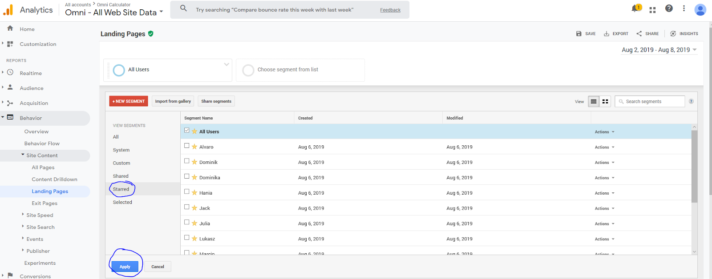

To see only your segment, remove the segment **All Users**.

.. _googleAnalyticsRemoveSegment:
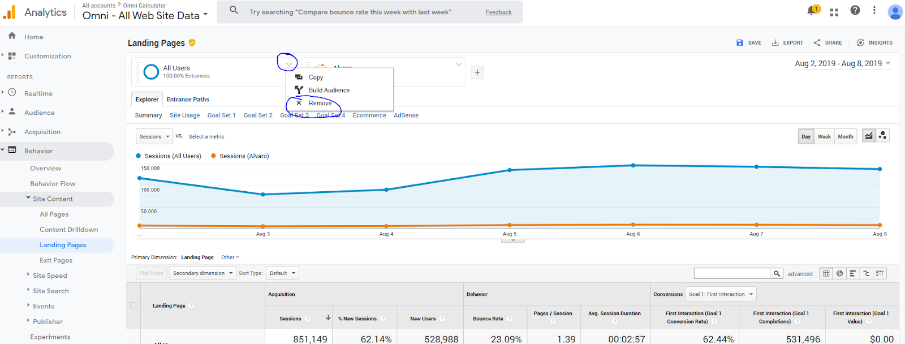

Under the graph, you can see all your calculators, and how well they are doing: number of sessions, bounce rate, session duration etc. Click on “show rows” to show more than 10 calculators.

.. _googleAnalyticsPersonalResults:
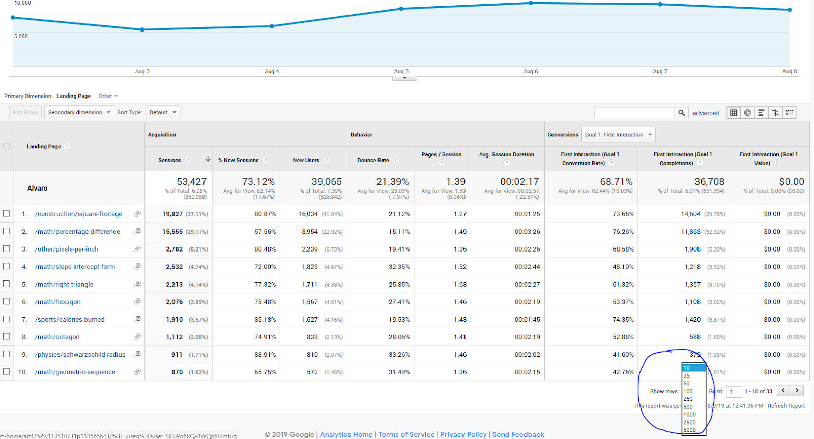

Click on the dates at the top-right to set the time frame to analyse and/or compare two different time periods.

.. _googleAnalyticsDates:
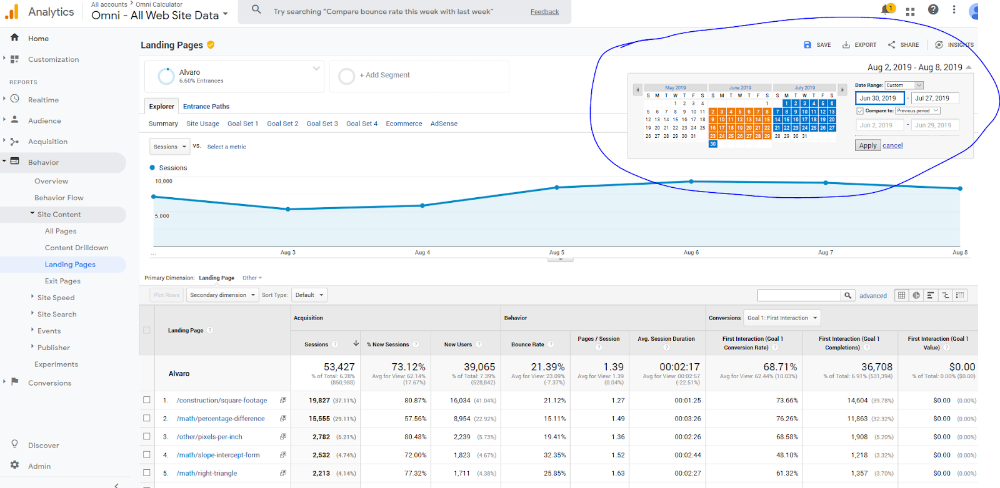

If this symbol is yellow (see below), it means that Google Analytics is extrapolating a fraction of all data - it’s not 100% reliable!

.. _googleAnalyticsYellowSymbol:
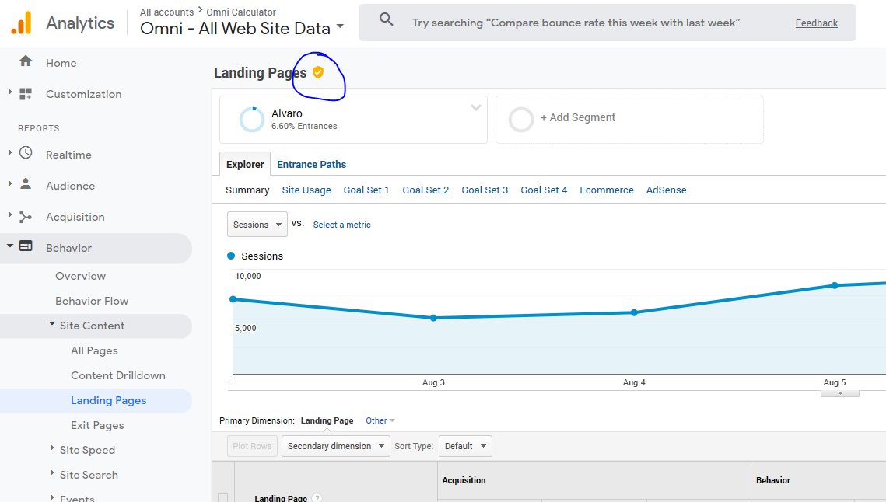

You can check where the traffic comes from by choosing **Secondary dimension -> Acquisition -> Source/Medium** (as discussed :ref:`above <googleAnalyticsSourceMedium>`).

.. _googleAnalyticsPersonalSource:
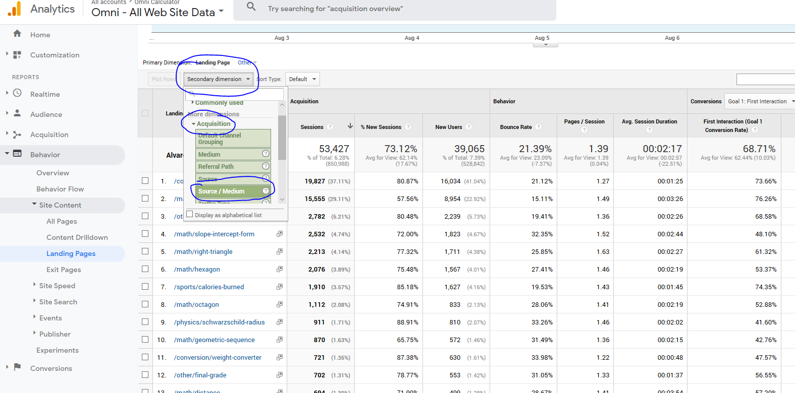

**Things you can do:**

* See how the performance of your calculators **changes over time**;
* See how **long people stay on the page**, and how often they bounce (go back immediately);
* Compare performance of your calculators **now vs. in the past**;
* Check which of your calculators are the most popular; and
* Check **where** the traffic comes from.

**Things to be aware of:**

* This report shows **landing pages** (i.e., first page the user encounters when on our website) only — i.e., it measures how good you are at bringing people from search engines to our website, and not how good other calculatorians are at internal linking 😅;
* Traffic is **highly seasonal** — lower in summer and during holidays, higher on weekdays;
* Traffic depends on a **million factors**, most of which you can’t influence (e.g. Google updates); and
* It **takes time** for a brand new calculator to move up in Google and start bringing traffic.

**Things you shouldn’t do (because they don’t make sense):**

* Compare with **another calculatorian**;
* Compare a **new calculator** with an **old one** and wonder why the new one is doing so bad; and
* Compare number of sessions in calculators with **unpopular and popular keywords**.

