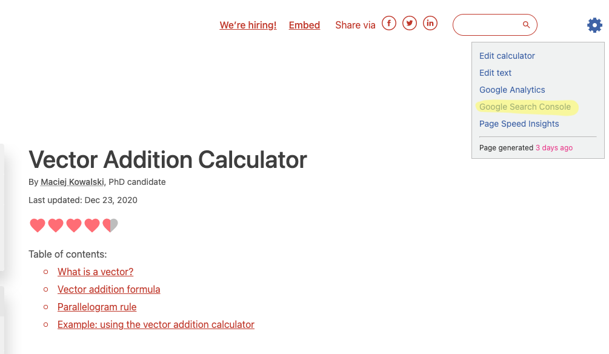

.. _searchConsole:

Google Search Console
=====================

The Google Search Console (GSC) is a website provided by Google that tells you statistics on visitors your you calculator that come from **Google search results, only**.

It can show you how many times your calculator appeared in search results (**impressions**). How many **clicks** it got and where on the list of links it appears.

.. tip::
  If you prefer, you can view this content in `this presentation <https://omnic.slack.com/files/U2SDL2Z8E/F01NSB7D6PR/gmt20210224-125611_bogna-szyk_2560x1440.mp4>`_ given by Bogna. Please **skip to time code 7m:30s** to see the start of the presentation on GSC. 

How to open GSC for a calculator
--------------------------------

To open up the GSC for a calculator, load it up and **click on the gear cog icon**. Then select **Google Search Console** from the list (highlighted below in yellow).

.. _searchConsoleOpen:

  Click on the menu item highlighted in yellow to open the GSC for this calculator.

You will then be greeted with the following page (if you are not, you may need to ask Bogna for access, and make sure you are logged into your Google account):

.. _searchConsoleExample:

By default it shows you the **last 28 days**. If you want to see longer term trends, click on the **date filter** at the top and select another time period to analyse.

The four stats of GSC
---------------------

Four stats are shown by default on the graph (click on the colored boxes to remove them from the graph):

* **Total clicks** — how many times people clicked on your calculator's search result.
* **Total impressions** — how many times your calculator appeared in search results.
* **Average CTR** — the number of clicks divided by the number of impressions, given as a percentage.
* **Average position** — where in the search results does your calculator appear, on average. The smaller the number the better.

.. tip::
  If your calculator is very new, there probably will not being enough data to make any meaningful conclusions. It is recommended to wait until it is at **least 2 months old**.

The average CTR and position statistics are **pretty useless** to use as they are an average over **all queries**. As most queries will not perfectly target your calculator, they will look worse. Plus its hard to come to any conclusions — these stats are too general.

.. note::
  You will see a general pattern of **low weekend** use for most calculators. This is because most of our calculators are used by students and workers who are trying to get stuff done during the week. On longer term timescales, you'll also see low traffic in school and public holidays.

Keyword stats
-------------

Below the graph, you will see the **queries section**. This is a list of queries (aka keywords) that people typed into Google search and your calculator appeared as a result.

The default is to order the list by clicks, but you can **click on the headings** to order by the other three stats.

Now the click through rate and position stats have more meaning. You can see which keywords are working. If you **click on a keyword**, you get the graphs again, but for just that keyword. What you want to see is a rising position and CTR.

.. _searchConsoleKeywordExample:

In the graph above, we have plotted the ranking position for the keyword **vector addition calculator**, which rises nicely to a plateau near the top of the Google search results.

Ideas for new calculators
-------------------------

If your calculator has **a lot of keywords** (many hundreds) and **lots of traffic**, it may be ranking for keywords that you never thought of when you originally created the calculator.

What you can do is to order the keywords so those with the highest impressions are near the top (have the biggest potential) and then **look for keywords that are not ranked as high as the main calculator keywords**. In this case, if it makes sense, a new calculator could be born using these found keywords as a basis.

.. _searchConsoleNewCalcs:

  The keywords with their positions highlighted in yellow are not ranking so high as the rest, so might be suitable for the basis of spin-off calculators.

If you find an idea using this method, check with Hania about adding to :ref:`Mastermind <mastermind>`.